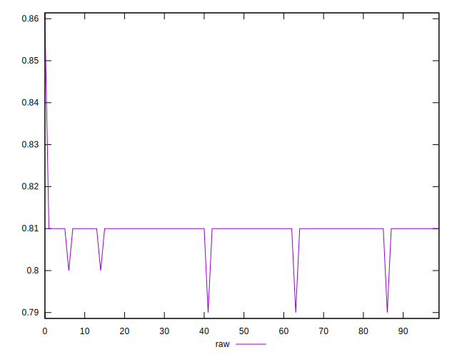
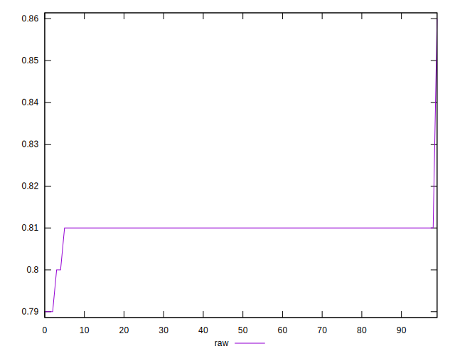
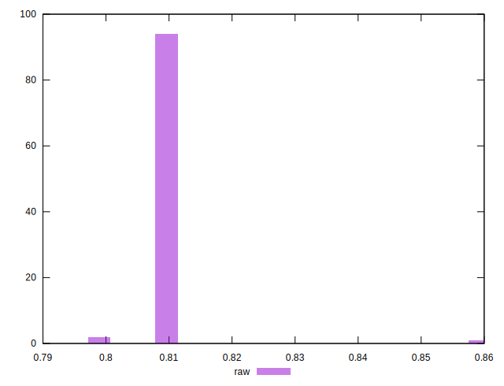

# //meta/score/samples/pages+cached+noadtech+nomedia+nocss

[→ Parent](../..)


## Raw


```yaml
p90min: 0.8
p90max: 0.81
p90range: 0.010000000000000009
p90mean: 0.8097872340425543
p90median: 0.81
p90stdev: 0.0014430489325798458
p90skewness: -6.634888026972226
p90eccentricity: 0.999999999999994
p90discretization: 47
outlandishness: 0.9997845623140055
confidence: 0.0024451679918828352
p90confidence: 0.0005834386797342844

```

