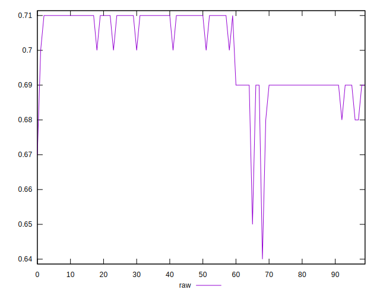
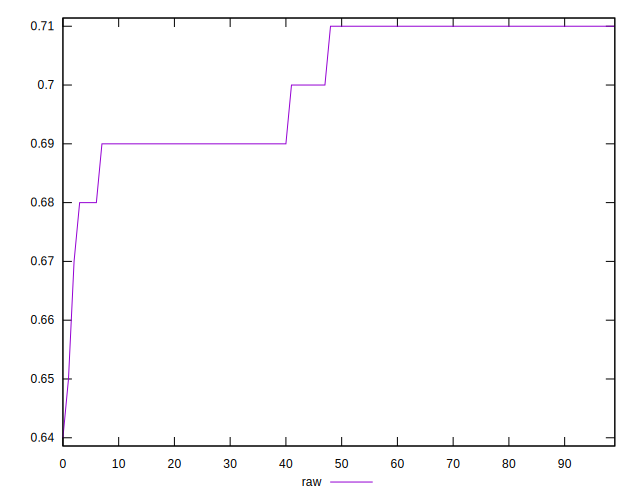
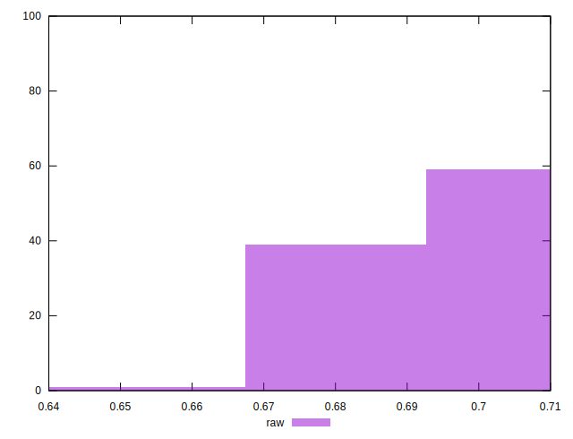

# //meta/score/samples/pages+cached+noadtech+nomedia

[→ Parent](../..)


## Raw


```yaml
p90min: 0.68
p90max: 0.71
p90range: 0.029999999999999916
p90mean: 0.7007446808510635
p90median: 0.71
p90stdev: 0.010235457946092544
p90skewness: -0.38730514986949516
p90eccentricity: 0.9999999999999999
p90discretization: 23.5
outlandishness: 0.9967356272478131
confidence: 0.005138545645406209
p90confidence: 0.004138294922451356

```

