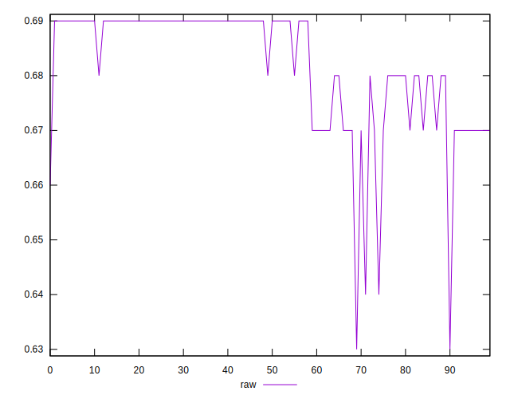
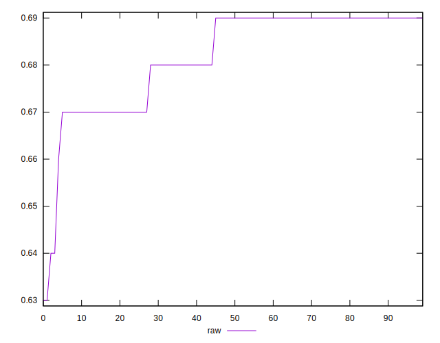
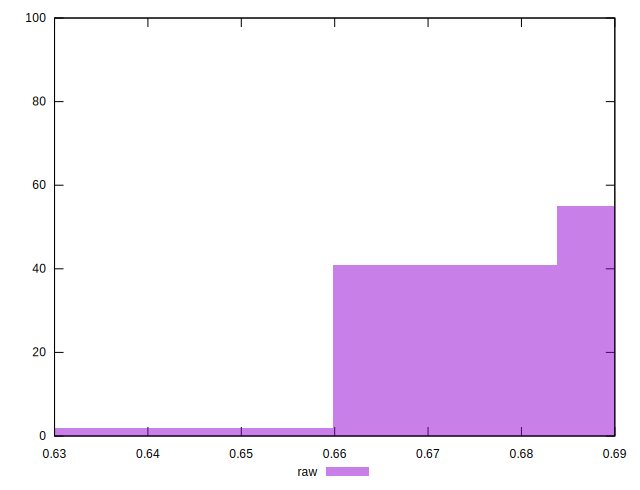

# //meta/score/samples/pages+cached+noadtech

[→ Parent](../..)


## Raw


```yaml
p90min: 0.64
p90max: 0.69
p90range: 0.04999999999999993
p90mean: 0.6824468085106387
p90median: 0.69
p90stdev: 0.009750741402555045
p90skewness: -1.2620404280084054
p90eccentricity: 1.0000000000000029
p90discretization: 18.8
outlandishness: 0.9963494017249371
confidence: 0.004997869729763004
p90confidence: 0.0039423193225794255

```

