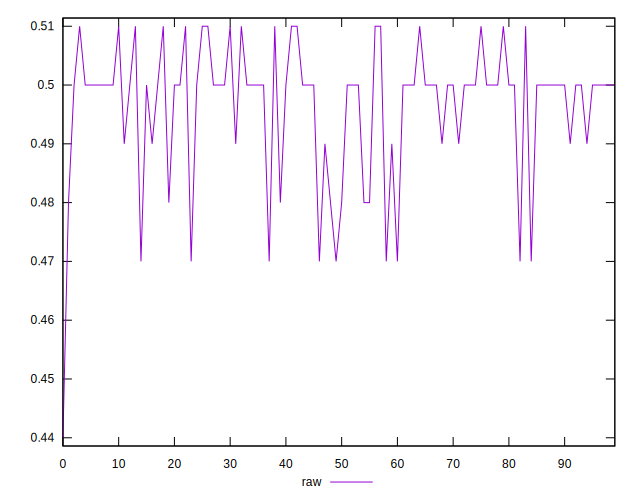
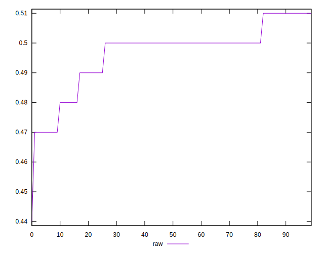
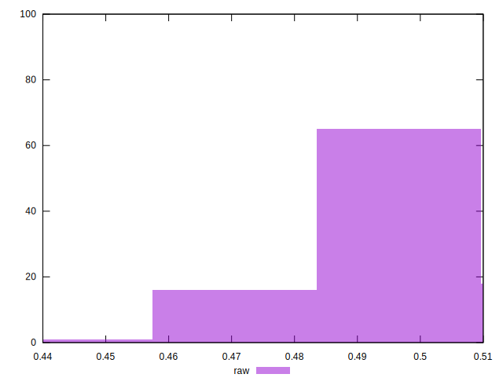

# //meta/score/samples/pages+cached

[→ Parent](../..)


## Raw


```yaml
p90min: 0.47
p90max: 0.51
p90range: 0.040000000000000036
p90mean: 0.4969148936170213
p90median: 0.5
p90stdev: 0.010621795711536677
p90skewness: -1.2258075854833361
p90eccentricity: 1.0000000000000002
p90discretization: 18.8
outlandishness: 0.9971247415591383
confidence: 0.004920407510719282
p90confidence: 0.004294495028153417

```

