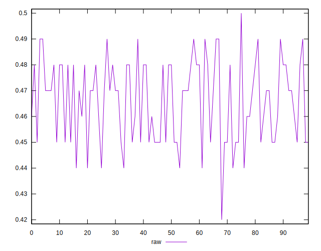
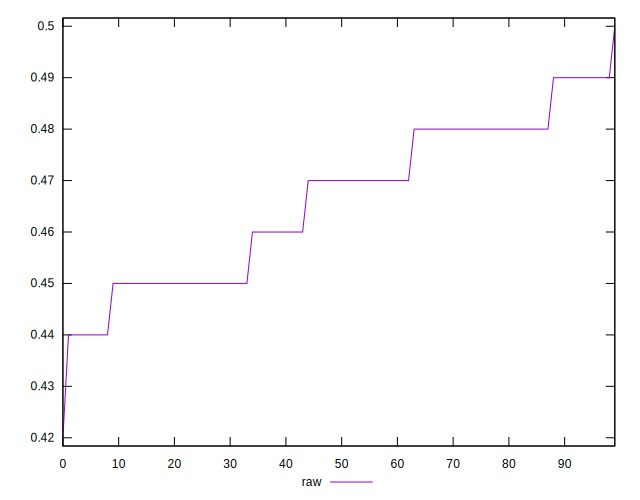
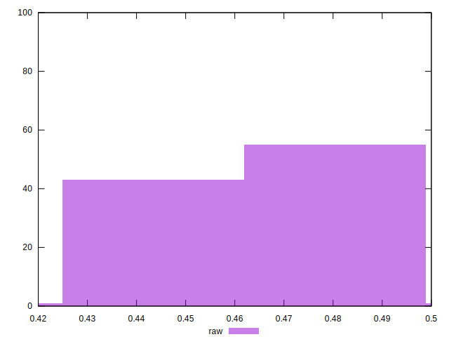

# //meta/score/samples/pages

[→ Parent](../..)


## Raw


```yaml
p90min: 0.44
p90max: 0.49
p90range: 0.04999999999999999
p90mean: 0.4662765957446809
p90median: 0.47
p90stdev: 0.01501658958882244
p90skewness: -0.10485213486727814
p90eccentricity: 1.0000000000000002
p90discretization: 15.666666666666666
outlandishness: 0.9992426713898708
confidence: 0.00643859355833265
p90confidence: 0.006071352818335143

```

