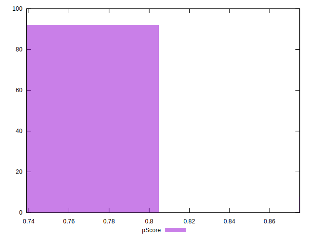

# //offscreen-images/samples/pages+cached+noadtech

[→ Parent](../..)


## Raw


```yaml
p90min: 150
p90max: 310
p90range: 160
p90mean: 294.25531914893617
p90median: 300
p90stdev: 34.44049329045148
p90skewness: -3.883973472471295
p90eccentricity: 1.000000000000001
p90discretization: 31.333333333333332
outlandishness: 0.9759811261004794
confidence: 16.381875649546963
p90confidence: 13.924625479508242

```


## Score


```yaml
p90min: 0.74
p90max: 0.88
p90range: 0.14
p90mean: 0.7546808510638299
p90median: 0.75
p90stdev: 0.029989435290830733
p90skewness: 3.85245155505969
p90eccentricity: 1.0000000000000002
p90discretization: 31.333333333333332
outlandishness: 1.008815508906973
confidence: 0.014198582989510882
p90confidence: 0.012125019558954496

```


## Raw Estimate


## Score Estimate


## P Score


```yaml
p90min: 0.7444444444444445
p90max: 0.875
p90range: 0.13055555555555554
p90mean: 0.7554078014184398
p90median: 0.75
p90stdev: 0.02843884488091458
p90skewness: 3.937849226790139
p90eccentricity: 1.0000000000000033
p90discretization: 31.333333333333332
outlandishness: 1.0082035885881173
confidence: 0.013510594502896657
p90confidence: 0.011498100816876381

```


## Score Difference


```yaml
p90min: 0
p90max: 0
p90range: 0
p90mean: 0
p90median: 0
p90stdev: 0
p90skewness: .nan
p90eccentricity: .nan
p90discretization: 94
outlandishness: .nan
confidence: 0
p90confidence: 0

```


## P Score Difference


```yaml
p90min: -0.0050000000000000044
p90max: 0.004444444444444473
p90range: 0.009444444444444478
p90mean: 0.0005496453900709288
p90median: 0
p90stdev: 0.0022021771483267992
p90skewness: 0.18312540323220228
p90eccentricity: 0.9999999999999987
p90discretization: 23.5
outlandishness: 0.8275130072840821
confidence: 0.0009549820832263385
p90confidence: 0.0008903615802298566

```

