# //offscreen-images/samples/pages+cached

[→ Parent](../..)


## Raw


```yaml
p90min: 150
p90max: 310
p90range: 160
p90mean: 182.12765957446808
p90median: 150
p90stdev: 59.748984508873114
p90skewness: 1.4669719251251265
p90eccentricity: 1.0000000000000002
p90discretization: 18.8
outlandishness: 1.0162335771683118
confidence: 25.47362106819064
p90confidence: 24.15709394899005

```

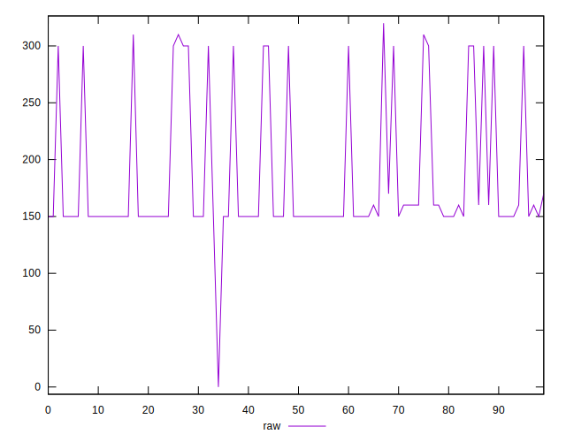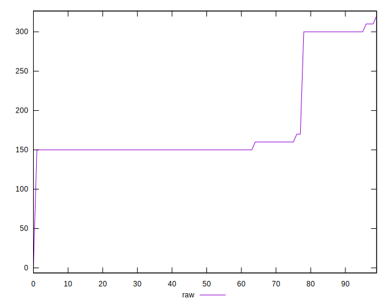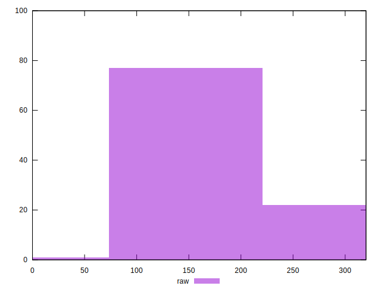
## Score


```yaml
p90min: 0.74
p90max: 0.88
p90range: 0.14
p90mean: 0.8519148936170214
p90median: 0.88
p90stdev: 0.051741513760860156
p90skewness: -1.4616619171531586
p90eccentricity: 0.9999999999999988
p90discretization: 18.8
outlandishness: 0.9969154691711889
confidence: 0.02191530729724262
p90confidence: 0.020919595860218146

```

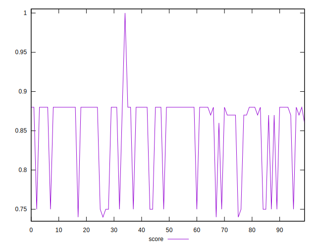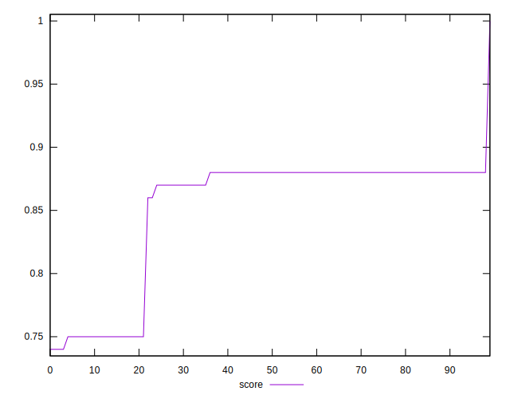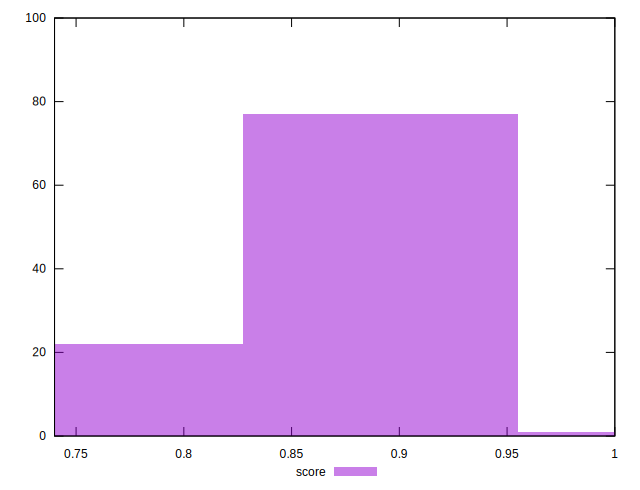
## Raw Estimate

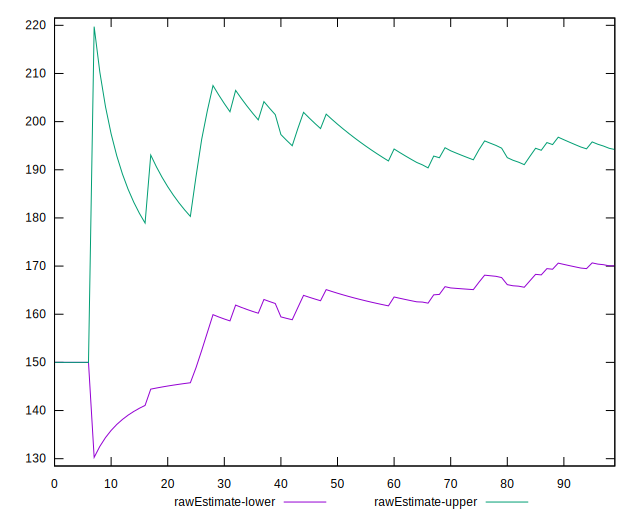
## Score Estimate

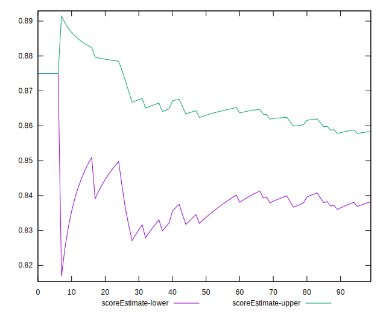
## P Score


```yaml
p90min: 0.7444444444444445
p90max: 0.875
p90range: 0.13055555555555554
p90mean: 0.8482565011820328
p90median: 0.875
p90stdev: 0.049728353298440955
p90skewness: -1.4663154724635379
p90eccentricity: 0.9999999999999966
p90discretization: 18.8
outlandishness: 0.9973666549166219
confidence: 0.021120382429057335
p90confidence: 0.02010565555939461

```

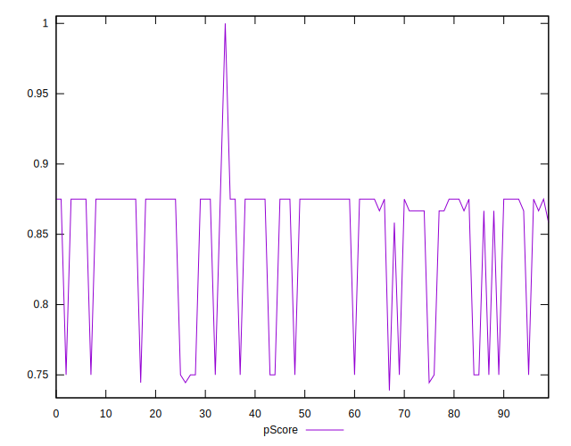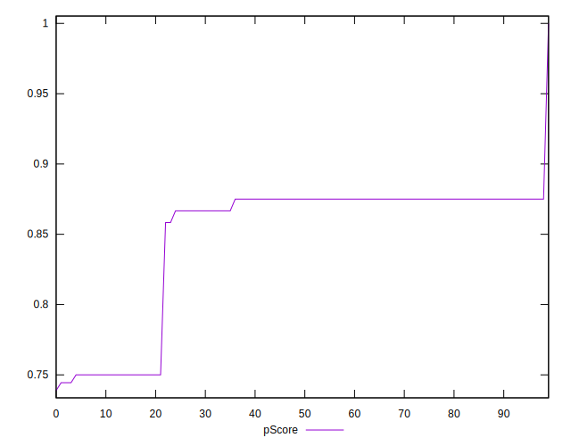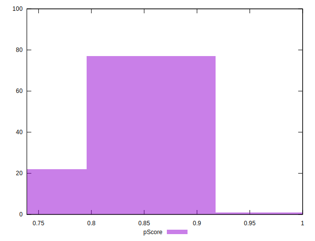
## Score Difference


```yaml
p90min: 0
p90max: 0
p90range: 0
p90mean: 0
p90median: 0
p90stdev: 0
p90skewness: .nan
p90eccentricity: .nan
p90discretization: 94
outlandishness: .nan
confidence: 0
p90confidence: 0

```


## P Score Difference


```yaml
p90min: -0.0050000000000000044
p90max: 0
p90range: 0.0050000000000000044
p90mean: -0.00366430260047281
p90median: -0.0050000000000000044
p90stdev: 0.0020052452051841905
p90skewness: 1.0883047978277534
p90eccentricity: 1.000000000000001
p90discretization: 18.8
outlandishness: 0.8921716555671171
confidence: 0.0009411531575284445
p90confidence: 0.0008107400855524587

```

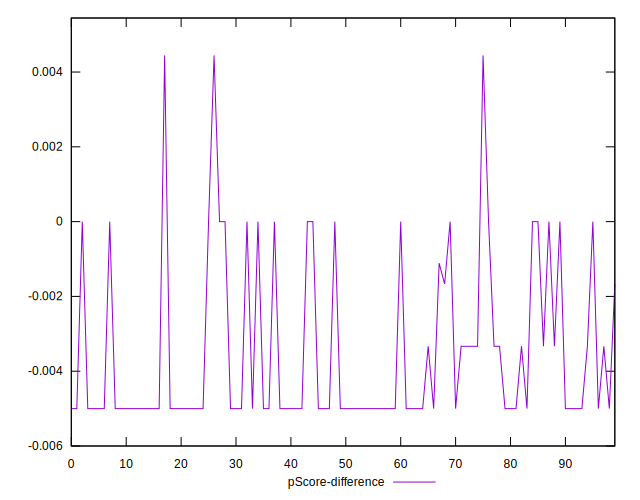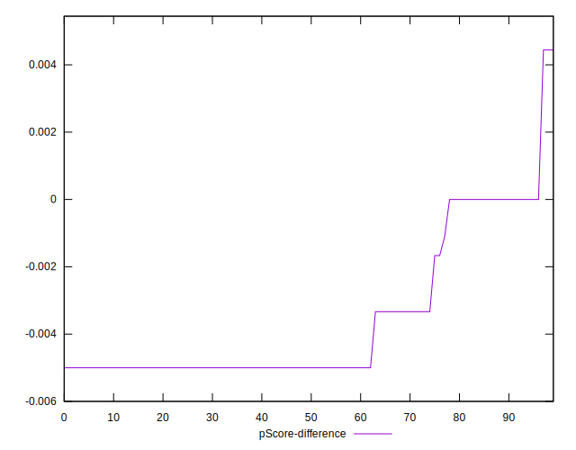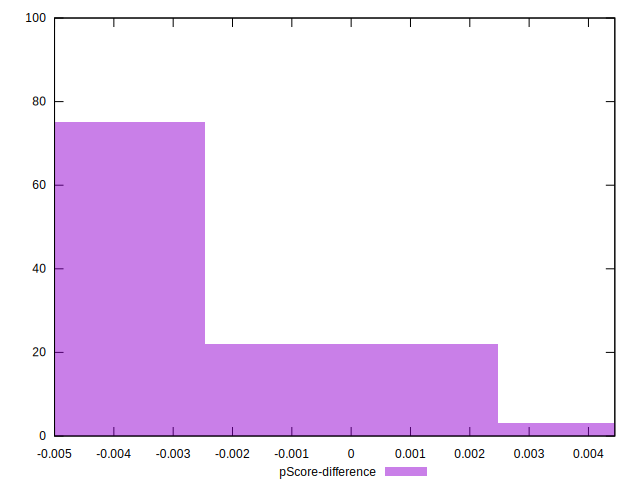