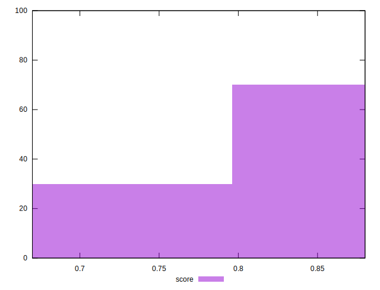
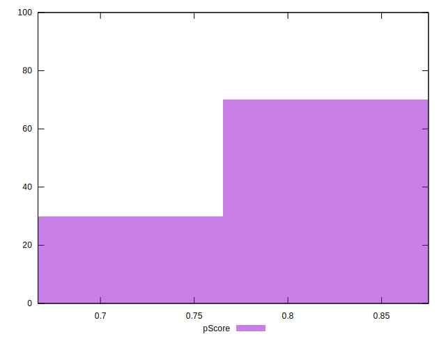
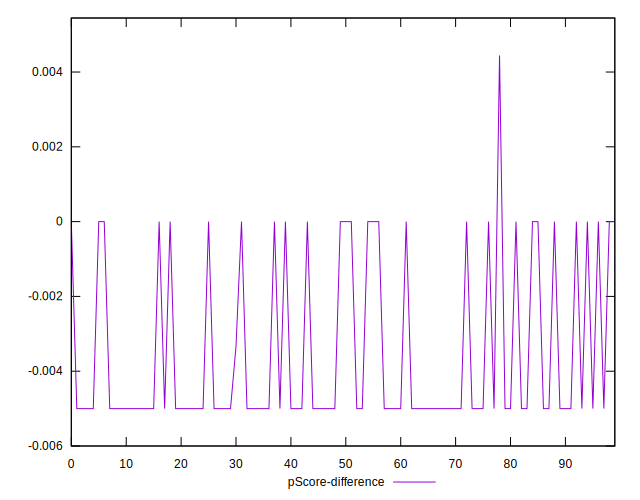

# //offscreen-images/samples/pages

[→ Parent](../..)


## Raw


```yaml
p90min: 150
p90max: 300
p90range: 150
p90mean: 193.08510638297872
p90median: 150
p90stdev: 67.87075633447898
p90skewness: 0.9404608211447976
p90eccentricity: 0.9999999999999992
p90discretization: 47
outlandishness: 1.0367390938991718
confidence: 28.495584675825747
p90confidence: 27.44080507205164

```


## Score


```yaml
p90min: 0.75
p90max: 0.88
p90range: 0.13
p90mean: 0.8426595744680851
p90median: 0.88
p90stdev: 0.058821322156548436
p90skewness: -0.9404608211447931
p90eccentricity: 0.9999999999999996
p90discretization: 47
outlandishness: 0.9939342358459909
confidence: 0.024090787908388166
p90confidence: 0.02378203106244475

```


## Raw Estimate


## Score Estimate


## P Score


```yaml
p90min: 0.75
p90max: 0.875
p90range: 0.125
p90mean: 0.839095744680851
p90median: 0.875
p90stdev: 0.056558963612065805
p90skewness: -0.9404608211447945
p90eccentricity: 1.000000000000001
p90discretization: 47
outlandishness: 0.9940865986265685
confidence: 0.02320970951888434
p90confidence: 0.022867337560043027

```


## Score Difference


```yaml
p90min: 0
p90max: 0
p90range: 0
p90mean: 0
p90median: 0
p90stdev: 0
p90skewness: .nan
p90eccentricity: .nan
p90discretization: 94
outlandishness: .nan
confidence: 0
p90confidence: 0

```


## P Score Difference


```yaml
p90min: -0.0050000000000000044
p90max: 0
p90range: 0.0050000000000000044
p90mean: -0.003599290780141848
p90median: -0.0050000000000000044
p90stdev: 0.002232142048761413
p90skewness: 0.9835515568241291
p90eccentricity: 1.0000000000000022
p90discretization: 31.333333333333332
outlandishness: 0.9395943777114492
confidence: 0.00093062559869054
p90confidence: 0.0009024766801084763

```

