# //render-blocking-resources/samples/pages+cached+noadtech+nomedia

[→ Parent](../..)


## Raw


```yaml
p90min: 320
p90max: 490
p90range: 170
p90mean: 371.29787234042556
p90median: 331
p90stdev: 59.33601213343039
p90skewness: 0.8195466341402631
p90eccentricity: 0.9999999999999994
p90discretization: 2.088888888888889
outlandishness: 1.0211293008309343
confidence: 26.226691056350674
p90confidence: 23.99012521213351

```

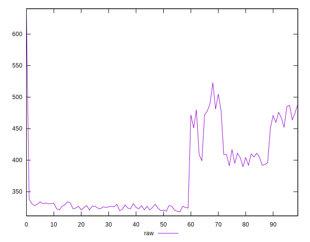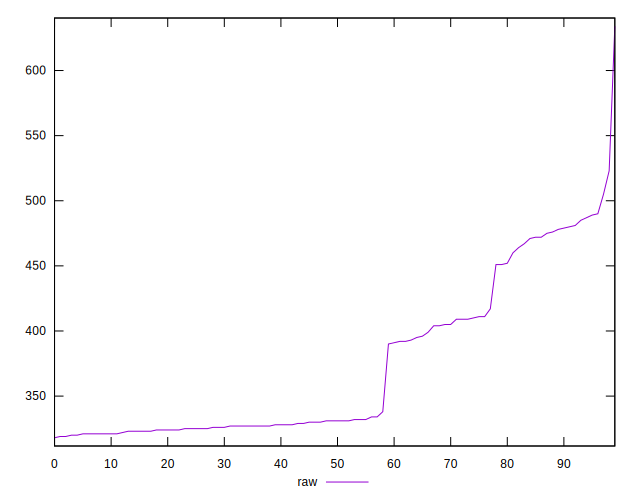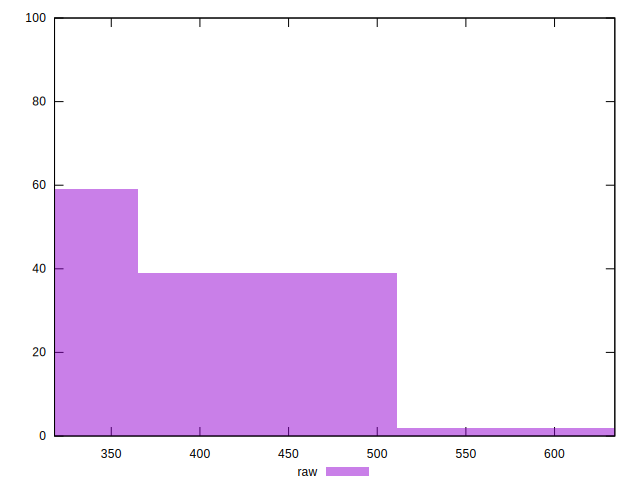
## Score


```yaml
p90min: 0.64
p90max: 0.74
p90range: 0.09999999999999998
p90mean: 0.7113829787234042
p90median: 0.73
p90stdev: 0.03337730990746739
p90skewness: -0.8038631892856978
p90eccentricity: 1.0000000000000002
p90discretization: 11.75
outlandishness: 0.9938721352633558
confidence: 0.01473684394816782
p90confidence: 0.013494770125833777

```

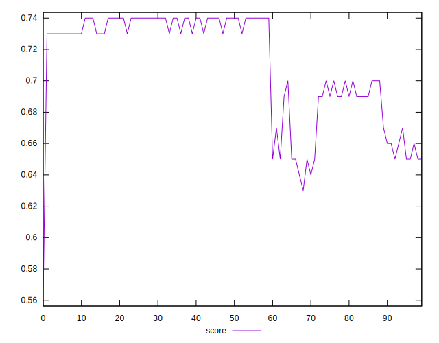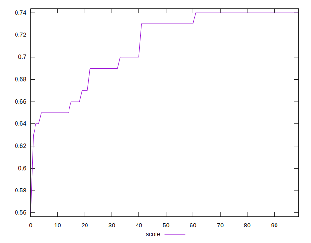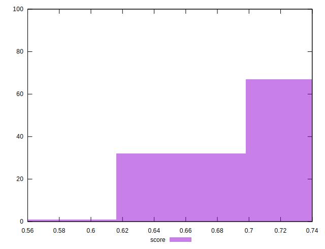
## Raw Estimate

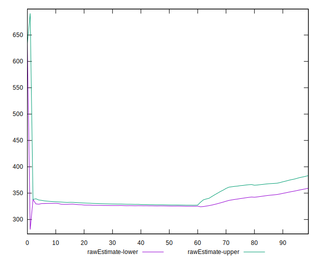
## Score Estimate

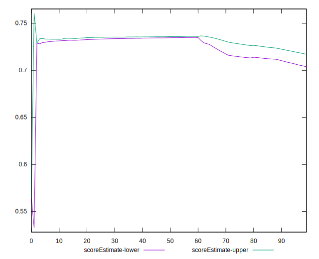
## P Score


```yaml
p90min: 0.6444444444444445
p90max: 0.7388888888888889
p90range: 0.09444444444444444
p90mean: 0.710390070921986
p90median: 0.7327777777777778
p90stdev: 0.032964451185239094
p90skewness: -0.8195466341402542
p90eccentricity: 1
p90discretization: 2.088888888888889
outlandishness: 0.9939060495051908
confidence: 0.014570383920194822
p90confidence: 0.013327847340074167

```

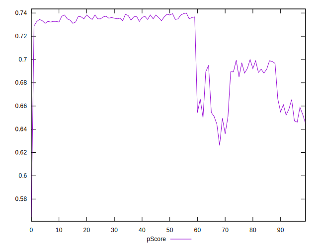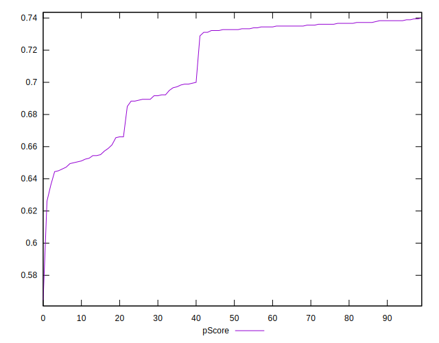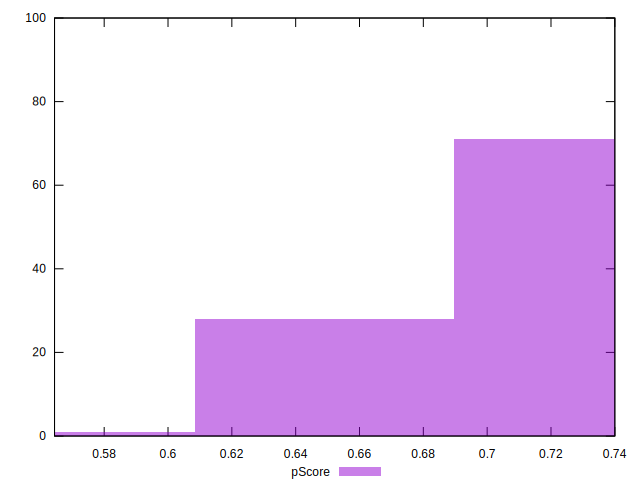
## Score Difference


```yaml
p90min: 0
p90max: 1.1102230246251565e-16
p90range: 1.1102230246251565e-16
p90mean: 1.8897413185109047e-17
p90median: 0
p90stdev: 4.172435856076858e-17
p90skewness: 1.7550294029241114
p90eccentricity: 0.9999999999999962
p90discretization: 47
outlandishness: 1.2460140625
confidence: 1.707291296655469e-17
p90confidence: 1.686956285531762e-17

```

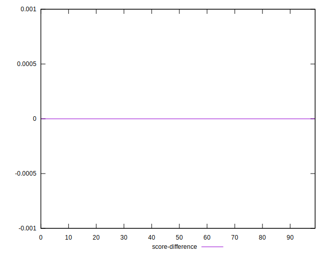
## P Score Difference


```yaml
p90min: -0.0050000000000000044
p90max: 0.004444444444444473
p90range: 0.009444444444444478
p90mean: -0.001022458628841602
p90median: -0.0016666666666665941
p90stdev: 0.002876842486421903
p90skewness: 0.37433025736366904
p90eccentricity: 0.9999999999999983
p90discretization: 3.9166666666666665
outlandishness: 0.9145107955494659
confidence: 0.0011856657188562493
p90confidence: 0.0011631353200759322

```

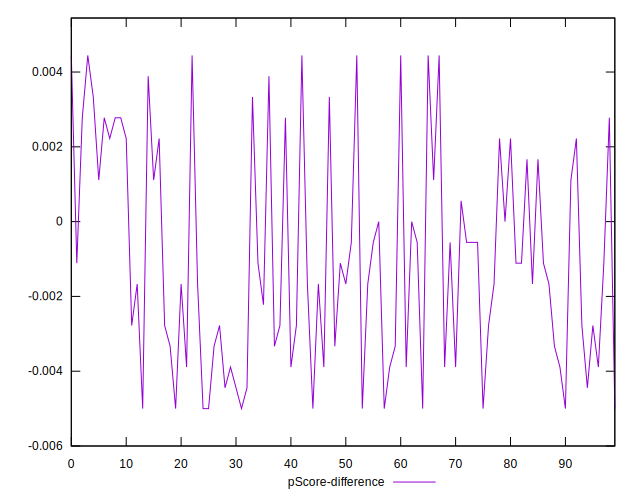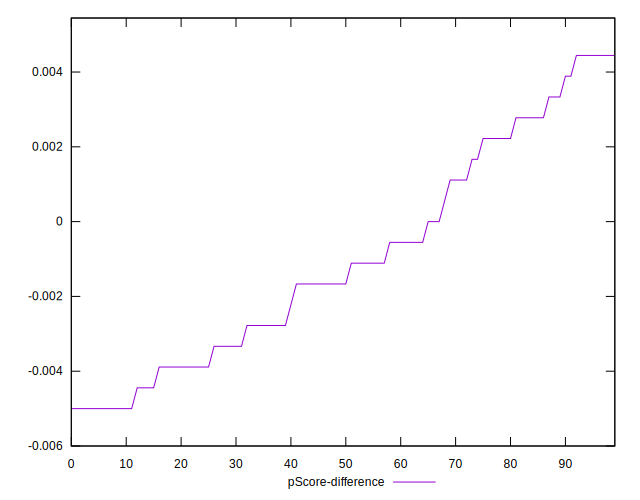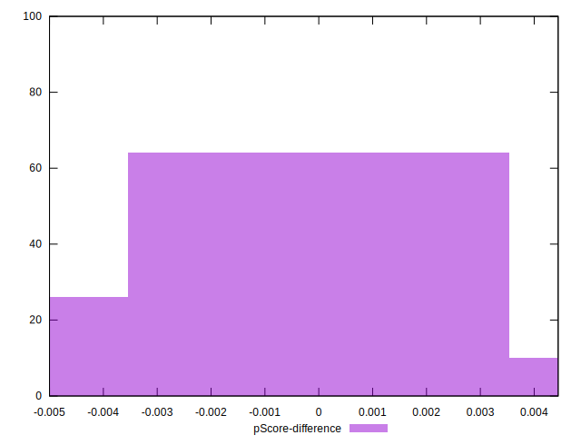