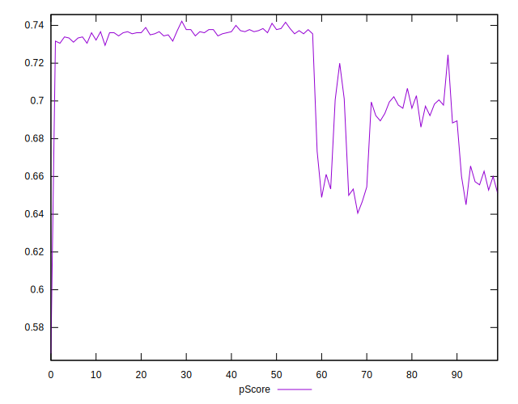

# //render-blocking-resources/samples/pages+cached+noadtech

[→ Parent](../..)


## Raw


```yaml
p90min: 318
p90max: 486
p90range: 168
p90mean: 366.2659574468085
p90median: 330
p90stdev: 54.61454399308536
p90skewness: 0.9495936781625531
p90eccentricity: 1.0000000000000002
p90discretization: 1.9583333333333333
outlandishness: 1.0199973275131773
confidence: 24.454073753709288
p90confidence: 22.081189848946877

```


## Score


```yaml
p90min: 0.65
p90max: 0.74
p90range: 0.08999999999999997
p90mean: 0.7141489361702127
p90median: 0.73
p90stdev: 0.031230426192174497
p90skewness: -0.915339766852991
p90eccentricity: 1.0000000000000027
p90discretization: 10.444444444444445
outlandishness: 0.9942701114399279
confidence: 0.013784497906100375
p90confidence: 0.012626764216876692

```


## Raw Estimate


## Score Estimate


## P Score


```yaml
p90min: 0.6466666666666667
p90max: 0.74
p90range: 0.09333333333333327
p90mean: 0.7131855791962175
p90median: 0.7333333333333333
p90stdev: 0.030341413329491865
p90skewness: -0.949593678162564
p90eccentricity: 1
p90discretization: 1.9583333333333333
outlandishness: 0.9943308031209629
confidence: 0.013585596529838491
p90confidence: 0.012267327693859374

```


## Score Difference


```yaml
p90min: 0
p90max: 1.1102230246251565e-16
p90range: 1.1102230246251565e-16
p90mean: 2.1259589833247678e-17
p90median: 0
p90stdev: 4.368430442181631e-17
p90skewness: 1.5681404042640346
p90eccentricity: 0.9999999999999996
p90discretization: 47
outlandishness: 1.2026777777777777
confidence: 1.7726031205081345e-17
p90confidence: 1.7661987976672326e-17

```


## P Score Difference


```yaml
p90min: -0.004444444444444473
p90max: 0.004444444444444473
p90range: 0.008888888888888946
p90mean: -0.0009810874704491571
p90median: -0.0016666666666667052
p90stdev: 0.002714921860507397
p90skewness: 0.43468595523811115
p90eccentricity: 0.9999999999999996
p90discretization: 3.9166666666666665
outlandishness: 0.9158259399041941
confidence: 0.0011289401792889573
p90confidence: 0.0010976692405325198

```

