# //render-blocking-resources/samples/pages+cached

[→ Parent](../..)


## Raw


```yaml
p90min: 1185
p90max: 1392
p90range: 207
p90mean: 1253.8297872340424
p90median: 1212.5
p90stdev: 70.28084062907331
p90skewness: 0.781099066375172
p90eccentricity: 0.9999999999999996
p90discretization: 1.5666666666666667
outlandishness: 1.0059269643400528
confidence: 30.32344494040625
p90confidence: 28.415225528032018

```

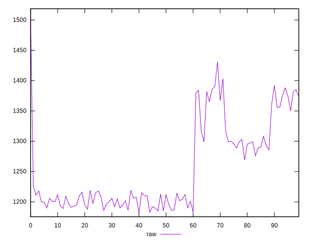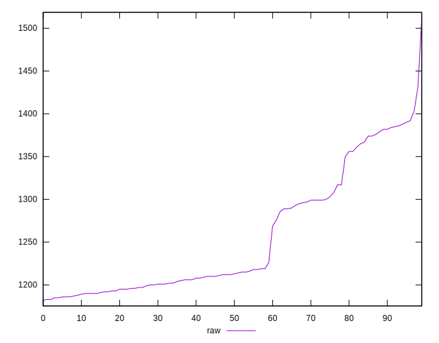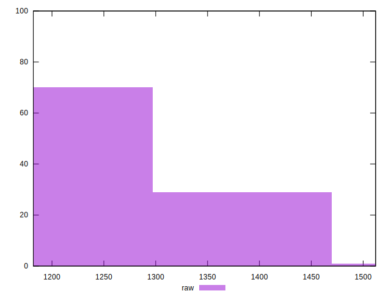
## Score


```yaml
p90min: 0.42
p90max: 0.45
p90range: 0.030000000000000027
p90mean: 0.4428723404255314
p90median: 0.45
p90stdev: 0.008946928680853596
p90skewness: -0.8625272551757921
p90eccentricity: 1.000000000000001
p90discretization: 23.5
outlandishness: 0.9974169956220132
confidence: 0.0038747848527113057
p90confidence: 0.0036173300429264525

```

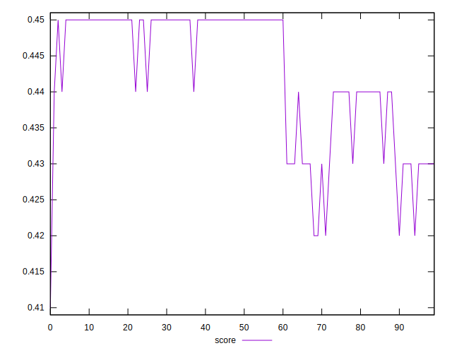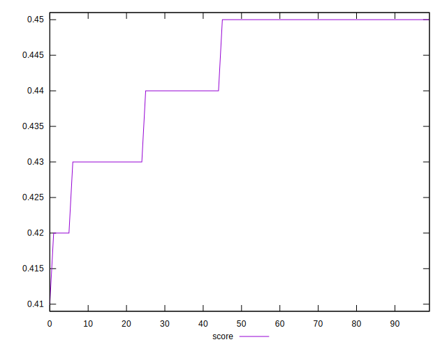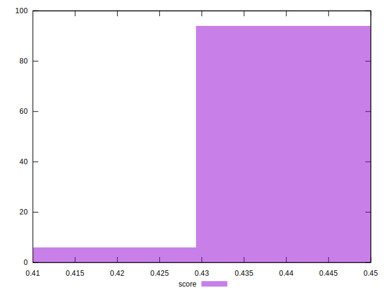
## Raw Estimate

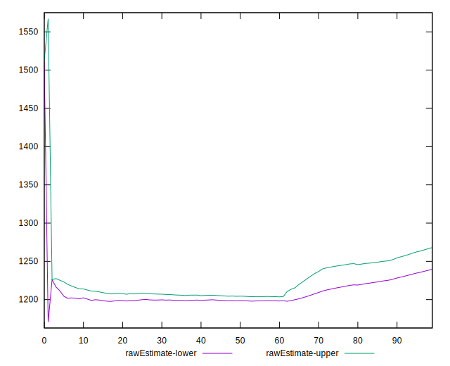
## Score Estimate

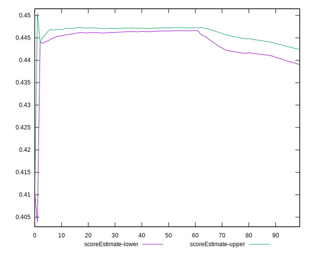
## P Score


```yaml
p90min: 0.4244705882352941
p90max: 0.44882352941176473
p90range: 0.024352941176470633
p90mean: 0.44072590738423023
p90median: 0.4455882352941176
p90stdev: 0.008268334191655681
p90skewness: -0.7810990663751688
p90eccentricity: 1.0000000000000004
p90discretization: 1.5666666666666667
outlandishness: 0.9980201778055401
confidence: 0.00356746411063603
p90confidence: 0.0033429677091802367

```

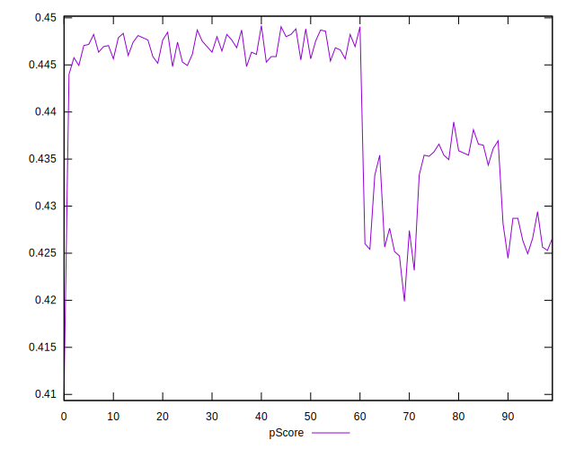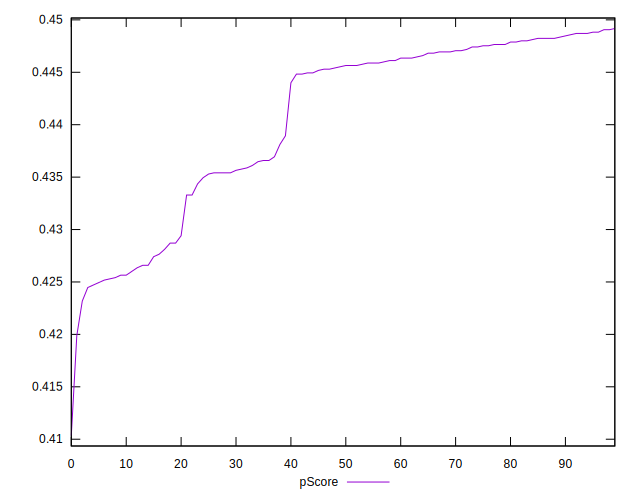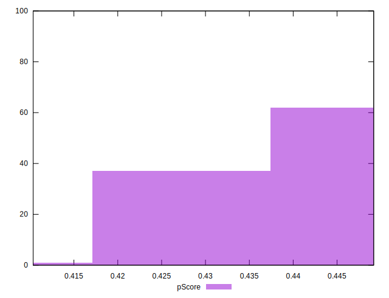
## Score Difference


```yaml
p90min: 0
p90max: 0
p90range: 0
p90mean: 0
p90median: 0
p90stdev: 0
p90skewness: .nan
p90eccentricity: .nan
p90discretization: 94
outlandishness: .inf
confidence: 2.165089820536967e-18
p90confidence: 0

```


## P Score Difference


```yaml
p90min: -0.004705882352941171
p90max: 0.004941176470588227
p90range: 0.009647058823529397
p90mean: -0.0021439299123904966
p90median: -0.002705882352941197
p90stdev: 0.0025075108703694103
p90skewness: 1.5741506890727828
p90eccentricity: 1.0000000000000009
p90discretization: 2
outlandishness: 0.8794782563474464
confidence: 0.001081202343453982
p90confidence: 0.0010138109655174474

```

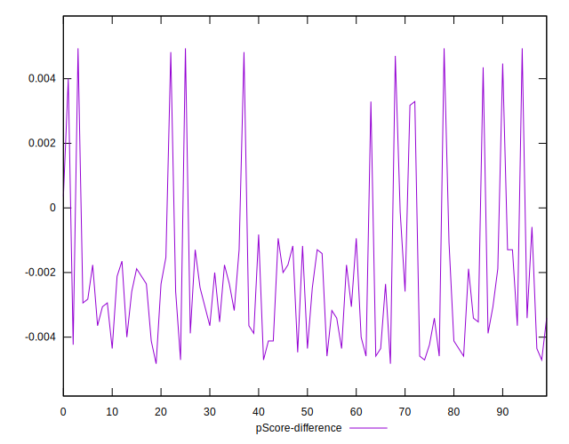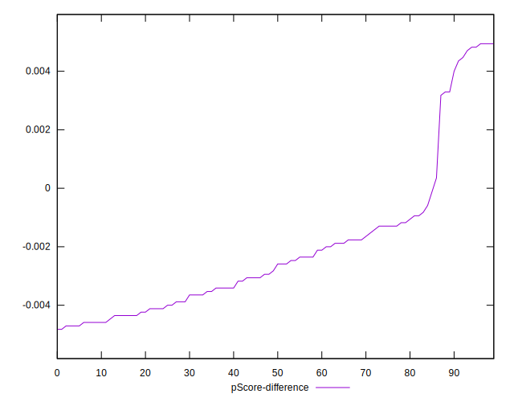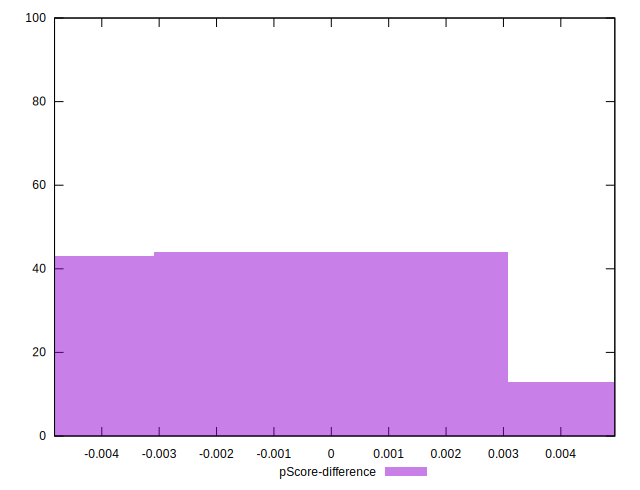