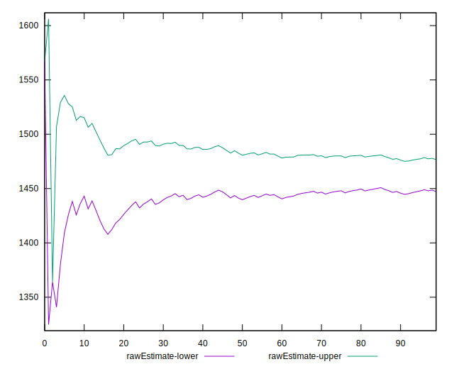

# //render-blocking-resources/samples/pages

[→ Parent](../..)


## Raw


```yaml
p90min: 1331
p90max: 1562
p90range: 231
p90mean: 1461.840425531915
p90median: 1491.5
p90stdev: 72.86964508138493
p90skewness: -0.6461951219731465
p90eccentricity: 1.0000000000000002
p90discretization: 1.4029850746268657
outlandishness: 0.9984676902648616
confidence: 30.19627556284774
p90confidence: 29.4619042772042

```


## Score


```yaml
p90min: 0.4
p90max: 0.43
p90range: 0.02999999999999997
p90mean: 0.41585106382978687
p90median: 0.41
p90stdev: 0.009272422446006349
p90skewness: 0.7513768825637299
p90eccentricity: 1.0000000000000027
p90discretization: 23.5
outlandishness: 0.9997544279715794
confidence: 0.003807781791650872
p90confidence: 0.0037489303291779763

```


## Raw Estimate


## Score Estimate


## P Score


```yaml
p90min: 0.40447058823529414
p90max: 0.4316470588235294
p90range: 0.027176470588235246
p90mean: 0.4162540675844805
p90median: 0.4127647058823529
p90stdev: 0.008572899421339403
p90skewness: 0.6461951219731139
p90eccentricity: 0.9999999999999997
p90discretization: 1.4029850746268657
outlandishness: 1.0006334383231492
confidence: 0.00355250300739385
p90confidence: 0.003466106385553435

```


## Score Difference


```yaml
p90min: 0
p90max: 5.551115123125783e-17
p90range: 5.551115123125783e-17
p90mean: 3.4842105560044804e-17
p90median: 5.551115123125783e-17
p90stdev: 2.6835667889989073e-17
p90skewness: -0.5281426177627947
p90eccentricity: 0.9999999999999996
p90discretization: 47
outlandishness: 0.9757421430623385
confidence: 1.0561995153875768e-17
p90confidence: 1.0849920810053081e-17

```


## P Score Difference


```yaml
p90min: -0.003529411764705892
p90max: 0.004470588235294115
p90range: 0.008000000000000007
p90mean: 0.0006082603254067741
p90median: 0.0004705882352941393
p90stdev: 0.002286202339271055
p90skewness: 0.1473499500008245
p90eccentricity: 0.9999999999999994
p90discretization: 1.6491228070175439
outlandishness: 0.9277732662703839
confidence: 0.000973555678038273
p90confidence: 0.0009243337798983006

```

