# //speed-index/samples/pages+cached+noadtech+nomedia+nocss

[→ Parent](../..)


## Raw


```yaml
p90min: 1584.87185
p90max: 1623.4279999999999
p90range: 38.55614999999989
p90mean: 1597.6541585106377
p90median: 1590.1385249999998
p90stdev: 12.709654671199829
p90skewness: 0.6884460968327158
p90eccentricity: 0.9999999999999997
p90discretization: 1
outlandishness: 1.019405278975748
confidence: 59.787263147966065
p90confidence: 5.138636655921722

```

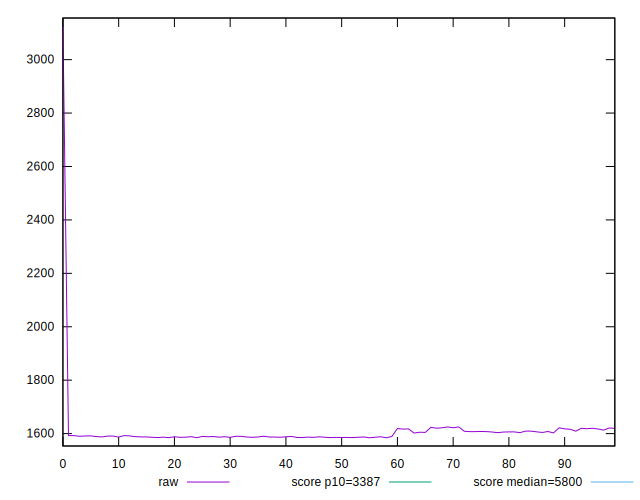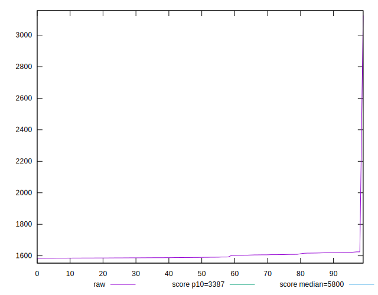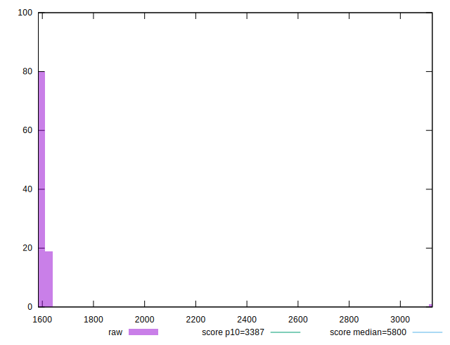
## Score


```yaml
p90min: 1
p90max: 1
p90range: 0
p90mean: 1
p90median: 1
p90stdev: 0
p90skewness: .nan
p90eccentricity: .nan
p90discretization: 94
outlandishness: 0.9986004900000002
confidence: 0.002730195358518301
p90confidence: 0

```

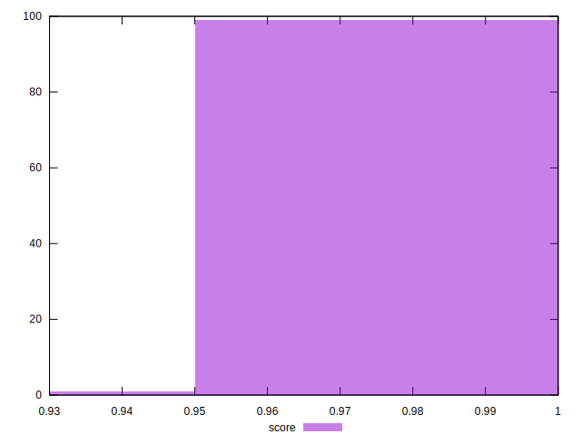
## Raw Estimate

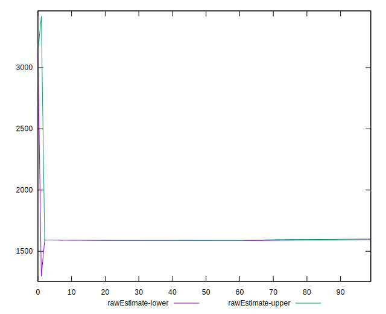
## Score Estimate

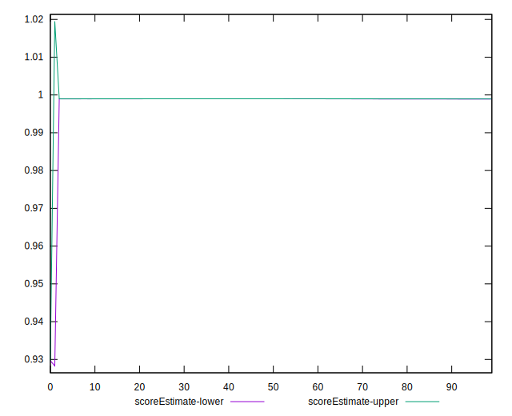
## P Score


```yaml
p90min: 0.9987917225205631
p90max: 0.9990021161246525
p90range: 0.00021039360408936503
p90mean: 0.9989341583965768
p90median: 0.9989752289701279
p90stdev: 0.00006877376465046831
p90skewness: -0.7221713583749817
p90eccentricity: 1.0000000000000002
p90discretization: 1
outlandishness: 0.9986118374326427
confidence: 0.0027015901738169945
p90confidence: 0.000027805900092584314

```

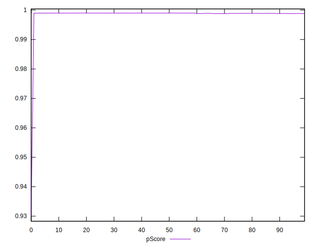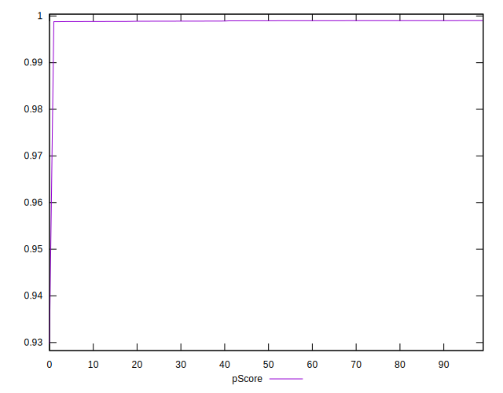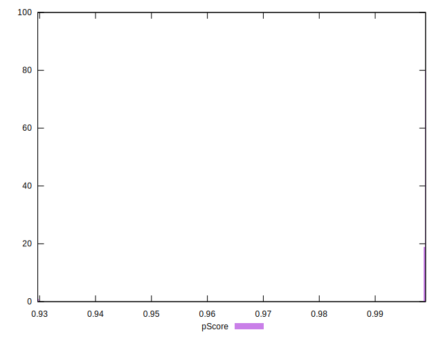
## Score Difference


```yaml
p90min: 0
p90max: 0
p90range: 0
p90mean: 0
p90median: 0
p90stdev: 0
p90skewness: .nan
p90eccentricity: .nan
p90discretization: 94
outlandishness: .nan
confidence: 0
p90confidence: 0

```


## P Score Difference


```yaml
p90min: -0.001198955273808755
p90max: -0.0009970312275175974
p90range: 0.00020192404629115757
p90mean: -0.001063594302871053
p90median: -0.0010241364952470189
p90stdev: 0.00006752274962831214
p90skewness: -0.7518266408377645
p90eccentricity: 1.0000000000000007
p90discretization: 1
outlandishness: 0.9921732648883731
confidence: 0.00004003317401180702
p90confidence: 0.0000273001025853926

```

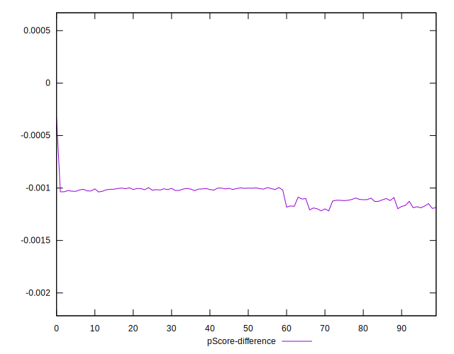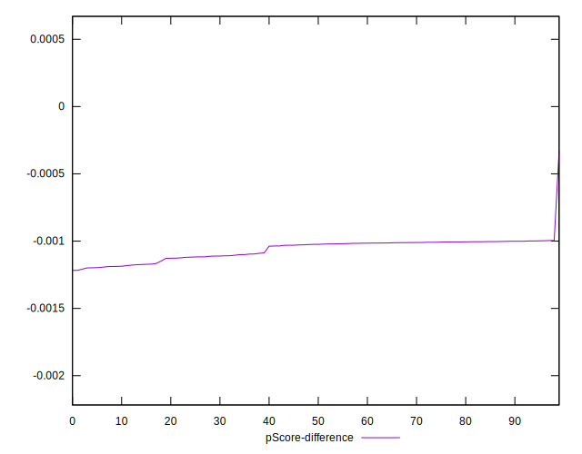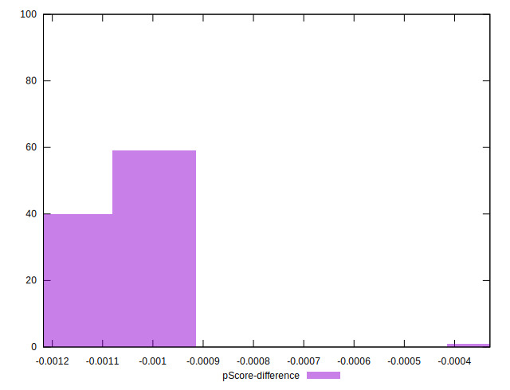