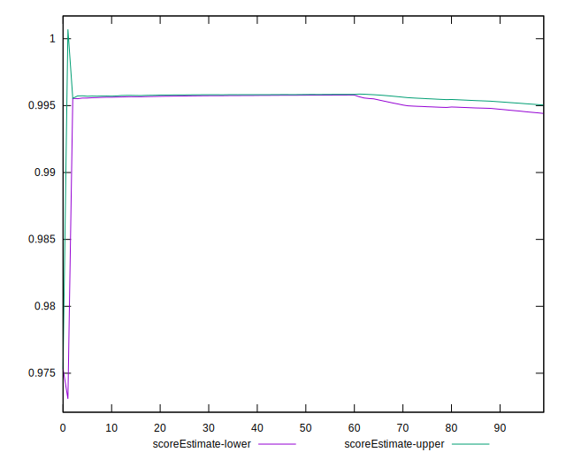

# //speed-index/samples/pages+cached+noadtech+nomedia

[→ Parent](../..)


## Raw


```yaml
p90min: 1907.8377499999995
p90max: 2160.8553
p90range: 253.0175500000007
p90mean: 1982.5225984042552
p90median: 1924.1897750000003
p90stdev: 85.37268097691111
p90skewness: 0.82627425548511
p90eccentricity: 0.9999999999999999
p90discretization: 1
outlandishness: 1.0074248986965324
confidence: 40.95653022901622
p90confidence: 34.51700295810256

```


## Score


```yaml
p90min: 0.99
p90max: 1
p90range: 0.010000000000000009
p90mean: 0.9959574468085092
p90median: 1
p90stdev: 0.004907473444540774
p90skewness: -0.39019948628577295
p90eccentricity: 0.9999999999999983
p90discretization: 47
outlandishness: 0.9996838532329733
confidence: 0.0020125690498812424
p90confidence: 0.001984139111759126

```


## Raw Estimate


## Score Estimate


## P Score


```yaml
p90min: 0.9906716817561025
p90max: 0.9959636316853678
p90range: 0.005291949929265294
p90mean: 0.9945526193829578
p90median: 0.9957141504457467
p90stdev: 0.0017150570770762103
p90skewness: -0.966869934698319
p90eccentricity: 0.9999999999999996
p90discretization: 1
outlandishness: 0.9995167190854127
confidence: 0.0010279919197977456
p90confidence: 0.0006934142107914409

```


## Score Difference


```yaml
p90min: 0
p90max: 0
p90range: 0
p90mean: 0
p90median: 0
p90stdev: 0
p90skewness: .nan
p90eccentricity: .nan
p90discretization: 94
outlandishness: .nan
confidence: 0
p90confidence: 0

```


## P Score Difference


```yaml
p90min: -0.0043727822792126725
p90max: 0.004130572938500943
p90range: 0.008503355217713615
p90mean: -0.001571244655511116
p90median: -0.004080922160741851
p90stdev: 0.0033339042509679985
p90skewness: 0.6116628554670561
p90eccentricity: 1.0000000000000002
p90discretization: 1
outlandishness: 0.8965258960297755
confidence: 0.001339784200179368
p90confidence: 0.001347929824574858

```

