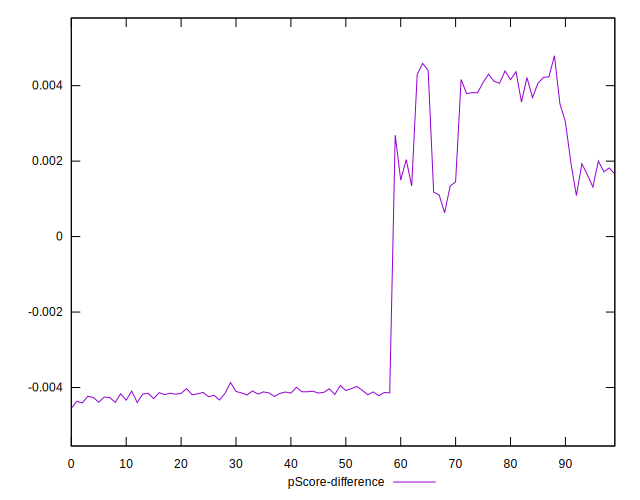

# //speed-index/samples/pages+cached+noadtech

[→ Parent](../..)


## Raw


```yaml
p90min: 1904.9456499999997
p90max: 2144.9882500000003
p90range: 240.04260000000068
p90mean: 1976.5862202127655
p90median: 1923.8332
p90stdev: 79.07888388360996
p90skewness: 0.9172348722181705
p90eccentricity: 1.0000000000000002
p90discretization: 1.010752688172043
outlandishness: 1.0069892784693288
confidence: 38.810854966485635
p90confidence: 31.972359749042205

```


## Score


```yaml
p90min: 0.99
p90max: 1
p90range: 0.010000000000000009
p90mean: 0.9958510638297858
p90median: 1
p90stdev: 0.004927036671025286
p90skewness: -0.3454668136699174
p90eccentricity: 1.0000000000000007
p90discretization: 47
outlandishness: 0.999696636620482
confidence: 0.002018287128597927
p90confidence: 0.0019920487139727257

```


## Raw Estimate


## Score Estimate


## P Score


```yaml
p90min: 0.9911030757611584
p90max: 0.996006591949797
p90range: 0.004903516188638601
p90mean: 0.9946861144519331
p90median: 0.9957196919601068
p90stdev: 0.0015690280847437338
p90skewness: -1.0787720405396808
p90eccentricity: 1.0000000000000004
p90discretization: 1.010752688172043
outlandishness: 0.9995428831028076
confidence: 0.0009850122357850423
p90confidence: 0.0006343732728399666

```


## Score Difference


```yaml
p90min: 0
p90max: 0
p90range: 0
p90mean: 0
p90median: 0
p90stdev: 0
p90skewness: .nan
p90eccentricity: .nan
p90discretization: 94
outlandishness: .nan
confidence: 0
p90confidence: 0

```


## P Score Difference


```yaml
p90min: -0.004393404746701246
p90max: 0.004389085851606134
p90range: 0.00878249059830738
p90mean: -0.0013250731719970069
p90median: -0.0040852160611244415
p90stdev: 0.0035337197812031415
p90skewness: 0.5404231737747454
p90eccentricity: 1.0000000000000002
p90discretization: 1.010752688172043
outlandishness: 0.8774908858806766
confidence: 0.0014175135001778093
p90confidence: 0.0014287171814819995

```

