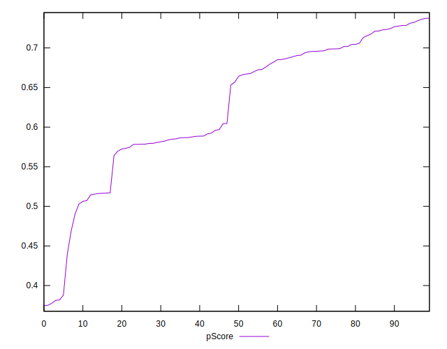

# //speed-index/samples/pages+cached

[→ Parent](../..)


## Raw


```yaml
p90min: 4459.527399099248
p90max: 6583.112403052612
p90range: 2123.5850039533634
p90mean: 5074.596414605899
p90median: 4875.557987752189
p90stdev: 502.7690555386239
p90skewness: 0.9412278505312832
p90eccentricity: 0.9999999999999999
p90discretization: 1
outlandishness: 1.0109009913506752
confidence: 222.01269083351616
p90confidence: 203.27440556730895

```


## Score


```yaml
p90min: 0.38
p90max: 0.73
p90range: 0.35
p90mean: 0.6268085106382981
p90median: 0.66
p90stdev: 0.08637144876411182
p90skewness: -0.8137541410133781
p90eccentricity: 0.9999999999999992
p90discretization: 4.2727272727272725
outlandishness: 0.9869336626947425
confidence: 0.03771636872177822
p90confidence: 0.03492081446162777

```


## Raw Estimate


## Score Estimate


## P Score


```yaml
p90min: 0.38142649347123114
p90max: 0.7343897590468662
p90range: 0.35296326557563507
p90mean: 0.6264365705348436
p90median: 0.6604344606712409
p90stdev: 0.08635979201561911
p90skewness: -0.8097021232160345
p90eccentricity: 1.0000000000000007
p90discretization: 1
outlandishness: 0.9866296416471682
confidence: 0.037688133908096805
p90confidence: 0.03491610152515206

```


## Score Difference


```yaml
p90min: 0
p90max: 1.1102230246251565e-16
p90range: 1.1102230246251565e-16
p90mean: 2.65744872915596e-17
p90median: 0
p90stdev: 4.702526560023989e-17
p90skewness: 1.2215638849347332
p90eccentricity: 0.9999999999999991
p90discretization: 31.333333333333332
outlandishness: 1.134935111111111
confidence: 1.884343169021469e-17
p90confidence: 1.9012770985463403e-17

```


## P Score Difference


```yaml
p90min: -0.004741855652374061
p90max: 0.004596247181995916
p90range: 0.009338102834369977
p90mean: -0.0004907017852814149
p90median: -0.0012425819920051095
p90stdev: 0.0028629407644200928
p90skewness: 0.3145222330259214
p90eccentricity: 1.0000000000000002
p90discretization: 1
outlandishness: 0.8993899350059418
confidence: 0.0011820020428698601
p90confidence: 0.0011575147190362508

```

