# //speed-index/samples/pages

[→ Parent](../..)


## Raw


```yaml
p90min: 4871.143157330085
p90max: 6764.507665154467
p90range: 1893.3645078243817
p90mean: 5799.018817178436
p90median: 5629.7625447275
p90stdev: 564.5454052141333
p90skewness: 0.2425889844865202
p90eccentricity: 1.0000000000000002
p90discretization: 1
outlandishness: 1.000596523443081
confidence: 238.10868450748524
p90confidence: 228.2511829168105

```

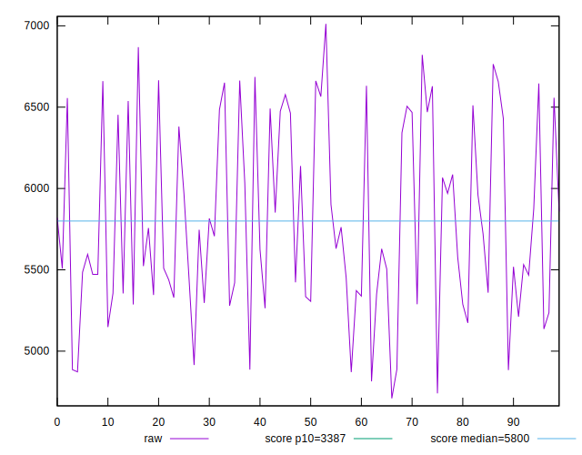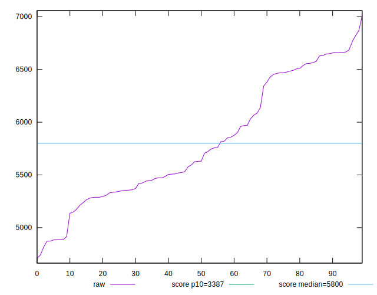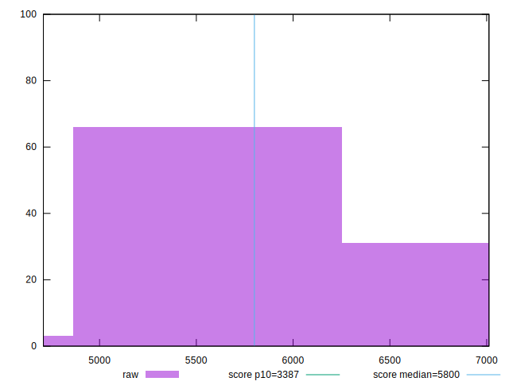
## Score


```yaml
p90min: 0.36
p90max: 0.66
p90range: 0.30000000000000004
p90mean: 0.505
p90median: 0.53
p90stdev: 0.09091438572588441
p90skewness: -0.1505607656107106
p90eccentricity: 0.9999999999999996
p90discretization: 3.6153846153846154
outlandishness: 1.001188471718459
confidence: 0.03822464450832034
p90confidence: 0.036757567937723785

```

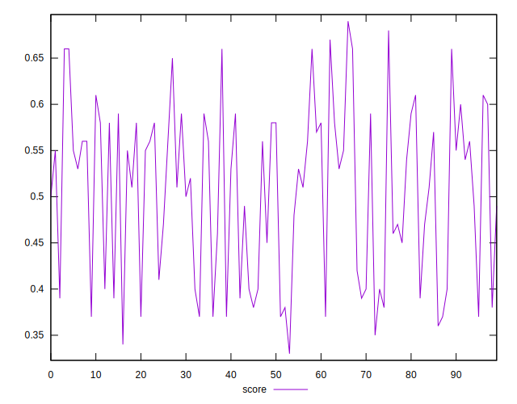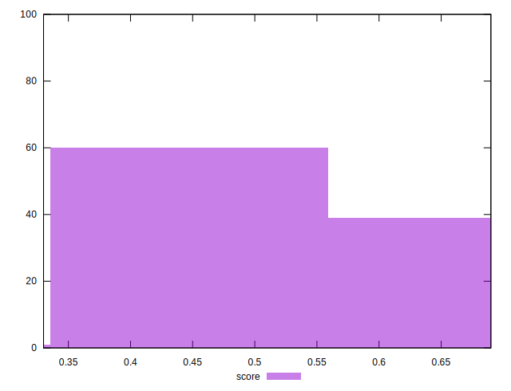
## Raw Estimate

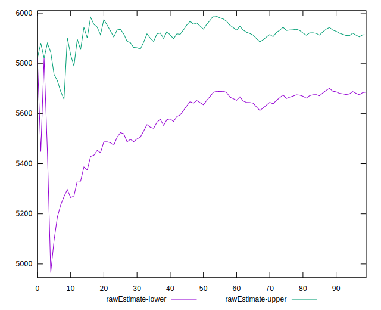
## Score Estimate

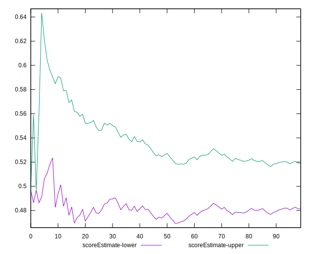
## P Score


```yaml
p90min: 0.3569975639059415
p90max: 0.6612244279158738
p90range: 0.30422686400993226
p90mean: 0.5046184274381436
p90median: 0.5282911419079566
p90stdev: 0.09058782669094553
p90skewness: -0.1437593634252721
p90eccentricity: 0.9999999999999997
p90discretization: 1
outlandishness: 1.0014668610212456
confidence: 0.0381672038058812
p90confidence: 0.03662553695256557

```

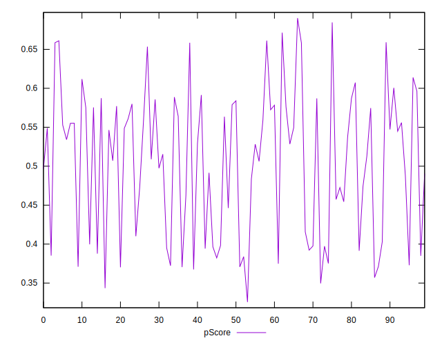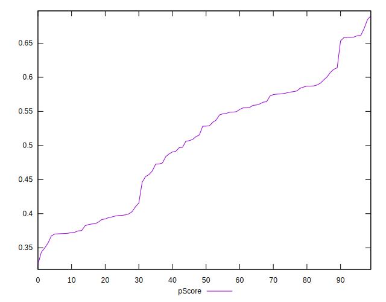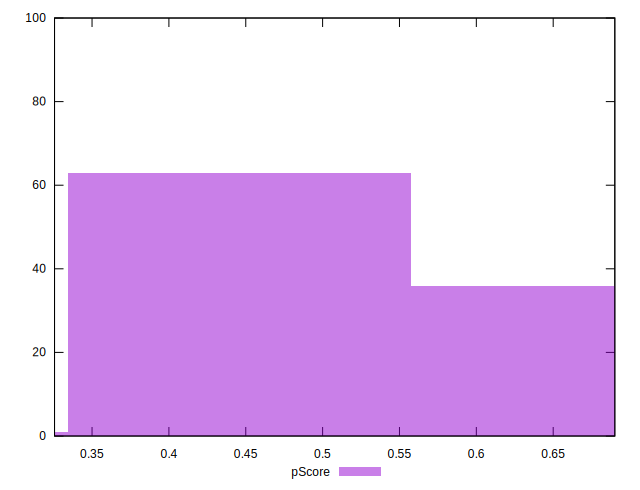
## Score Difference


```yaml
p90min: 0
p90max: 5.551115123125783e-17
p90range: 5.551115123125783e-17
p90mean: 2.9527208101732887e-18
p90median: 0
p90stdev: 1.2457542745436645e-17
p90skewness: 3.9819818903758177
p90eccentricity: 0.9999999999999976
p90discretization: 47
outlandishness: 4.276624
confidence: 8.646679982371953e-18
p90confidence: 5.0367053590740306e-18

```

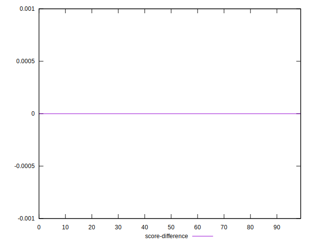
## P Score Difference


```yaml
p90min: -0.004802691284334304
p90max: 0.004634331114027557
p90range: 0.00943702239836186
p90mean: -0.00033264668225938167
p90median: -0.0007977449654674174
p90stdev: 0.002799281076654404
p90skewness: 0.1718866154062496
p90eccentricity: 1.0000000000000002
p90discretization: 1
outlandishness: 0.8774941089350156
confidence: 0.0011621283497906113
p90confidence: 0.0011317764898301841

```

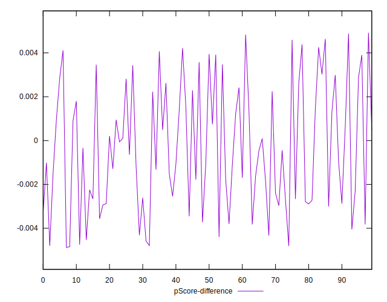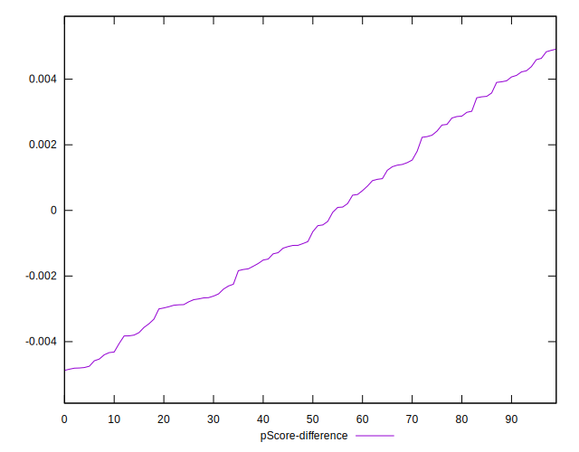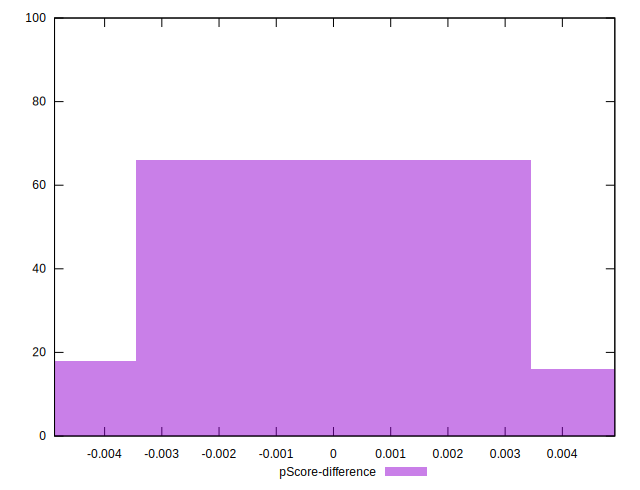