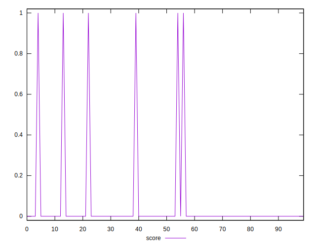
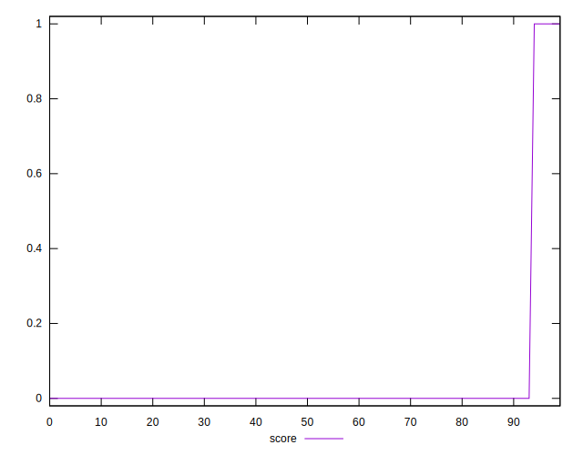
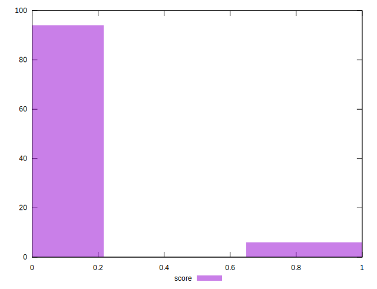

# //third-party-summary/samples/pages+cached

[→ Parent](../..)


## Raw


```yaml
p90range: 0

```


## Score


```yaml
p90min: 0
p90max: 1
p90range: 1
p90mean: 0.031914893617021274
p90median: 0
p90stdev: 0.1757735281048754
p90skewness: 5.32600228748549
p90eccentricity: 1.0000000000000038
p90discretization: 47
outlandishness: 3.5344000000000007
confidence: 0.09309313132281
p90confidence: 0.0710669422598192

```

