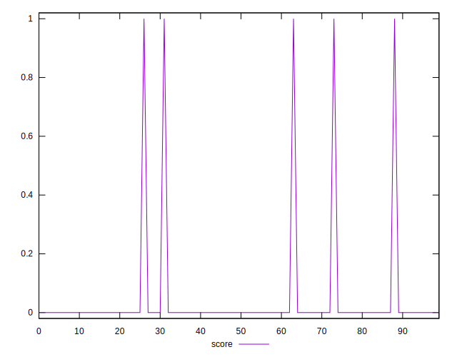
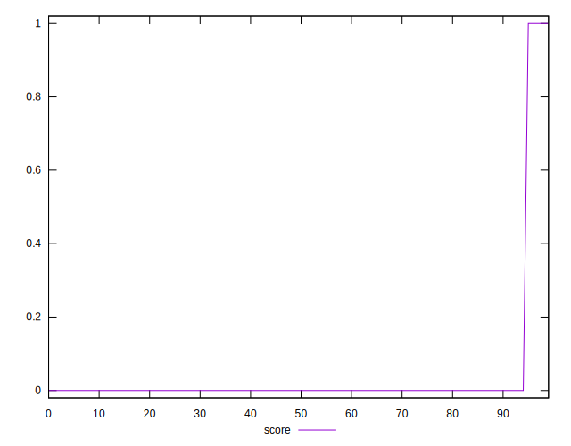
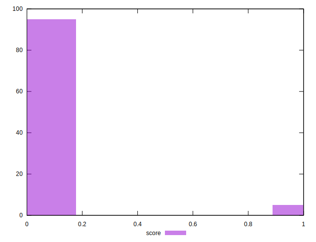

# //third-party-summary/samples/pages

[→ Parent](../..)


## Raw


```yaml
p90range: 0

```


## Score


```yaml
p90min: 0
p90max: 1
p90range: 1
p90mean: 0.02127659574468085
p90median: 0
p90stdev: 0.14430489325798446
p90skewness: 6.634888026970369
p90eccentricity: 0.9999999999999992
p90discretization: 47
outlandishness: 5.522500000000001
confidence: 0.0854328494158942
p90confidence: 0.05834386797342839

```

