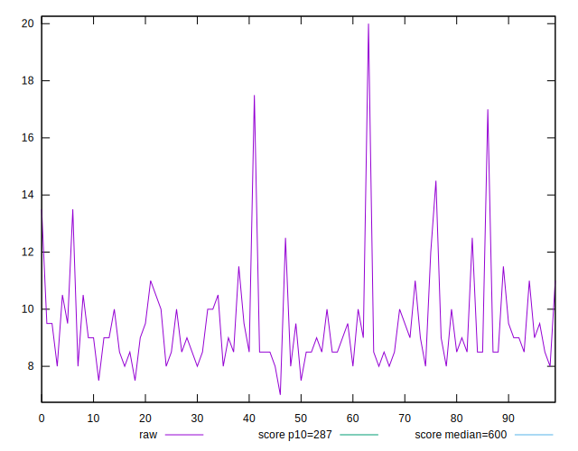
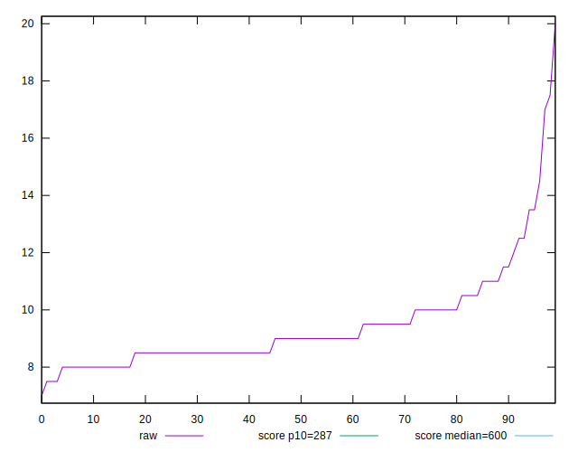
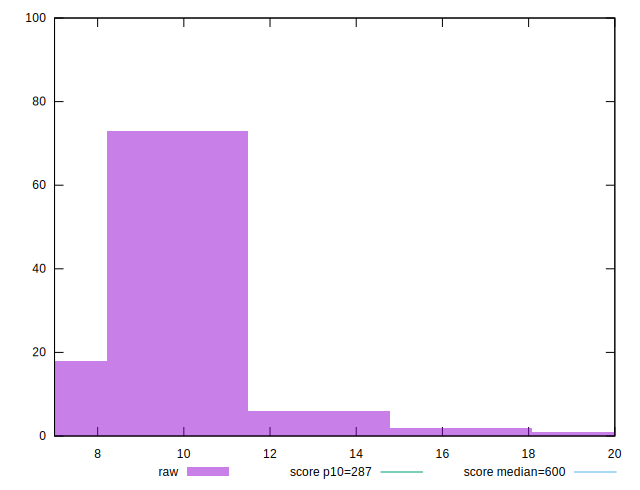
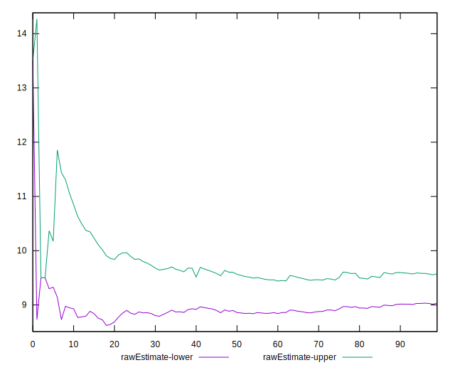
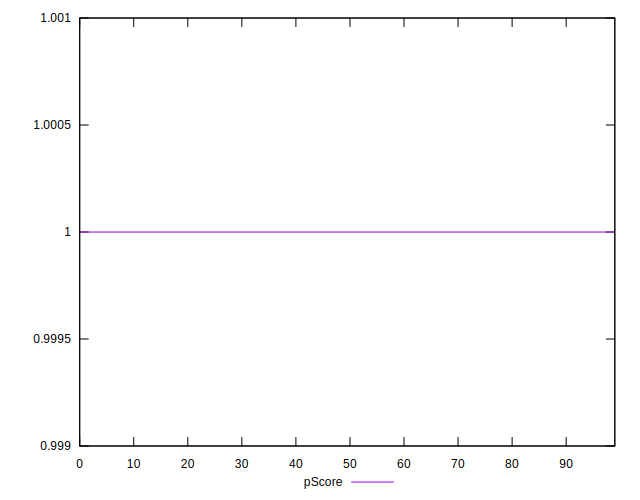
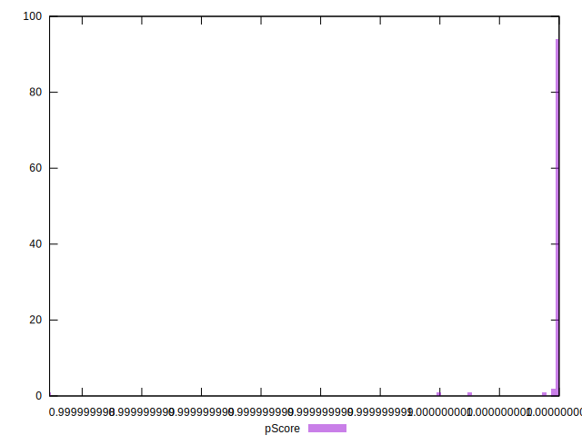
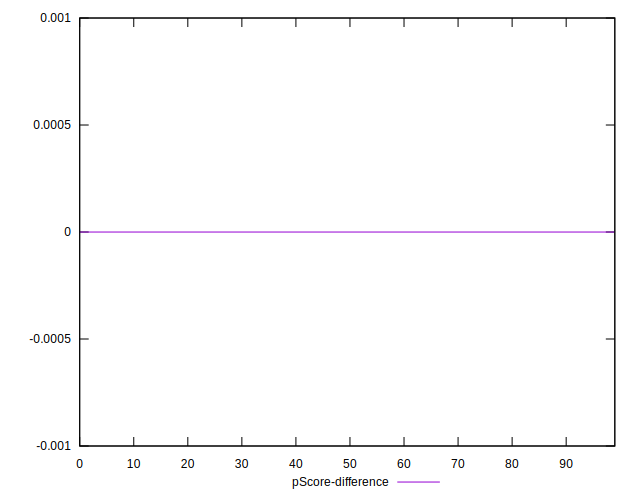
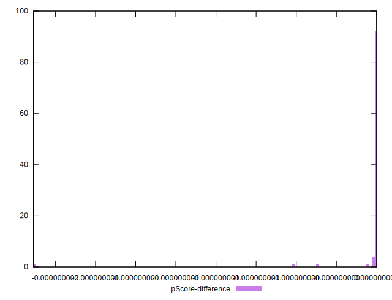

# //total-blocking-time/samples/pages+cached+noadtech+nomedia+nocss

[→ Parent](../..)


## Raw


```yaml
p90min: 7.5
p90max: 14.5
p90range: 7
p90mean: 9.303191489361701
p90median: 9
p90stdev: 1.3353182844470572
p90skewness: 1.6645809713997788
p90eccentricity: 1.0000000000000002
p90discretization: 7.230769230769231
outlandishness: 1.0449538572887032
confidence: 0.799501958676913
p90confidence: 0.539882133802648

```


## Score


```yaml
p90min: 1
p90max: 1
p90range: 0
p90mean: 1
p90median: 1
p90stdev: 0
p90skewness: .nan
p90eccentricity: .nan
p90discretization: 94
outlandishness: 1
confidence: 0
p90confidence: 0

```


## Raw Estimate


## Score Estimate


## P Score


```yaml
p90min: 0.9999999999506068
p90max: 0.9999999999999867
p90range: 4.937983355546294e-11
p90mean: 0.9999999999984477
p90median: 0.9999999999998532
p90stdev: 5.982455010132641e-12
p90skewness: -6.264661026939839
p90eccentricity: 1.0000000008646617
p90discretization: 7.230769230769231
outlandishness: 0.9999999999519322
confidence: 6.91662417931403e-11
p90confidence: 2.418764585093801e-12

```


## Score Difference


```yaml
p90min: 0
p90max: 0
p90range: 0
p90mean: 0
p90median: 0
p90stdev: 0
p90skewness: .nan
p90eccentricity: .nan
p90discretization: 94
outlandishness: .nan
confidence: 0
p90confidence: 0

```


## P Score Difference


```yaml
p90min: -4.939315623175844e-11
p90max: -1.3322676295501878e-14
p90range: 4.937983355546294e-11
p90mean: -1.5521189534574224e-12
p90median: -1.467714838554457e-13
p90stdev: 5.9824550095449206e-12
p90skewness: -6.264703080387512
p90eccentricity: 0.9999999999999992
p90discretization: 7.230769230769231
outlandishness: 271.7385434736183
confidence: 6.916624179309887e-11
p90confidence: 2.41876458485618e-12

```

