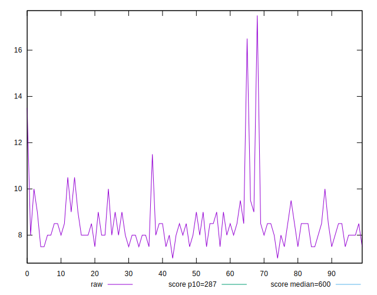
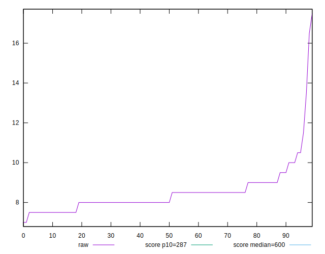
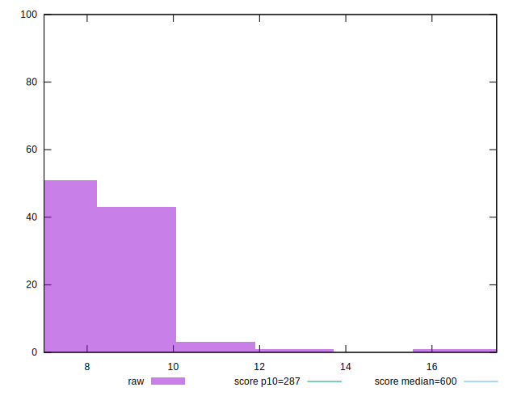
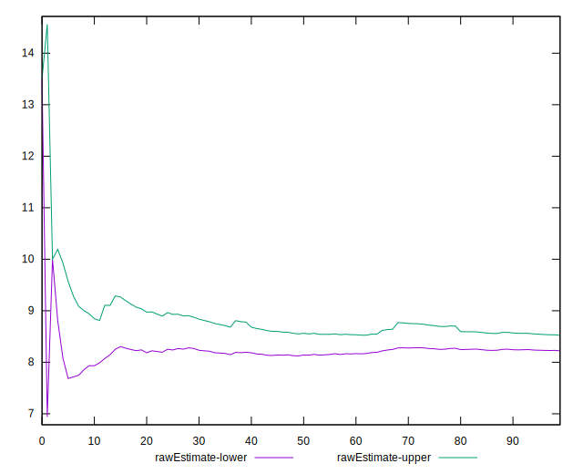
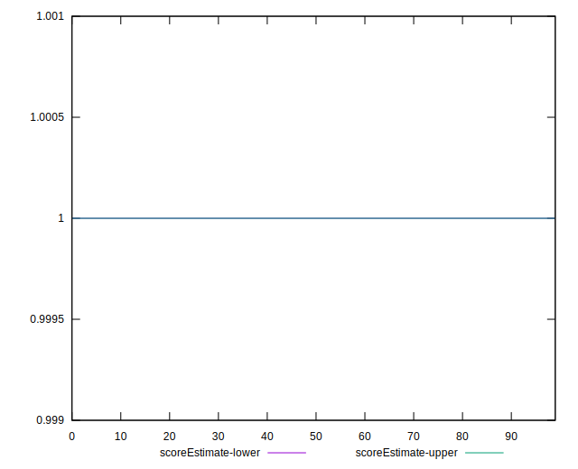
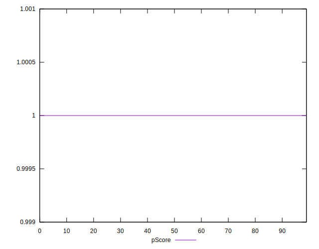
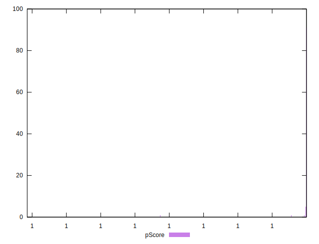
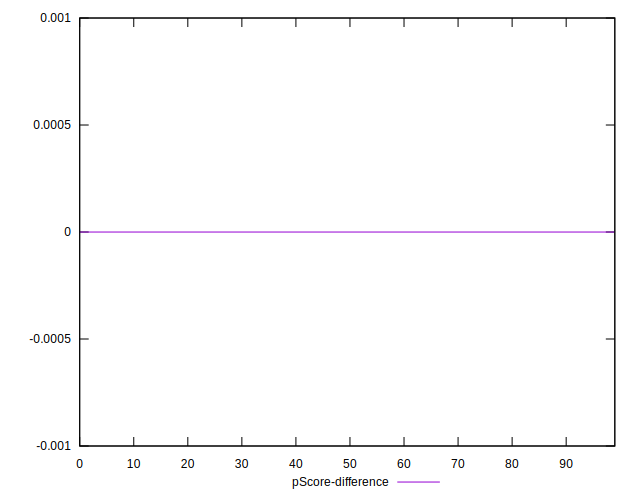
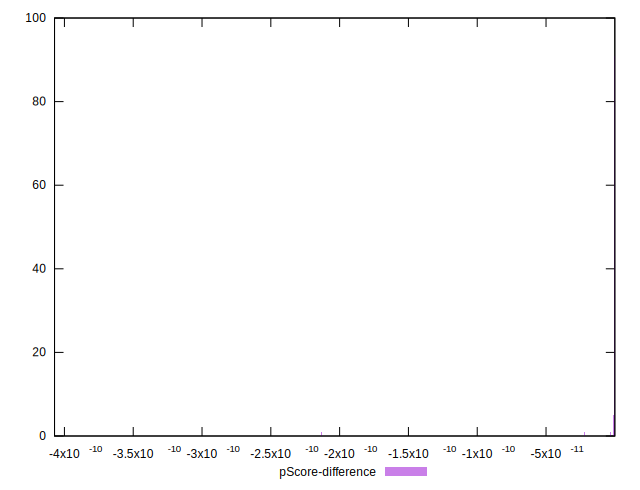

# //total-blocking-time/samples/pages+cached+noadtech+nomedia

[→ Parent](../..)


## Raw


```yaml
p90min: 7.5
p90max: 11.5
p90range: 4
p90mean: 8.372340425531915
p90median: 8
p90stdev: 0.7435401597875126
p90skewness: 1.4906237163309684
p90eccentricity: 1.0000000000000004
p90discretization: 11.75
outlandishness: 1.0453308602787676
confidence: 0.5927262925713712
p90confidence: 0.30062049828088

```


## Score


```yaml
p90min: 1
p90max: 1
p90range: 0
p90mean: 1
p90median: 1
p90stdev: 0
p90skewness: .nan
p90eccentricity: .nan
p90discretization: 94
outlandishness: 1
confidence: 0
p90confidence: 0

```


## Raw Estimate


## Score Estimate


## P Score


```yaml
p90min: 0.9999999999968233
p90max: 0.9999999999999867
p90range: 3.1633584640644585e-12
p90mean: 0.9999999999998674
p90median: 0.9999999999999686
p90stdev: 3.6012556530324397e-13
p90skewness: -6.806064394961532
p90eccentricity: 0.9999988655703819
p90discretization: 11.75
outlandishness: 0.999999999987184
confidence: 1.7847255661997718e-11
p90confidence: 1.4560225895005244e-13

```


## Score Difference


```yaml
p90min: 0
p90max: 0
p90range: 0
p90mean: 0
p90median: 0
p90stdev: 0
p90skewness: .nan
p90eccentricity: .nan
p90discretization: 94
outlandishness: .nan
confidence: 0
p90confidence: 0

```


## P Score Difference


```yaml
p90min: -3.1766811403599604e-12
p90max: -1.3322676295501878e-14
p90range: 3.1633584640644585e-12
p90mean: -1.3261495920315087e-13
p90median: -3.141931159689193e-14
p90stdev: 3.601253569363984e-13
p90skewness: -6.802849023258612
p90eccentricity: 1.000000000000001
p90discretization: 11.75
outlandishness: 2432.458657581461
confidence: 1.78472556614645e-11
p90confidence: 1.4560217470531582e-13

```

