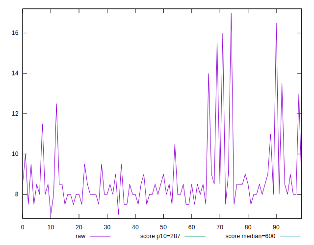
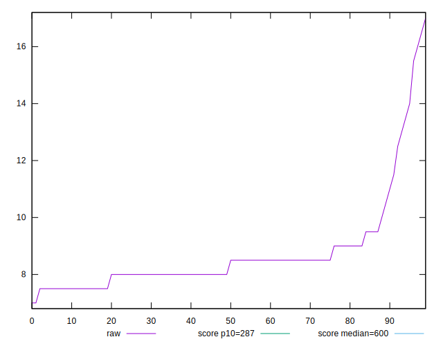
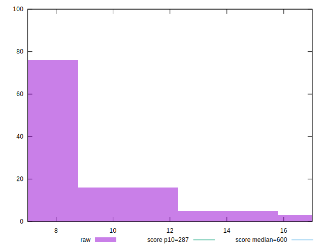
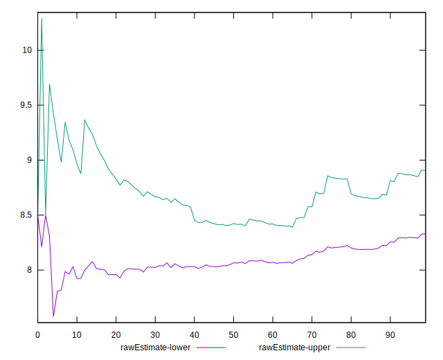
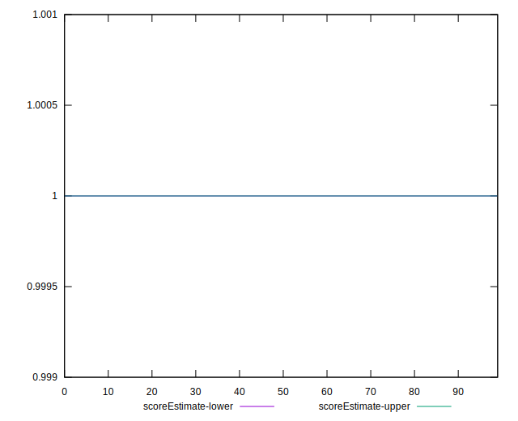
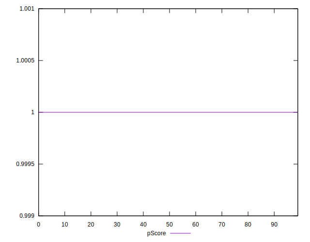
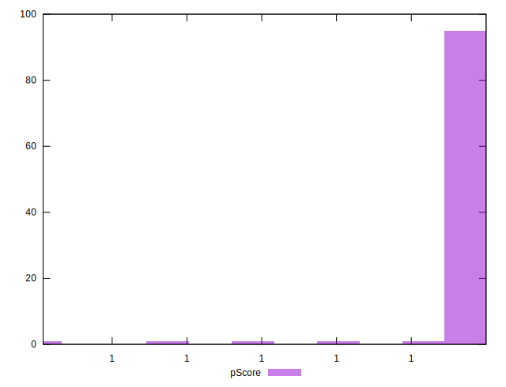
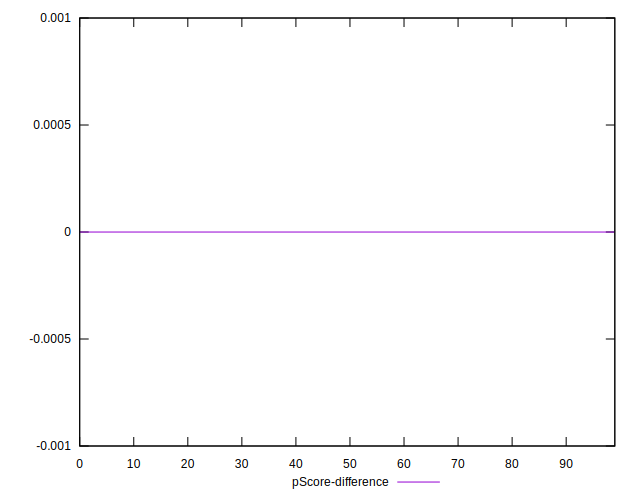
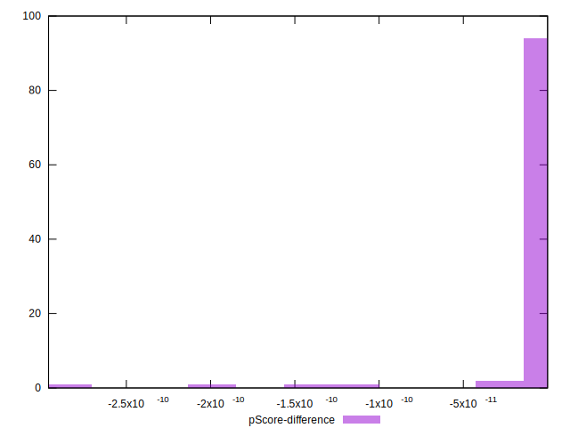

# //total-blocking-time/samples/pages+cached+noadtech

[→ Parent](../..)


## Raw


```yaml
p90min: 7.5
p90max: 15.5
p90range: 8
p90mean: 8.617021276595745
p90median: 8.25
p90stdev: 1.4262462484611251
p90skewness: 2.788505674944411
p90eccentricity: 1
p90discretization: 6.714285714285714
outlandishness: 1.0452916622466086
confidence: 0.7650289537564396
p90confidence: 0.5766451915739818

```


## Score


```yaml
p90min: 1
p90max: 1
p90range: 0
p90mean: 1
p90median: 1
p90stdev: 0
p90skewness: .nan
p90eccentricity: .nan
p90discretization: 94
outlandishness: 1
confidence: 0
p90confidence: 0

```


## Raw Estimate


## Score Estimate


## P Score


```yaml
p90min: 0.9999999998943788
p90max: 0.9999999999999867
p90range: 1.0560785579372123e-10
p90mean: 0.9999999999979302
p90median: 0.9999999999999494
p90stdev: 1.1570780537003542e-11
p90skewness: -7.88635267325756
p90eccentricity: 1.000000000417231
p90discretization: 6.714285714285714
outlandishness: 0.999999999987049
confidence: 1.5752116828831217e-11
p90confidence: 4.678178797399144e-12

```


## Score Difference


```yaml
p90min: 0
p90max: 0
p90range: 0
p90mean: 0
p90median: 0
p90stdev: 0
p90skewness: .nan
p90eccentricity: .nan
p90discretization: 94
outlandishness: .nan
confidence: 0
p90confidence: 0

```


## P Score Difference


```yaml
p90min: -1.0562117847001673e-10
p90max: -1.3322676295501878e-14
p90range: 1.0560785579372123e-10
p90mean: -2.070039175533382e-12
p90median: -5.062616992290714e-14
p90stdev: 1.1570780536708169e-11
p90skewness: -7.886374109627867
p90eccentricity: 0.9999999999999992
p90discretization: 6.714285714285714
outlandishness: 17.042224318789803
confidence: 1.5752116828828047e-11
p90confidence: 4.678178797279722e-12

```

