# //total-blocking-time/samples/pages+cached

[→ Parent](../..)


## Raw


```yaml
p90min: 175.0000000000009
p90max: 209
p90range: 33.99999999999909
p90mean: 184.64361702127658
p90median: 183.25
p90stdev: 6.737329455633917
p90skewness: 1.2243657931207061
p90eccentricity: 0.9999999999999999
p90discretization: 1.540983606557377
outlandishness: 1.0194978073329188
confidence: 5.806699199381818
p90confidence: 2.7239676450212547

```

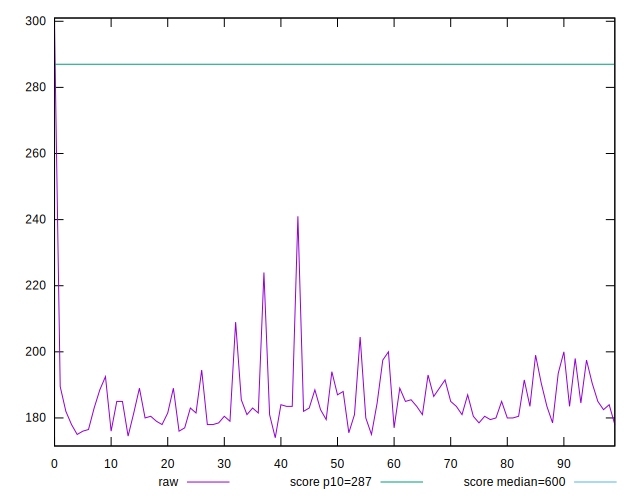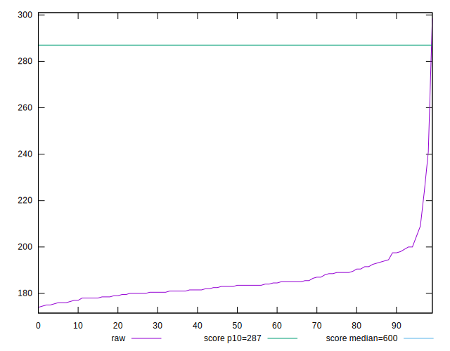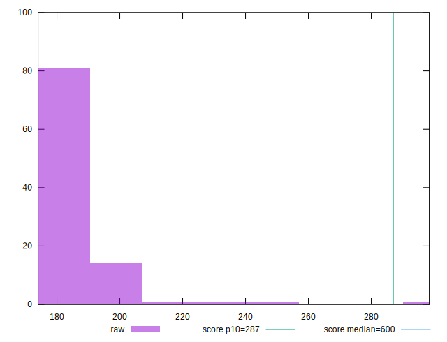
## Score


```yaml
p90min: 0.97
p90max: 0.98
p90range: 0.010000000000000009
p90mean: 0.9790425531914894
p90median: 0.98
p90stdev: 0.0029424078055190063
p90skewness: -2.747785799036451
p90eccentricity: 1.000000000000001
p90discretization: 47
outlandishness: 0.9970553058508901
confidence: 0.004002167749953297
p90confidence: 0.0011896440145122205

```

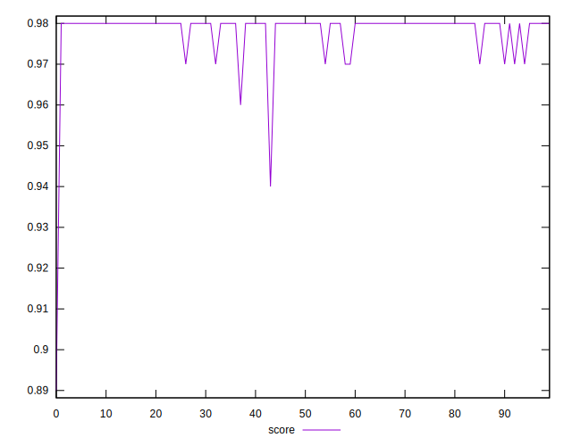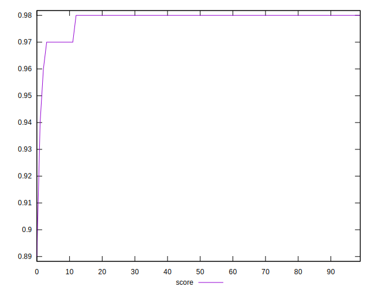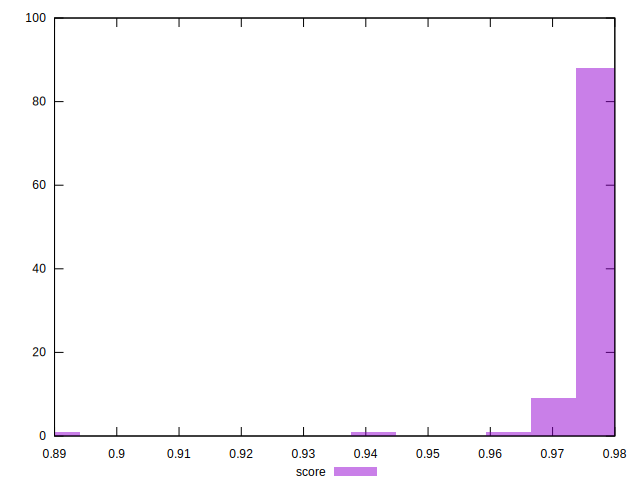
## Raw Estimate

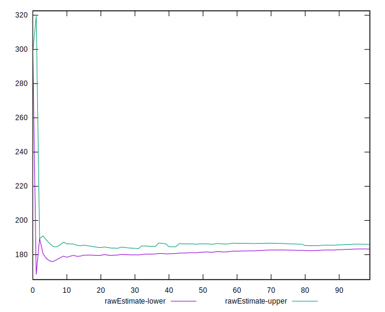
## Score Estimate

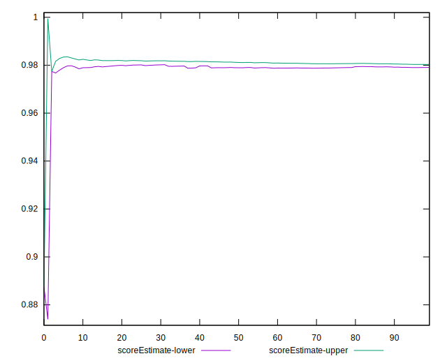
## P Score


```yaml
p90min: 0.9665763046435457
p90max: 0.9838729155496052
p90range: 0.017296610906059495
p90mean: 0.9795757843939119
p90median: 0.9803574881071855
p90stdev: 0.003292357458742902
p90skewness: -1.4866743280207215
p90eccentricity: 0.9999999999999997
p90discretization: 1.540983606557377
outlandishness: 0.9971916469886899
confidence: 0.0041482139754517615
p90confidence: 0.0013311320535112881

```

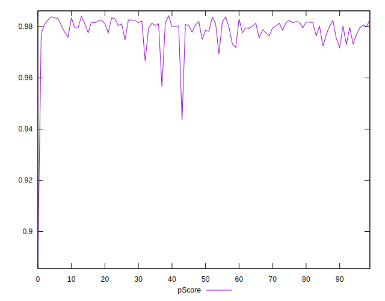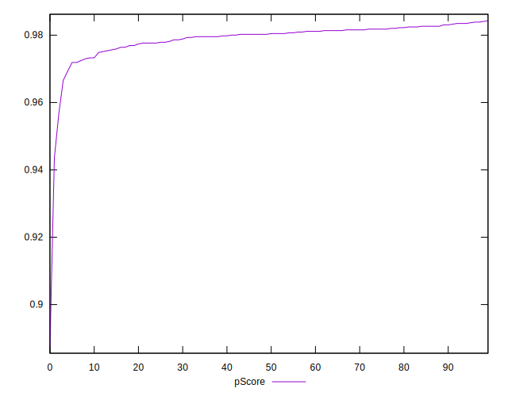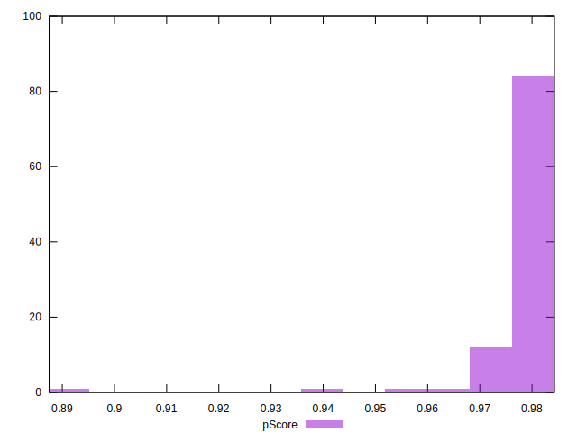
## Score Difference


```yaml
p90min: 0
p90max: 0
p90range: 0
p90mean: 0
p90median: 0
p90stdev: 0
p90skewness: .nan
p90eccentricity: .nan
p90discretization: 94
outlandishness: .inf
confidence: 4.3301796410739334e-18
p90confidence: 0

```

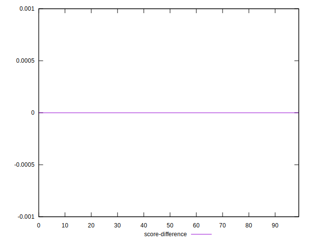
## P Score Difference


```yaml
p90min: -0.004099242914980872
p90max: 0.00387291554960556
p90range: 0.007972158464586432
p90mean: 0.000644352197225435
p90median: 0.0010286095376503823
p90stdev: 0.002020154181160372
p90skewness: -0.5049898780161014
p90eccentricity: 0.9999999999999996
p90discretization: 1.540983606557377
outlandishness: 0.8651092048918729
confidence: 0.0008845710602163516
p90confidence: 0.0008167679291434467

```

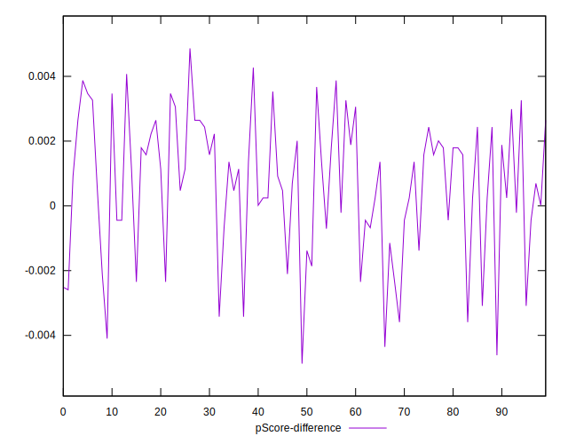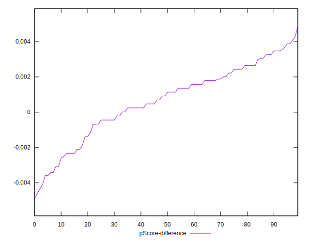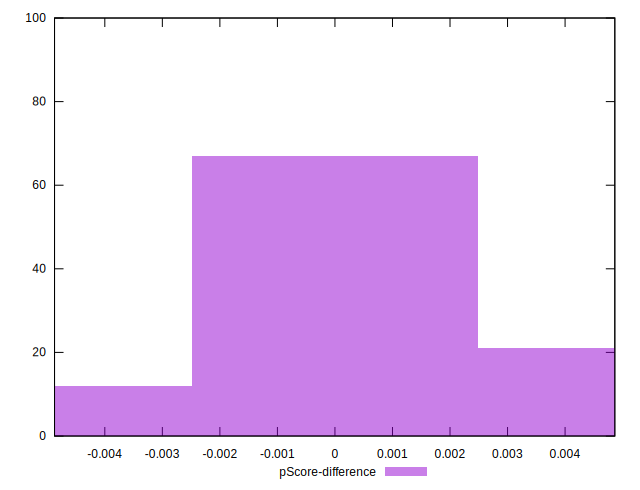