# //total-blocking-time/samples/pages

[→ Parent](../..)


## Raw


```yaml
p90min: 179
p90max: 299.4999999999991
p90range: 120.49999999999909
p90mean: 194.40425531914886
p90median: 190.49999999999955
p90stdev: 17.47159953761807
p90skewness: 3.6584378430005735
p90eccentricity: 1
p90discretization: 1.46875
outlandishness: 1.0305871747602853
confidence: 10.253526624257423
p90confidence: 7.063937152048026

```

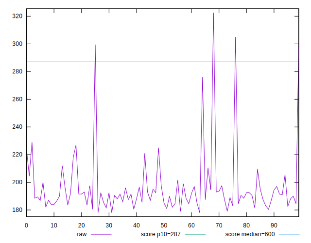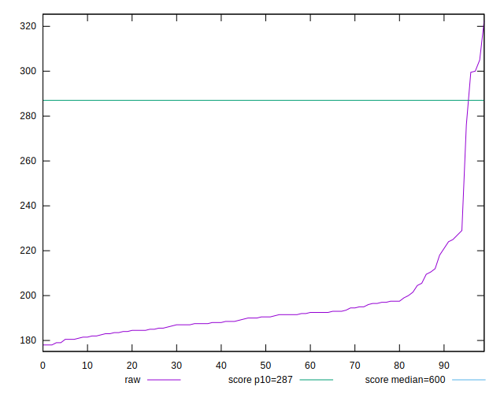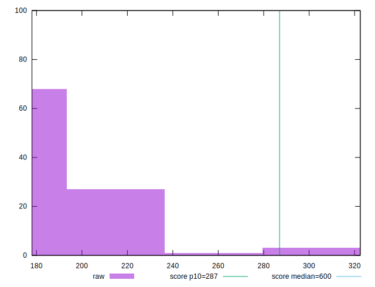
## Score


```yaml
p90min: 0.89
p90max: 0.98
p90range: 0.08999999999999997
p90mean: 0.9745744680851065
p90median: 0.98
p90stdev: 0.01301920787349356
p90skewness: -4.390068352536936
p90eccentricity: 1.000000000000002
p90discretization: 15.666666666666666
outlandishness: 0.9943144029984012
confidence: 0.008266866940000712
p90confidence: 0.005263792018000049

```

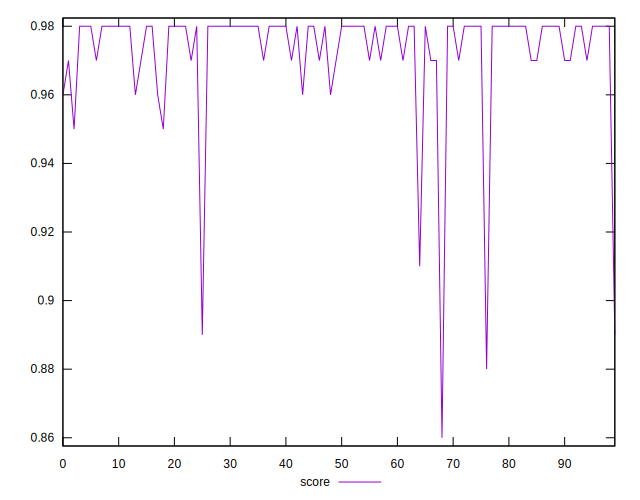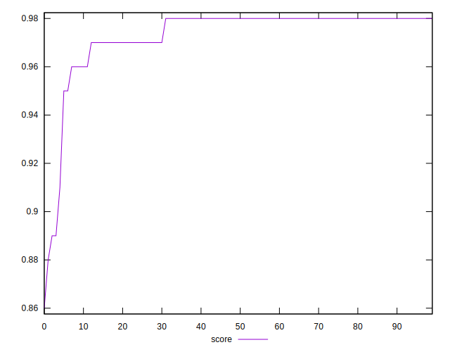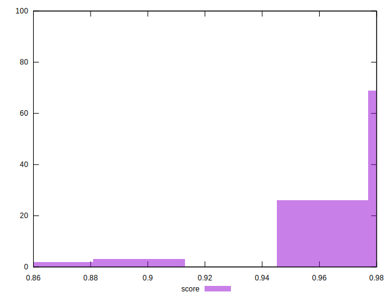
## Raw Estimate

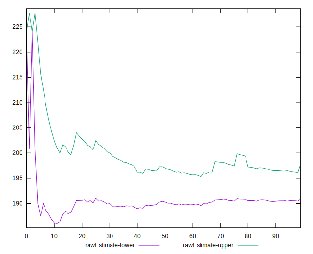
## Score Estimate

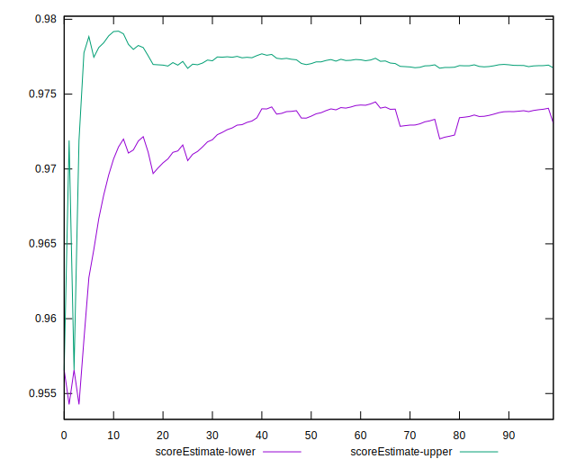
## P Score


```yaml
p90min: 0.886373267446029
p90max: 0.9822221352419864
p90range: 0.09584886779595747
p90mean: 0.9739599544440425
p90median: 0.9769110744045224
p90stdev: 0.012760796805600204
p90skewness: -4.829238322481713
p90eccentricity: 0.9999999999999999
p90discretization: 1.46875
outlandishness: 0.9944600041186674
confidence: 0.008262497479867988
p90confidence: 0.005159313916893049

```

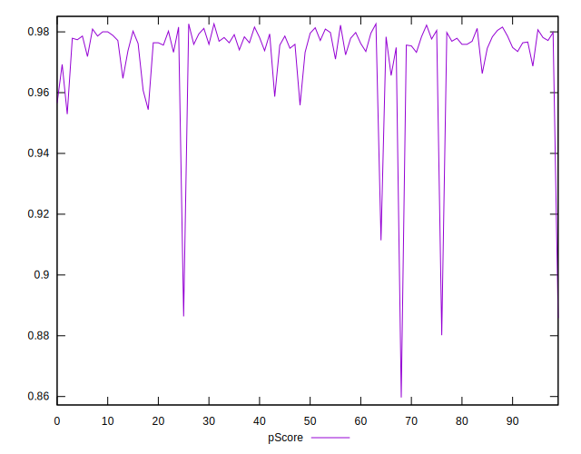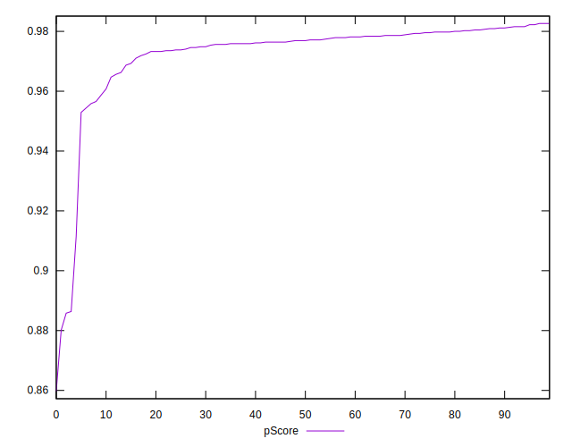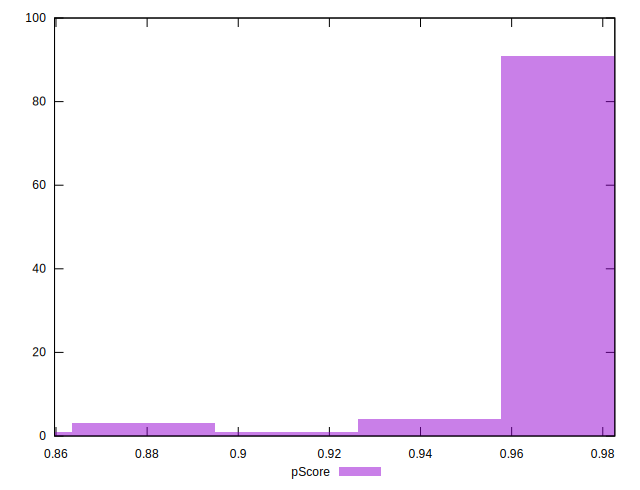
## Score Difference


```yaml
p90min: 0
p90max: 0
p90range: 0
p90mean: 0
p90median: 0
p90stdev: 0
p90skewness: .nan
p90eccentricity: .nan
p90discretization: 94
outlandishness: .inf
confidence: 6.092792000602812e-18
p90confidence: 0

```

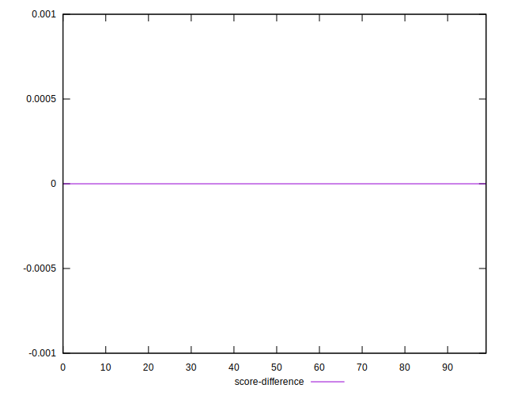
## P Score Difference


```yaml
p90min: -0.004355862049517212
p90max: 0.004601478756087518
p90range: 0.00895734080560473
p90mean: -0.0005878472655725635
p90median: -0.0006906903988610491
p90stdev: 0.002555722075853119
p90skewness: 0.2880812813974248
p90eccentricity: 0.9999999999999997
p90discretization: 1.4461538461538461
outlandishness: 0.8490315126868768
confidence: 0.0010704528892853987
p90confidence: 0.0010333032235003603

```

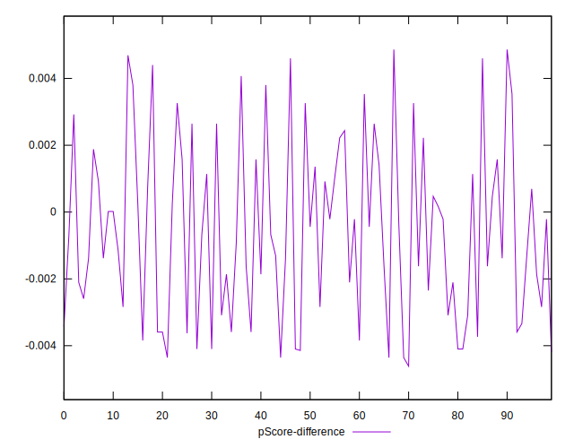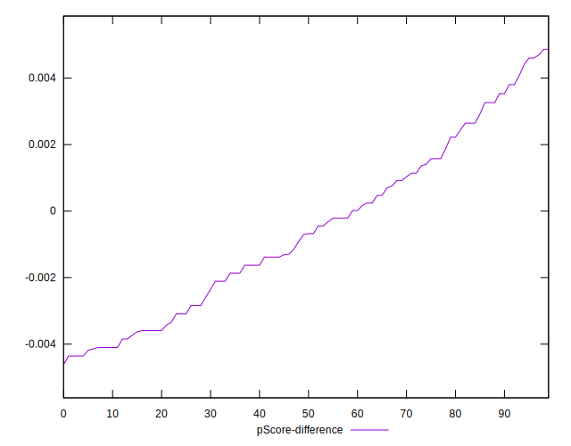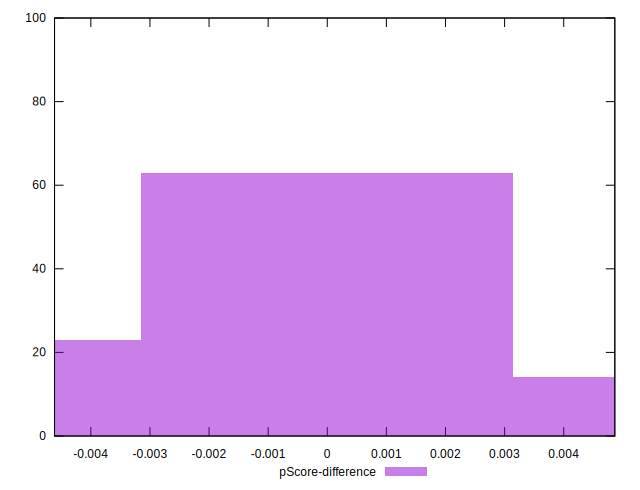