# //total-byte-weight/samples/pages

[→ Parent](../..)


## Raw


```yaml
p90min: 2201569
p90max: 2202946
p90range: 1377
p90mean: 2202049.1170212766
p90median: 2201944
p90stdev: 329.03287866441394
p90skewness: 1.8135495224683145
p90eccentricity: 1.0000000000000009
p90discretization: 1.5666666666666667
outlandishness: 1.0011704823994438
confidence: 5065.268825945718
p90confidence: 133.03118417054418

```

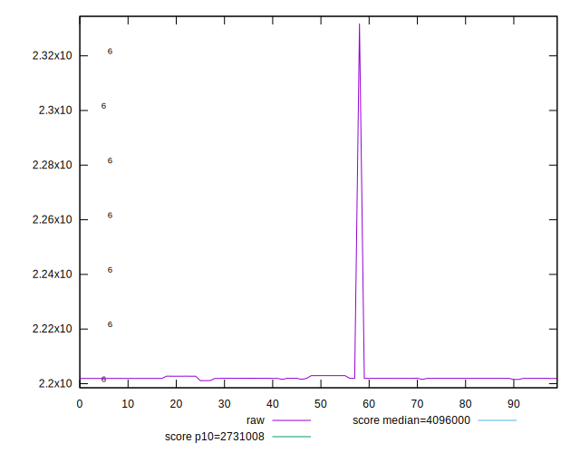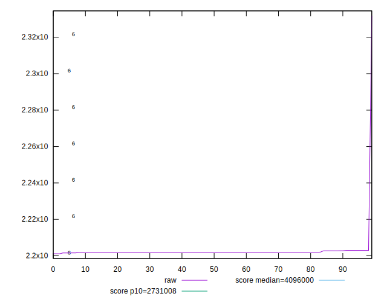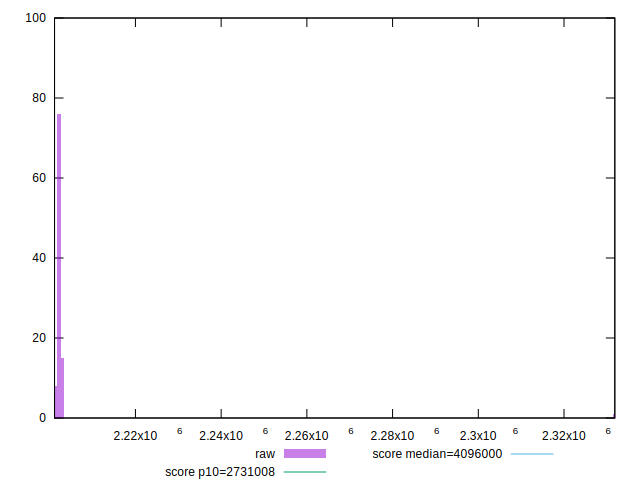
## Score


```yaml
p90min: 0.98
p90max: 0.98
p90range: 0
p90mean: 0.9800000000000002
p90median: 0.98
p90stdev: 2.220446049250313e-16
p90skewness: -1
p90eccentricity: 1
p90discretization: 94
outlandishness: 0.9995918783840071
confidence: 0.0007800558167195159
p90confidence: 8.977478740653372e-17

```

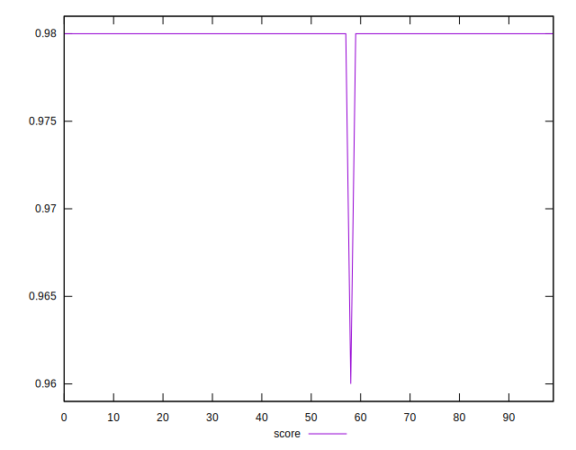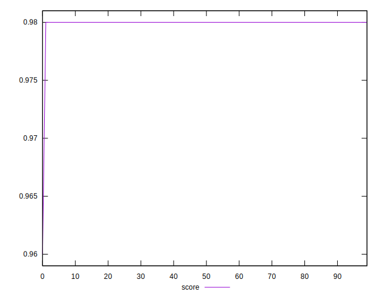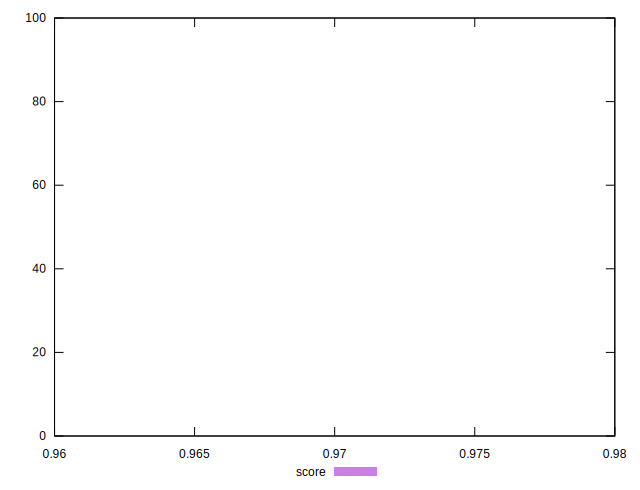
## Raw Estimate

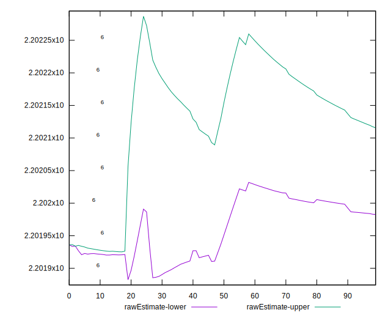
## Score Estimate


## P Score


```yaml
p90min: 0
p90max: 0
p90range: 0
p90mean: 0
p90median: 0
p90stdev: 0
p90skewness: .nan
p90eccentricity: .nan
p90discretization: 94
outlandishness: .nan
confidence: 0
p90confidence: 0

```


## Score Difference


```yaml
p90min: -0.98
p90max: -0.98
p90range: 0
p90mean: -0.9800000000000002
p90median: -0.98
p90stdev: 2.220446049250313e-16
p90skewness: 1
p90eccentricity: 1
p90discretization: 94
outlandishness: 0.9995918783840071
confidence: 0.0007800558167195159
p90confidence: 8.977478740653372e-17

```

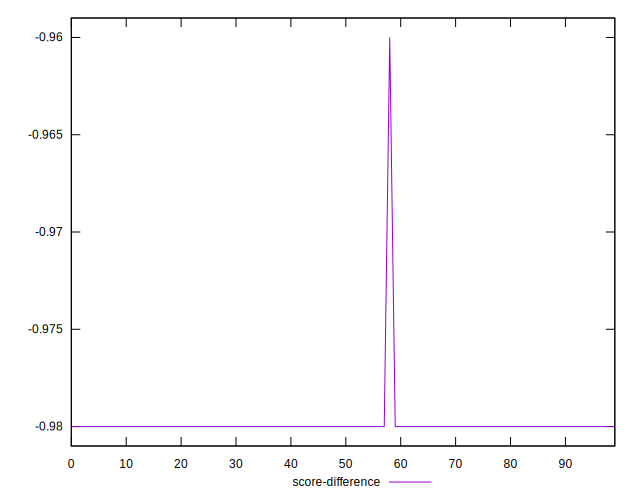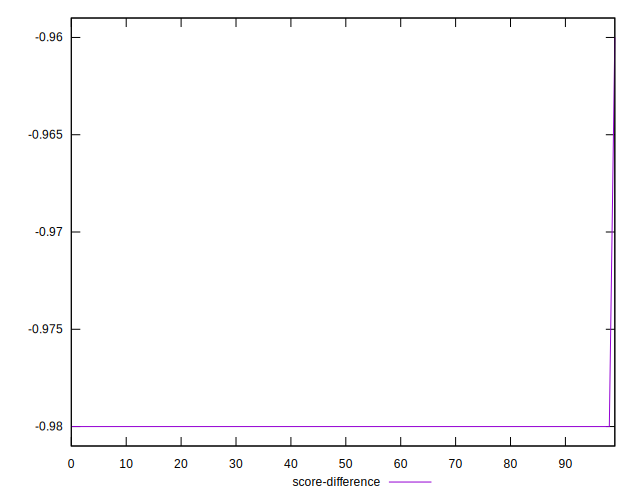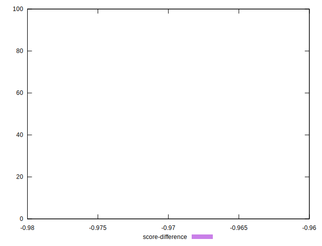
## P Score Difference


```yaml
p90min: -0.98
p90max: -0.98
p90range: 0
p90mean: -0.9800000000000002
p90median: -0.98
p90stdev: 2.220446049250313e-16
p90skewness: 1
p90eccentricity: 1
p90discretization: 94
outlandishness: 0.9995918783840071
confidence: 0.0007800558167195159
p90confidence: 8.977478740653372e-17

```

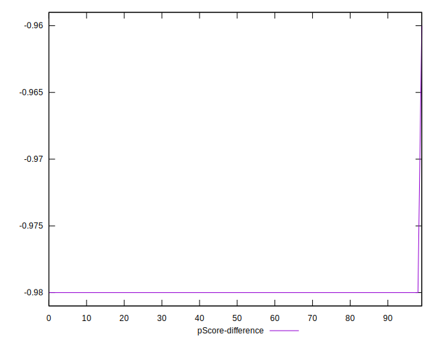