# //unminified-css/samples/pages

[→ Parent](../..)


## Raw


```yaml
p90min: 0
p90max: 150
p90range: 150
p90mean: 9.25531914893617
p90median: 0
p90stdev: 32.851677042011296
p90skewness: 3.630557452630123
p90eccentricity: 1.000000000000001
p90discretization: 18.8
outlandishness: 2.0340661117717
confidence: 15.658922475969877
p90confidence: 13.282251660158199

```

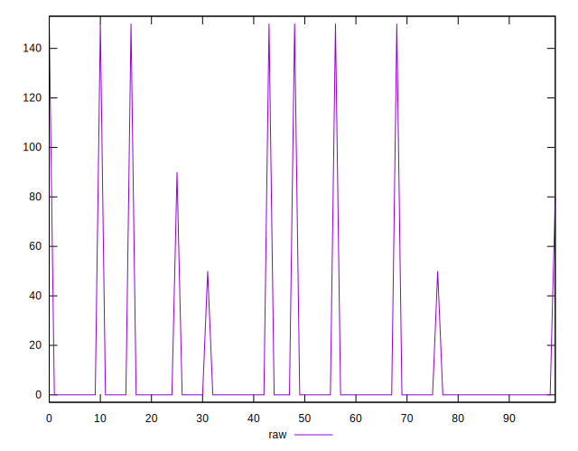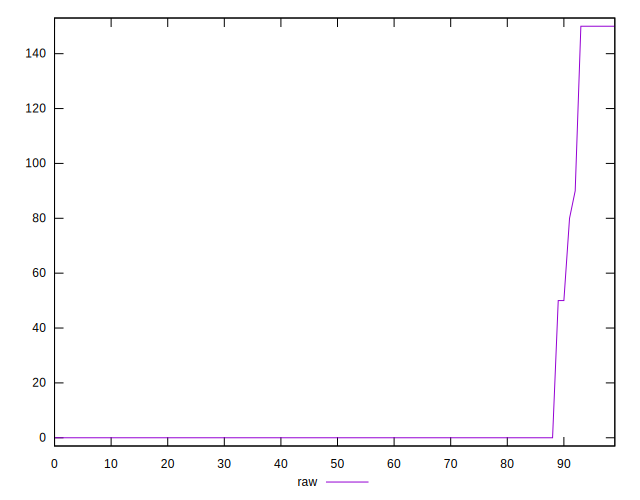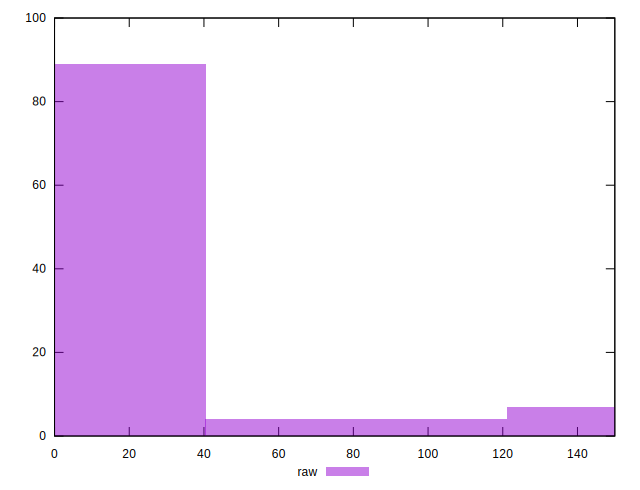
## Score


```yaml
p90min: 0.88
p90max: 1
p90range: 0.12
p90mean: 0.9925531914893617
p90median: 1
p90stdev: 0.02637439805555985
p90skewness: -3.610453005207341
p90eccentricity: 1.0000000000000022
p90discretization: 23.5
outlandishness: 0.9936563946195762
confidence: 0.0125538102978446
p90confidence: 0.010663424942085869

```

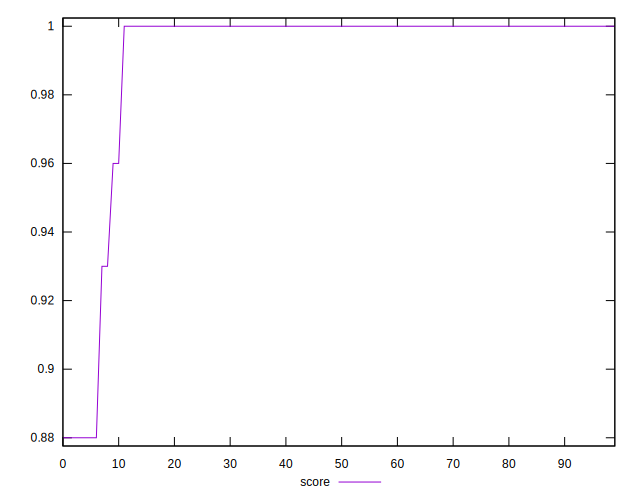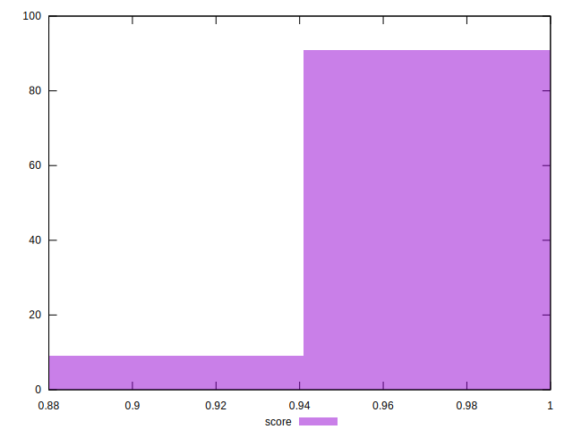
## Raw Estimate

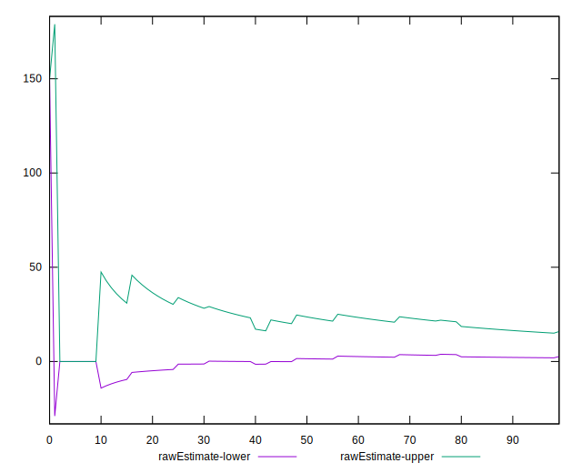
## Score Estimate

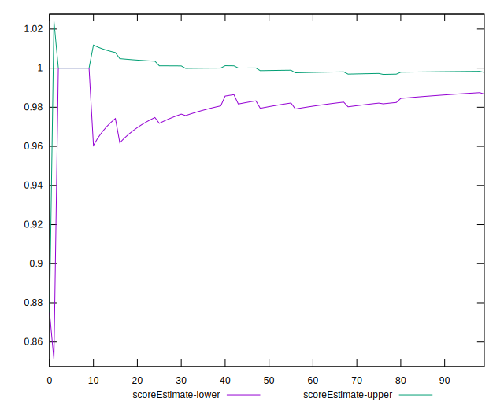
## P Score


```yaml
p90min: 0.875
p90max: 1
p90range: 0.125
p90mean: 0.9922872340425531
p90median: 1
p90stdev: 0.02737639753500942
p90skewness: -3.6305574526301223
p90eccentricity: 1.0000000000000016
p90discretization: 18.8
outlandishness: 0.9933854049905745
confidence: 0.013049102063308214
p90confidence: 0.011068543050131833

```

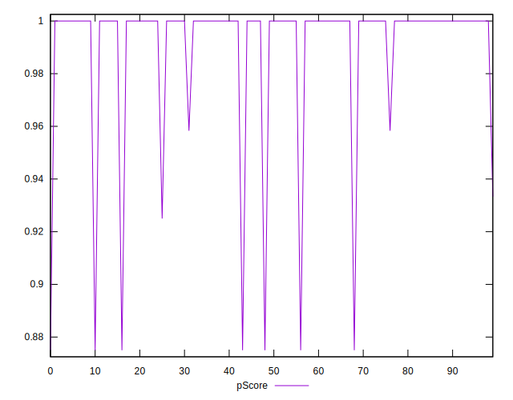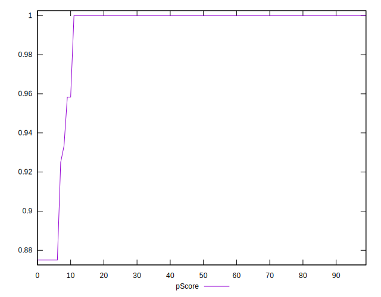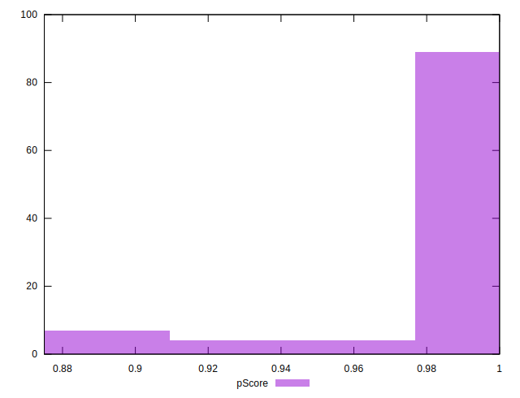
## Score Difference


```yaml
p90min: 0
p90max: 0
p90range: 0
p90mean: 0
p90median: 0
p90stdev: 0
p90skewness: .nan
p90eccentricity: .nan
p90discretization: 94
outlandishness: .nan
confidence: 0
p90confidence: 0

```


## P Score Difference


```yaml
p90min: -0.0050000000000000044
p90max: 0
p90range: 0.0050000000000000044
p90mean: -0.00030141843971631075
p90median: 0
p90stdev: 0.0011393137465544208
p90skewness: -3.7503622207162315
p90eccentricity: 0.9999999999999974
p90discretization: 31.333333333333332
outlandishness: 1.7610851211072756
confidence: 0.0005552846969567786
p90confidence: 0.00046063559806282077

```

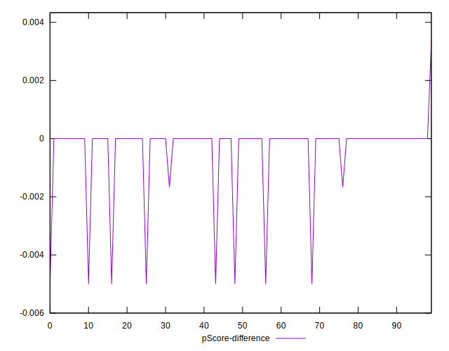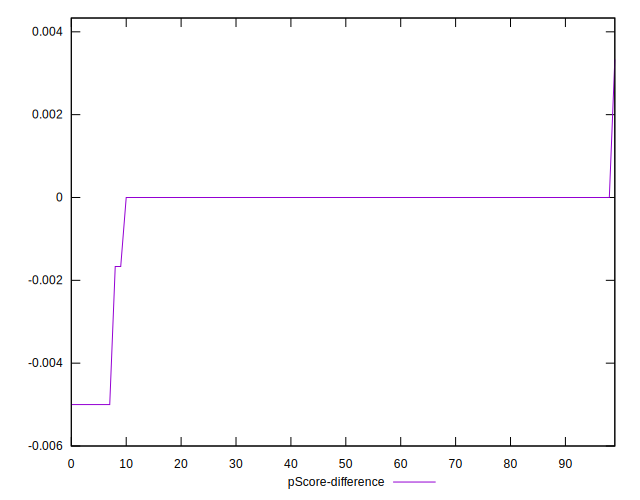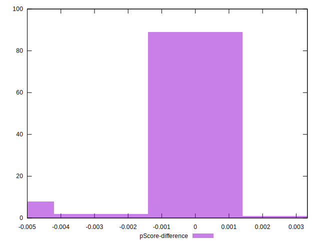