# //unminified-javascript/samples/pages+cached+noadtech

[→ Parent](../..)


## Raw


```yaml
p90min: 0
p90max: 150
p90range: 150
p90mean: 19.148936170212767
p90median: 0
p90stdev: 50.05655470646208
p90skewness: 2.231518495721683
p90eccentricity: 1
p90discretization: 47
outlandishness: 1.3929244938271605
confidence: 21.092126716883232
p90confidence: 20.23835057191955

```

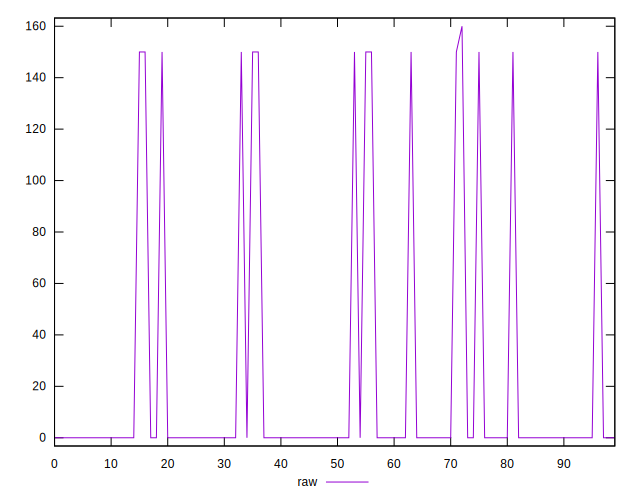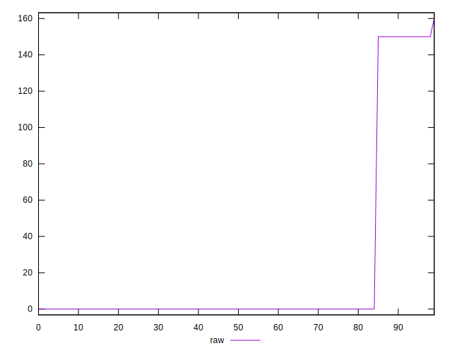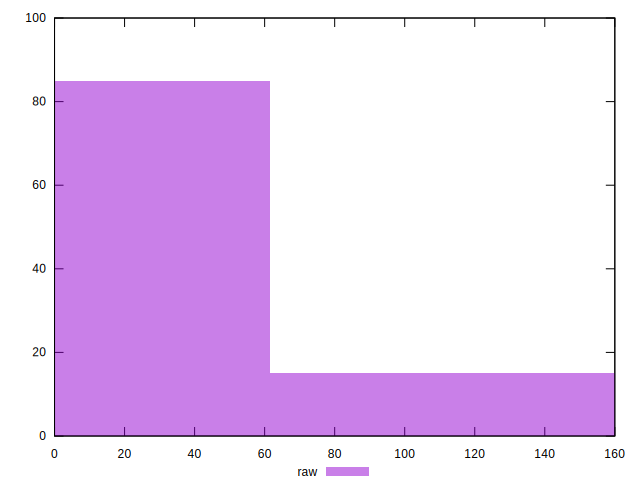
## Score


```yaml
p90min: 0.88
p90max: 1
p90range: 0.12
p90mean: 0.9846808510638299
p90median: 1
p90stdev: 0.04004524376516968
p90skewness: -2.231518495721685
p90eccentricity: 0.9999999999999984
p90discretization: 47
outlandishness: 0.9943597474440647
confidence: 0.01689388907145904
p90confidence: 0.016190680457535644

```

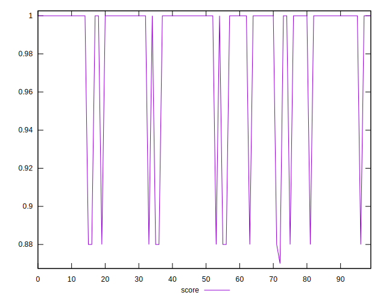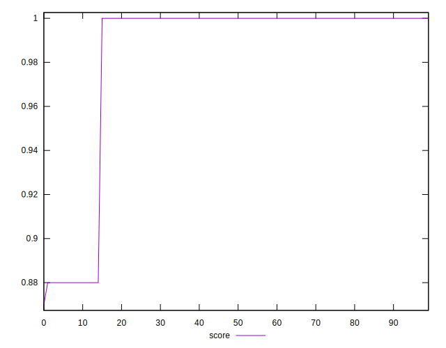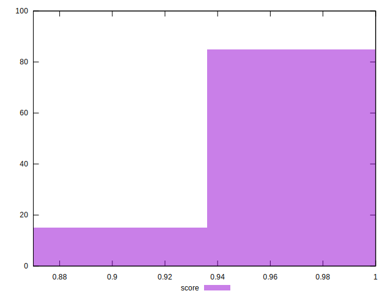
## Raw Estimate

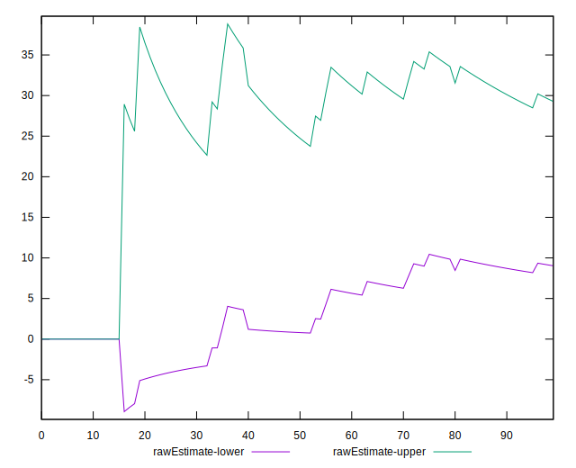
## Score Estimate

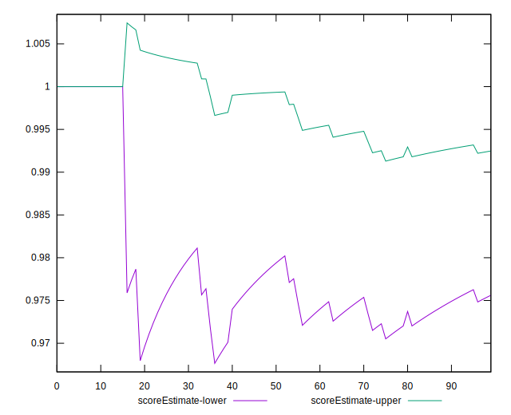
## P Score


```yaml
p90min: 0.875
p90max: 1
p90range: 0.125
p90mean: 0.9840425531914894
p90median: 1
p90stdev: 0.0417137955887184
p90skewness: -2.231518495721685
p90eccentricity: 0.9999999999999988
p90discretization: 47
outlandishness: 0.9941634960928495
confidence: 0.017576772264069347
p90confidence: 0.01686529214326629

```

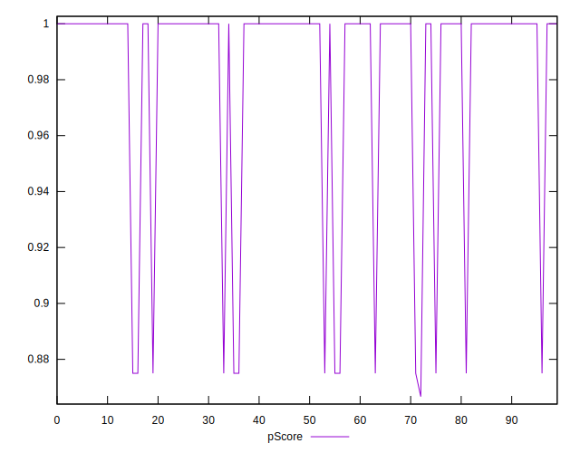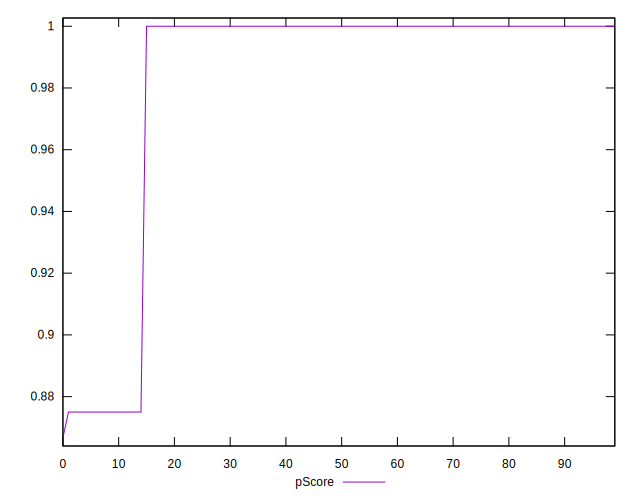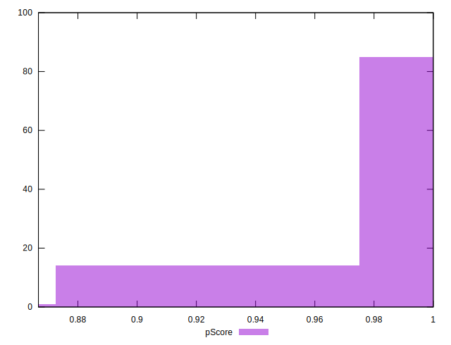
## Score Difference


```yaml
p90min: 0
p90max: 0
p90range: 0
p90mean: 0
p90median: 0
p90stdev: 0
p90skewness: .nan
p90eccentricity: .nan
p90discretization: 94
outlandishness: .nan
confidence: 0
p90confidence: 0

```


## P Score Difference


```yaml
p90min: -0.0050000000000000044
p90max: 0
p90range: 0.0050000000000000044
p90mean: -0.000620567375886525
p90median: 0
p90stdev: 0.0016305310044803214
p90skewness: -2.268316373833638
p90eccentricity: 1.0000000000000004
p90discretization: 31.333333333333332
outlandishness: 1.396448653061225
confidence: 0.0006871996345245431
p90confidence: 0.0006592394998131346

```

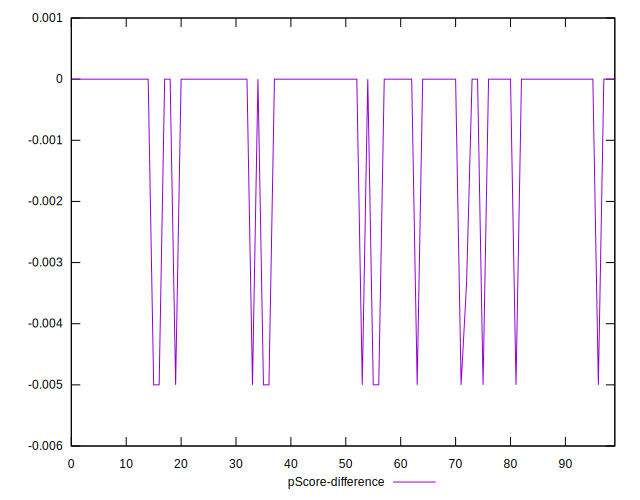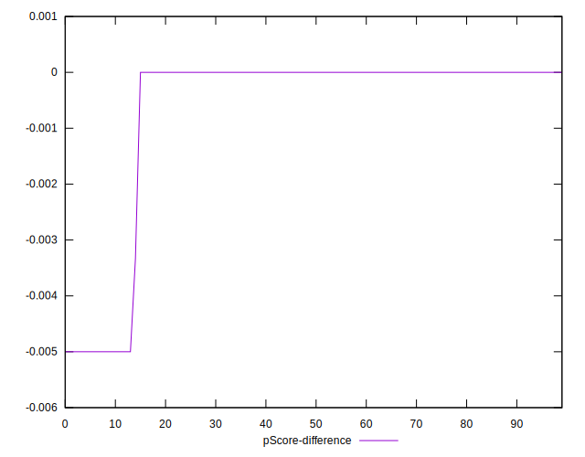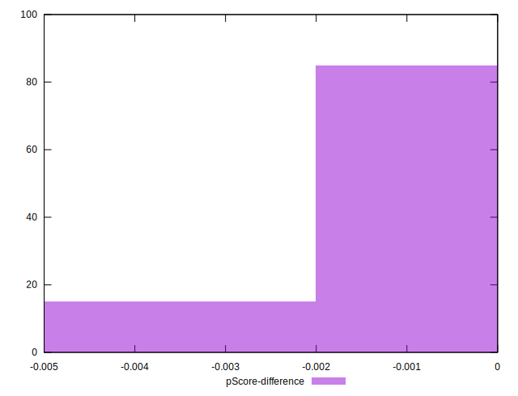