# //unminified-javascript/samples/pages+cached

[→ Parent](../..)


## Raw


```yaml
p90min: 0
p90max: 150
p90range: 150
p90mean: 17.5531914893617
p90median: 0
p90stdev: 48.21684552044082
p90skewness: 2.382852212357389
p90eccentricity: 1.0000000000000027
p90discretization: 47
outlandishness: 1.4312859504132236
confidence: 20.402462542801437
p90confidence: 19.494538304466943

```

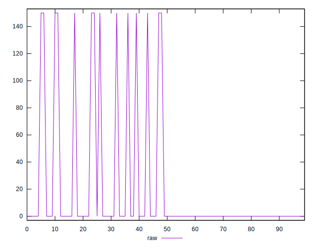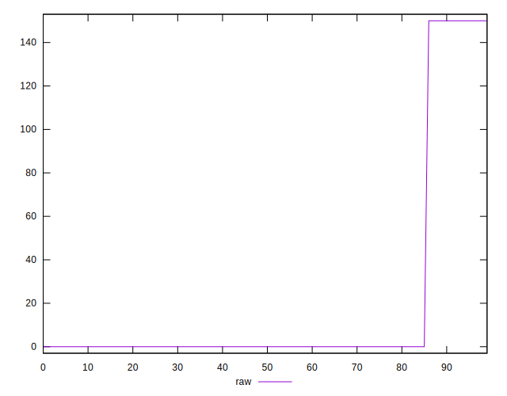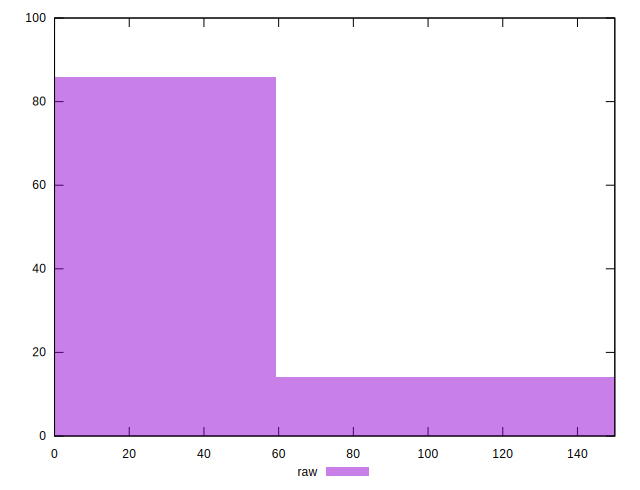
## Score


```yaml
p90min: 0.88
p90max: 1
p90range: 0.12
p90mean: 0.9859574468085107
p90median: 1
p90stdev: 0.03857347641635266
p90skewness: -2.3828522123573617
p90eccentricity: 1.000000000000003
p90discretization: 47
outlandishness: 0.9944143818493436
confidence: 0.016321970034241153
p90confidence: 0.015595630643573557

```

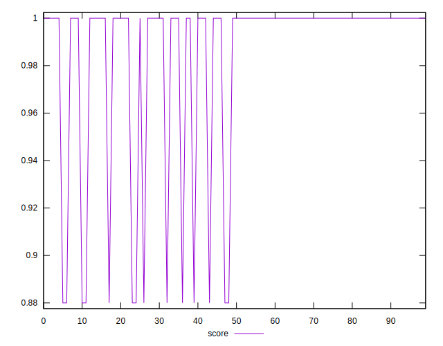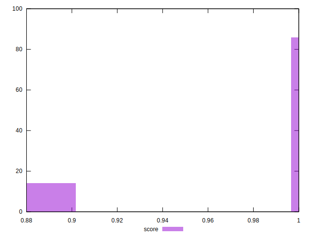
## Raw Estimate

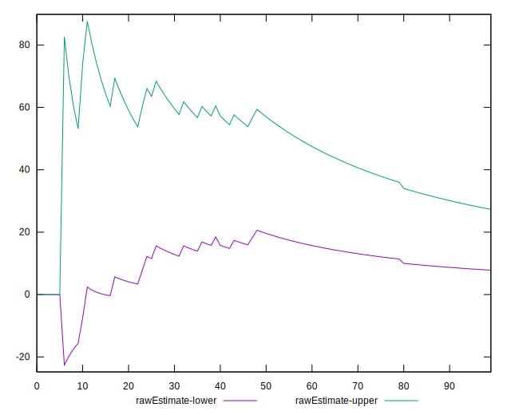
## Score Estimate

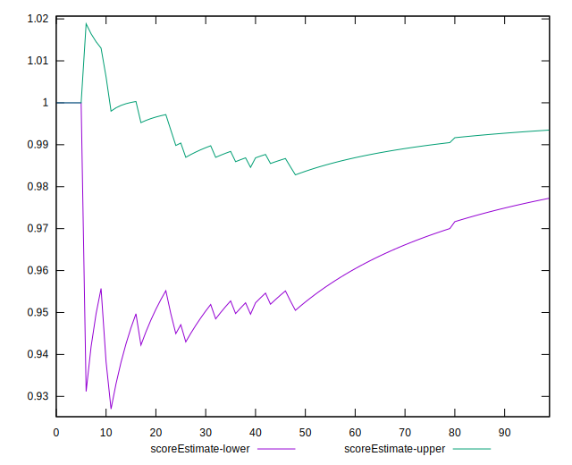
## P Score


```yaml
p90min: 0.875
p90max: 1
p90range: 0.125
p90mean: 0.9853723404255319
p90median: 1
p90stdev: 0.04018070460036736
p90skewness: -2.382852212357387
p90eccentricity: 1.0000000000000027
p90discretization: 47
outlandishness: 0.9941785375928143
confidence: 0.01700205211900121
p90confidence: 0.01624544858705579

```

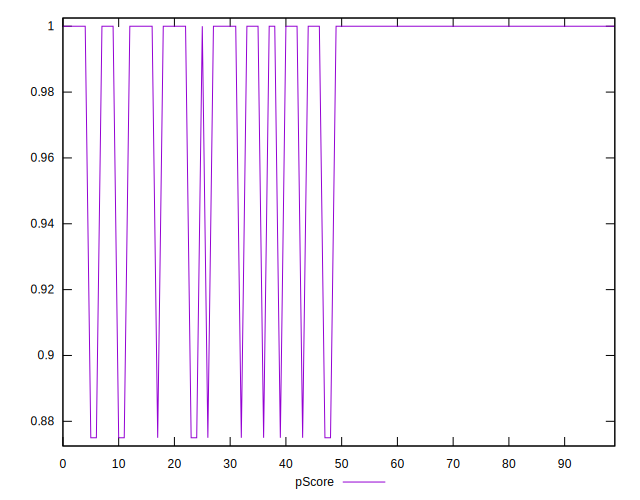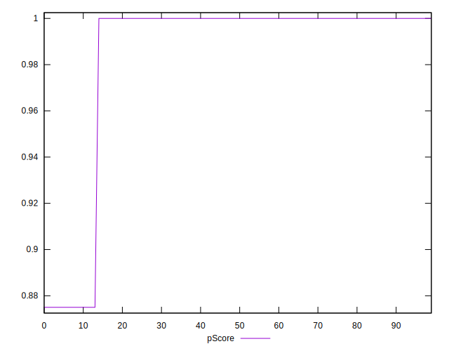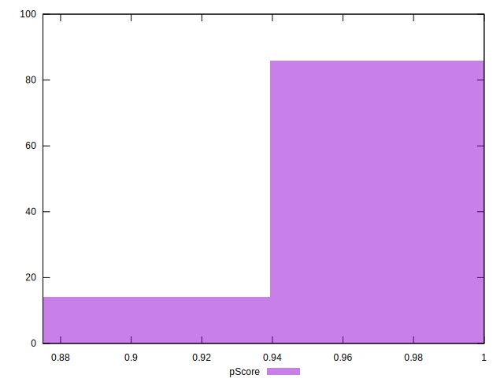
## Score Difference


```yaml
p90min: 0
p90max: 0
p90range: 0
p90mean: 0
p90median: 0
p90stdev: 0
p90skewness: .nan
p90eccentricity: .nan
p90discretization: 94
outlandishness: .nan
confidence: 0
p90confidence: 0

```


## P Score Difference


```yaml
p90min: -0.0050000000000000044
p90max: 0
p90range: 0.0050000000000000044
p90mean: -0.0005851063829787239
p90median: 0
p90stdev: 0.0016072281840146955
p90skewness: -2.38285221235739
p90eccentricity: 1.000000000000003
p90discretization: 47
outlandishness: 1.4312859504132236
confidence: 0.0006800820847600484
p90confidence: 0.000649817943482232

```

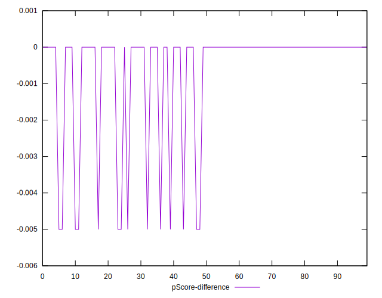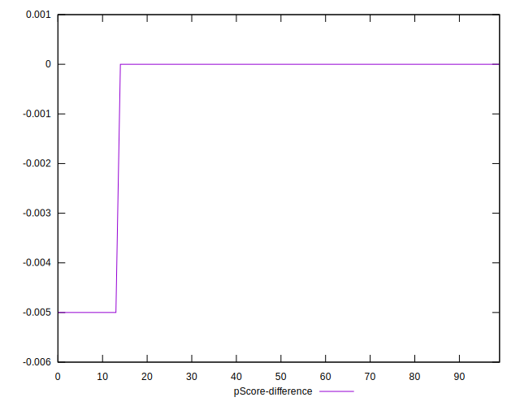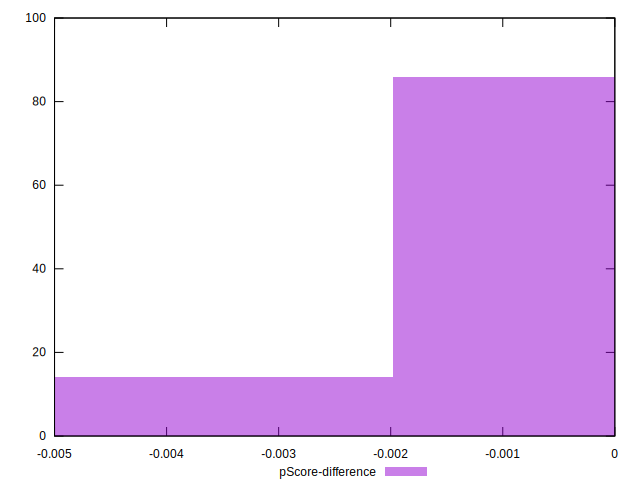