# //unused-css-rules/samples/pages+cached+noadtech+nomedia

[→ Parent](../..)


## Raw


```yaml
p90min: 0
p90max: 150
p90range: 150
p90mean: 108.51063829787235
p90median: 150
p90stdev: 67.09722140945323
p90skewness: -0.9988681377244328
p90eccentricity: 0.9999999999999961
p90discretization: 47
outlandishness: 0.9906103806228372
confidence: 27.67924397810093
p90confidence: 27.12805739926237

```

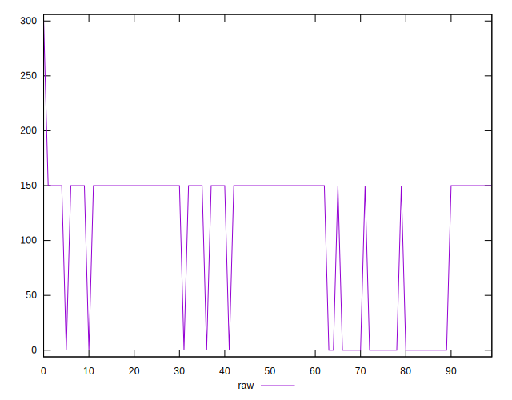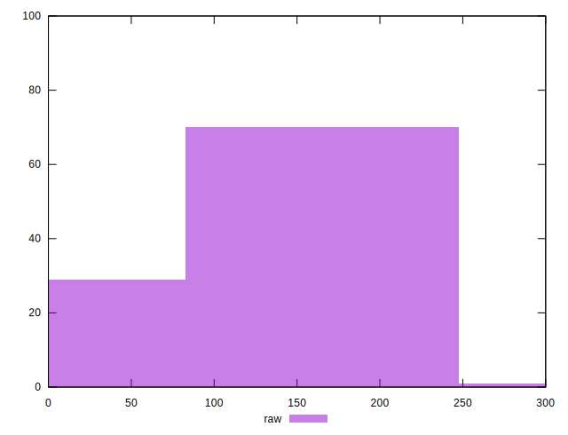
## Score


```yaml
p90min: 0.88
p90max: 1
p90range: 0.12
p90mean: 0.9131914893617021
p90median: 0.88
p90stdev: 0.05367777712756249
p90skewness: 0.9988681377244611
p90eccentricity: 0.9999999999999989
p90discretization: 47
outlandishness: 1.0006757898100807
confidence: 0.02225314486933657
p90confidence: 0.02170244591940986

```

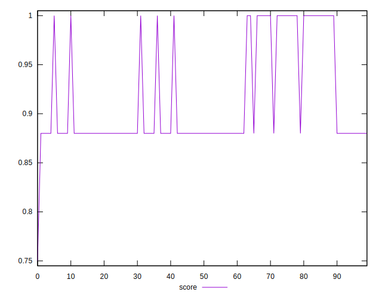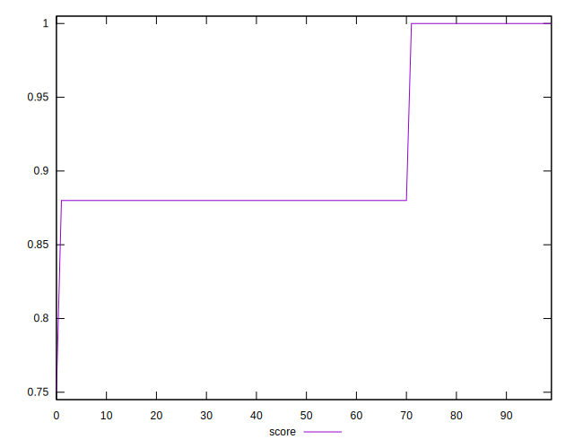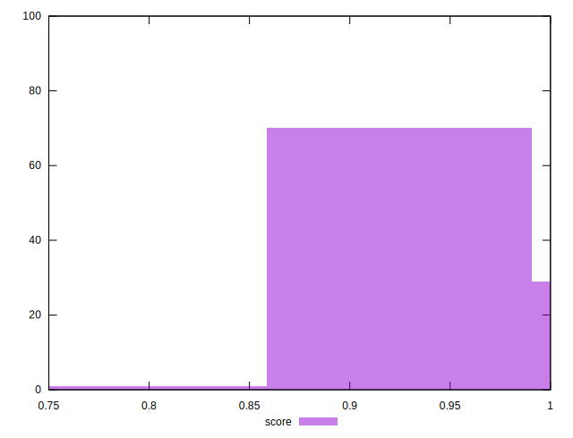
## Raw Estimate

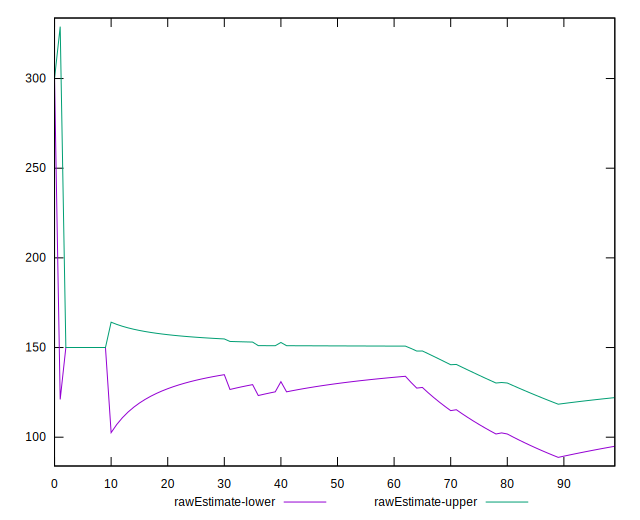
## Score Estimate

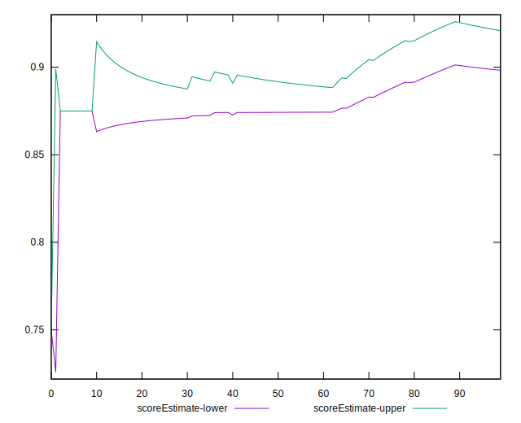
## P Score


```yaml
p90min: 0.875
p90max: 1
p90range: 0.125
p90mean: 0.9095744680851063
p90median: 0.875
p90stdev: 0.05591435117454421
p90skewness: 0.9988681377244432
p90eccentricity: 1.0000000000000013
p90discretization: 47
outlandishness: 1.0009358913853839
confidence: 0.02306603664841742
p90confidence: 0.022606714499385255

```

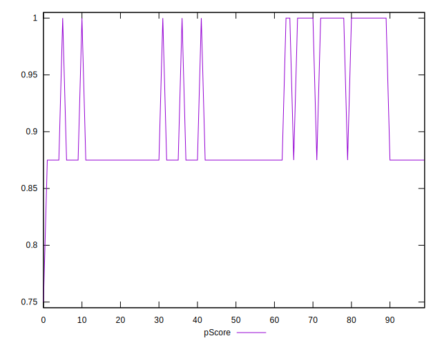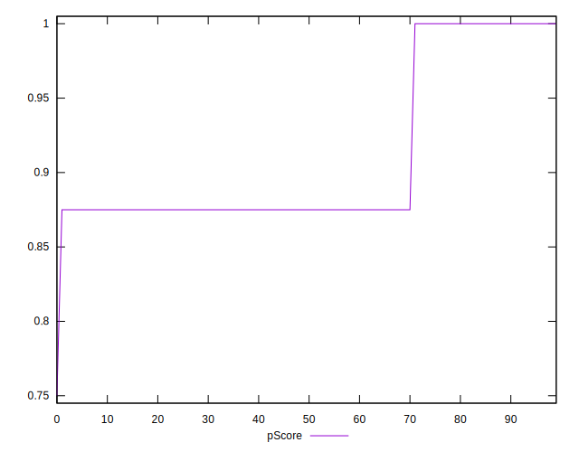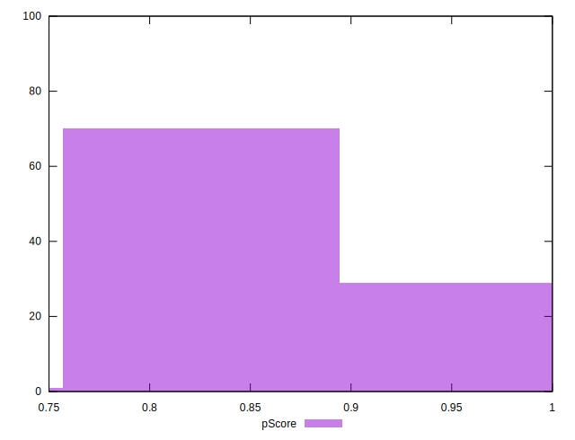
## Score Difference


```yaml
p90min: 0
p90max: 0
p90range: 0
p90mean: 0
p90median: 0
p90stdev: 0
p90skewness: .nan
p90eccentricity: .nan
p90discretization: 94
outlandishness: .nan
confidence: 0
p90confidence: 0

```


## P Score Difference


```yaml
p90min: -0.0050000000000000044
p90max: 0
p90range: 0.0050000000000000044
p90mean: -0.003563829787234046
p90median: -0.0050000000000000044
p90stdev: 0.002262358544482633
p90skewness: 0.9404608211447992
p90eccentricity: 1.0000000000000004
p90discretization: 47
outlandishness: 0.9644998886166183
confidence: 0.0008981683318542074
p90confidence: 0.0009146935024017214

```

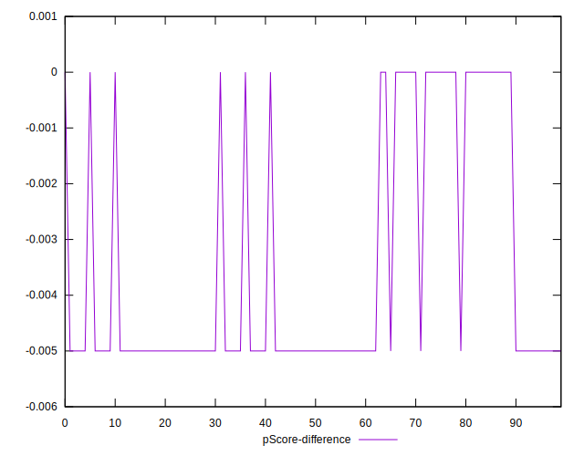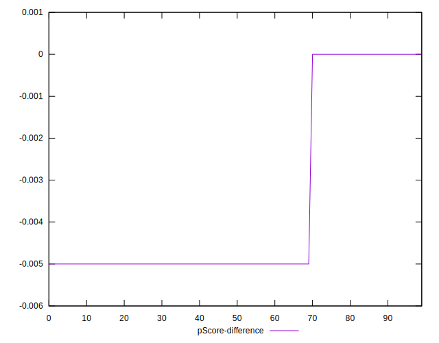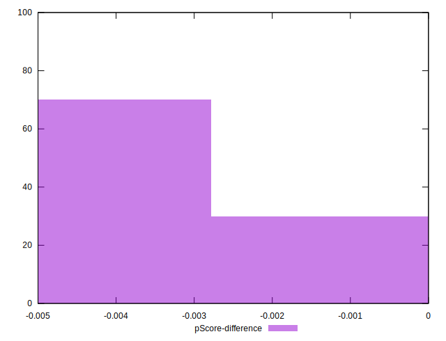