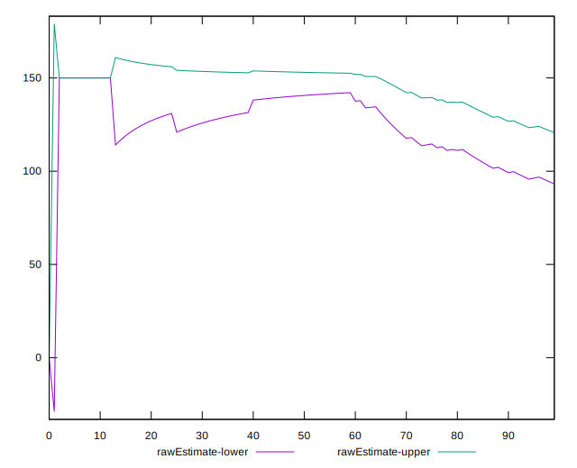

# //unused-css-rules/samples/pages+cached+noadtech

[→ Parent](../..)


## Raw


```yaml
p90min: 0
p90max: 150
p90range: 150
p90mean: 106.91489361702128
p90median: 150
p90stdev: 67.87075633447904
p90skewness: -0.9404608211447945
p90eccentricity: 0.9999999999999983
p90discretization: 47
outlandishness: 0.9922538650033415
confidence: 27.946502336344757
p90confidence: 27.440805072051663

```


## Score


```yaml
p90min: 0.88
p90max: 1
p90range: 0.12
p90mean: 0.9144680851063832
p90median: 0.88
p90stdev: 0.05429660506758317
p90skewness: 0.9404608211448207
p90eccentricity: 0.9999999999999989
p90discretization: 47
outlandishness: 1.0005072769732195
confidence: 0.022466727838905597
p90confidence: 0.021952644057641305

```


## Raw Estimate


## Score Estimate


## P Score


```yaml
p90min: 0.875
p90max: 1
p90range: 0.125
p90mean: 0.910904255319149
p90median: 0.875
p90stdev: 0.05655896361206584
p90skewness: 0.9404608211447936
p90eccentricity: 0.9999999999999991
p90discretization: 47
outlandishness: 1.0007592681549364
confidence: 0.023288751946953946
p90confidence: 0.02286733756004304

```


## Score Difference


```yaml
p90min: 0
p90max: 0
p90range: 0
p90mean: 0
p90median: 0
p90stdev: 0
p90skewness: .nan
p90eccentricity: .nan
p90discretization: 94
outlandishness: .nan
confidence: 0
p90confidence: 0

```


## P Score Difference


```yaml
p90min: -0.0050000000000000044
p90max: 0
p90range: 0.0050000000000000044
p90mean: -0.0035106382978723435
p90median: -0.0050000000000000044
p90stdev: 0.002286615453213263
p90skewness: 0.8839599998785503
p90eccentricity: 1.000000000000002
p90discretization: 47
outlandishness: 0.9657528925619834
confidence: 0.000906470099753144
p90confidence: 0.0009245008058719735

```

