# //unused-css-rules/samples/pages+cached

[→ Parent](../..)


## Raw


```yaml
p90min: 0
p90max: 160
p90range: 160
p90mean: 60.95744680851064
p90median: 0
p90stdev: 72.97725015571446
p90skewness: 0.38312821225643745
p90eccentricity: 1.0000000000000002
p90discretization: 18.8
outlandishness: 1.0411833934864119
confidence: 28.888459625671388
p90confidence: 29.505410052429227

```

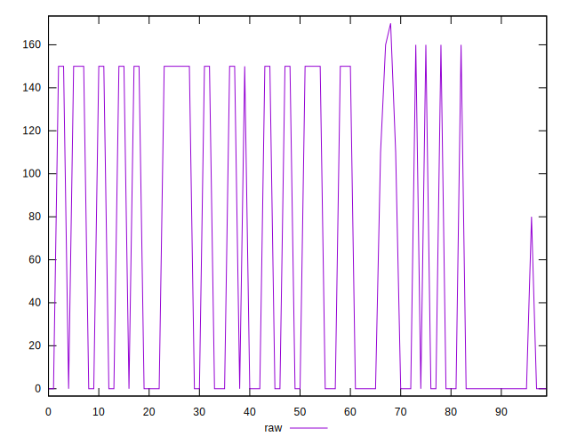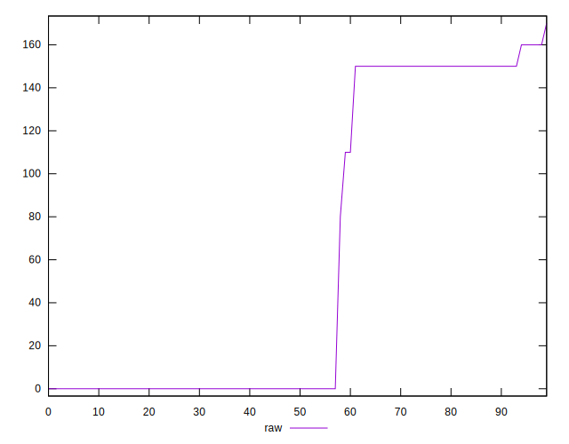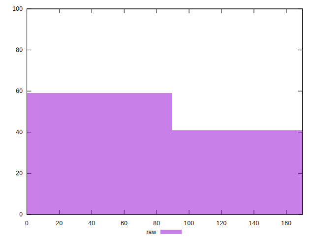
## Score


```yaml
p90min: 0.87
p90max: 1
p90range: 0.13
p90mean: 0.9510638297872344
p90median: 1
p90stdev: 0.058518374730313606
p90skewness: -0.37922972311659736
p90eccentricity: 1.000000000000001
p90discretization: 18.8
outlandishness: 0.9977641147295669
confidence: 0.02320385460022727
p90confidence: 0.023659546479697195

```

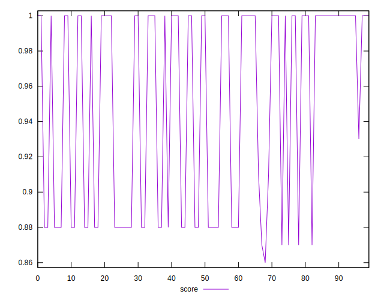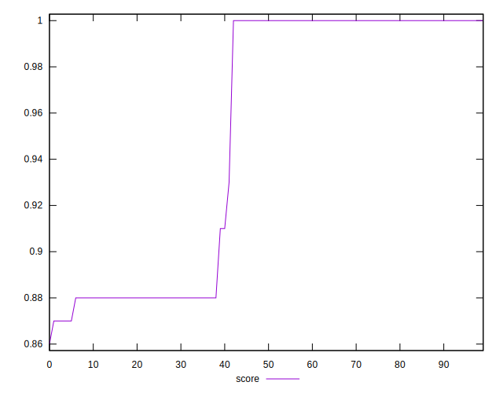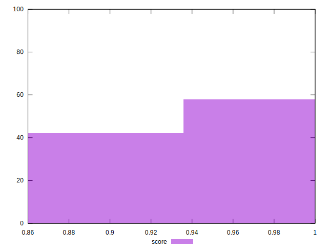
## Raw Estimate

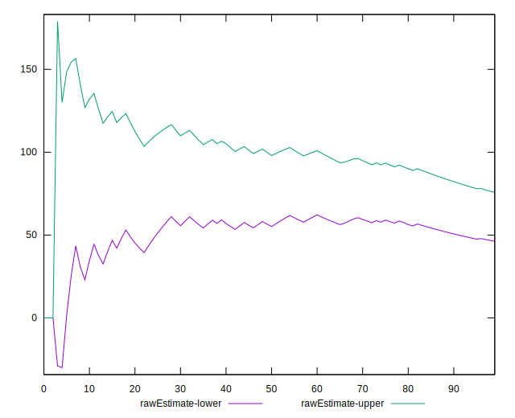
## Score Estimate

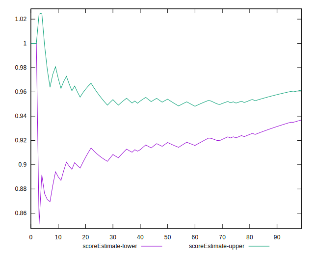
## P Score


```yaml
p90min: 0.8666666666666667
p90max: 1
p90range: 0.1333333333333333
p90mean: 0.9492021276595745
p90median: 1
p90stdev: 0.060814375129762094
p90skewness: -0.3831282122564422
p90eccentricity: 0.9999999999999999
p90discretization: 18.8
outlandishness: 0.9978194397517038
confidence: 0.024073716354726153
p90confidence: 0.024587841710357706

```

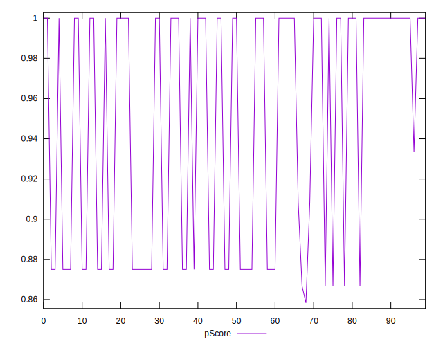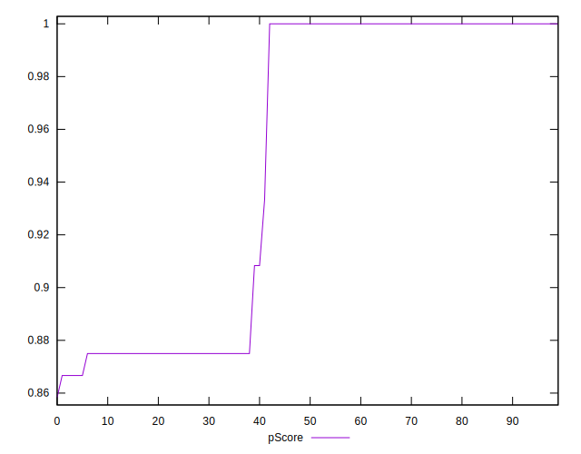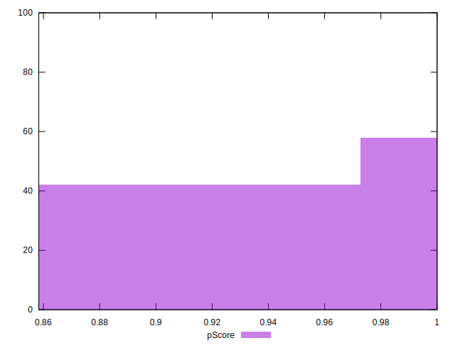
## Score Difference


```yaml
p90min: 0
p90max: 0
p90range: 0
p90mean: 0
p90median: 0
p90stdev: 0
p90skewness: .nan
p90eccentricity: .nan
p90discretization: 94
outlandishness: .nan
confidence: 0
p90confidence: 0

```


## P Score Difference


```yaml
p90min: -0.0050000000000000044
p90max: 0
p90range: 0.0050000000000000044
p90mean: -0.0018262411347517726
p90median: 0
p90stdev: 0.002307213850671138
p90skewness: -0.5500876007444727
p90eccentricity: 1
p90discretization: 18.8
outlandishness: 1.007782071825809
confidence: 0.0009308396094094047
p90confidence: 0.0009328289377503425

```

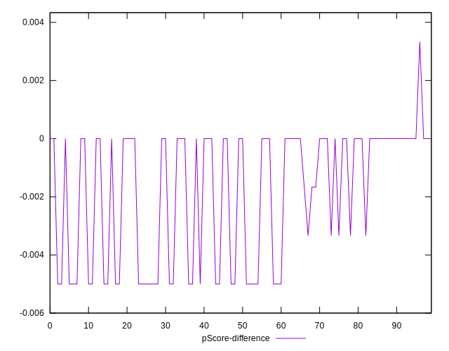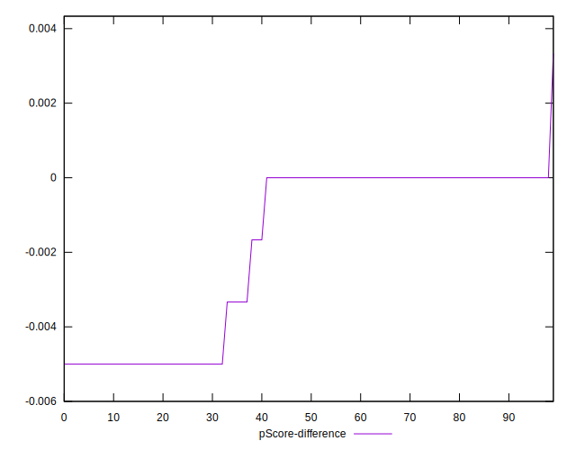