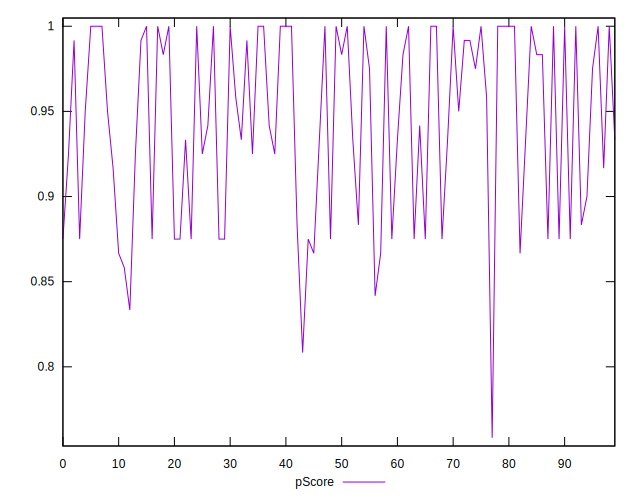
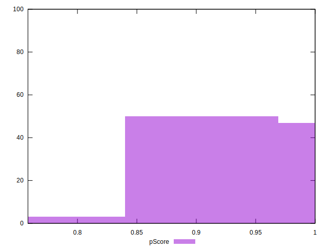

# //unused-css-rules/samples/pages

[→ Parent](../..)


## Raw


```yaml
p90min: 0
p90max: 190
p90range: 190
p90mean: 65
p90median: 60
p90stdev: 63.0222858252404
p90skewness: 0.3683481473548238
p90eccentricity: 1.0000000000000013
p90discretization: 5.875
outlandishness: 1.1041159763313608
confidence: 27.186643402972035
p90confidence: 25.48052141931123

```


## Score


```yaml
p90min: 0.84
p90max: 1
p90range: 0.16000000000000003
p90mean: 0.9467021276595747
p90median: 0.95
p90stdev: 0.05110248979803402
p90skewness: -0.3514655517593825
p90eccentricity: 1.0000000000000007
p90discretization: 7.230769230769231
outlandishness: 0.9940889946422878
confidence: 0.022187588742494435
p90confidence: 0.020661232274082984

```


## Raw Estimate


## Score Estimate


## P Score


```yaml
p90min: 0.8416666666666667
p90max: 1
p90range: 0.15833333333333333
p90mean: 0.9458333333333333
p90median: 0.95
p90stdev: 0.052518571521033675
p90skewness: -0.3683481473548158
p90eccentricity: 1.0000000000000004
p90discretization: 5.875
outlandishness: 0.9941934755186401
confidence: 0.022655536169143328
p90confidence: 0.02123376784942603

```


## Score Difference


```yaml
p90min: 0
p90max: 1.1102230246251565e-16
p90range: 1.1102230246251565e-16
p90mean: 4.724353296277262e-18
p90median: 0
p90stdev: 2.2409575331340657e-17
p90skewness: 4.532597979574666
p90eccentricity: 1.000000000000001
p90discretization: 47
outlandishness: 2.706025000000001
confidence: 1.1103983576888547e-17
p90confidence: 9.06040865942704e-18

```


## P Score Difference


```yaml
p90min: -0.0050000000000000044
p90max: 0.0033333333333332993
p90range: 0.008333333333333304
p90mean: -0.0008156028368794337
p90median: 0
p90stdev: 0.002821991073699421
p90skewness: -0.26156339093001924
p90eccentricity: 1.0000000000000013
p90discretization: 11.75
outlandishness: 1.002610396975428
confidence: 0.0011446927988498772
p90confidence: 0.001140958361902274

```

