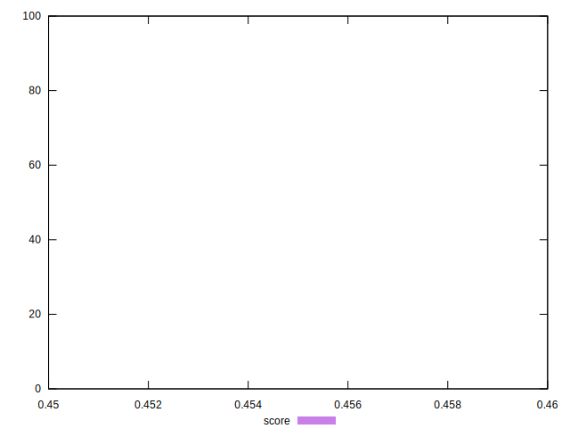

# //unused-javascript/samples/pages+cached+noadtech+nomedia+nocss

[→ Parent](../..)


## Raw


```yaml
p90min: 1050
p90max: 1050
p90range: 0
p90mean: 1050
p90median: 1050
p90stdev: 0
p90skewness: .nan
p90eccentricity: .nan
p90discretization: 94
outlandishness: 1.0028591836734693
confidence: 5.850418625396364
p90confidence: 0

```


## Score


```yaml
p90min: 0.46
p90max: 0.46
p90range: 0
p90mean: 0.4600000000000007
p90median: 0.46
p90stdev: 6.661338147750939e-16
p90skewness: -1
p90eccentricity: 1
p90discretization: 94
outlandishness: 0.9995652646502833
confidence: 0.00039002790835975757
p90confidence: 2.6932436221960113e-16

```


## Raw Estimate


## Score Estimate


## P Score


```yaml
p90min: 0.4647058823529412
p90max: 0.4647058823529412
p90range: 0
p90mean: 0.4647058823529403
p90median: 0.4647058823529412
p90stdev: 8.881784197001252e-16
p90skewness: 1
p90eccentricity: 1
p90discretization: 94
outlandishness: 0.999240650536772
confidence: 0.0006882845441642773
p90confidence: 3.5909914962613487e-16

```


## Score Difference


```yaml
p90min: 0
p90max: 0
p90range: 0
p90mean: 0
p90median: 0
p90stdev: 0
p90skewness: .nan
p90eccentricity: .nan
p90discretization: 94
outlandishness: .nan
confidence: 0
p90confidence: 0

```


## P Score Difference


```yaml
p90min: 0.004705882352941171
p90max: 0.004705882352941171
p90range: 0
p90mean: 0.004705882352941171
p90median: 0.004705882352941171
p90stdev: 0
p90skewness: .nan
p90eccentricity: .nan
p90discretization: 94
outlandishness: 0.9677640625
confidence: 0.0002982566358045194
p90confidence: 0

```

