# //unused-javascript/samples/pages+cached+noadtech+nomedia

[→ Parent](../..)


## Raw


```yaml
p90min: 2150
p90max: 2290
p90range: 140
p90mean: 2240.744680851064
p90median: 2250
p90stdev: 33.42948633785807
p90skewness: -1.6538218433485217
p90eccentricity: 0.999999999999997
p90discretization: 10.444444444444445
outlandishness: 0.9989785641517758
confidence: 14.56104191209762
p90confidence: 13.515865562705738

```

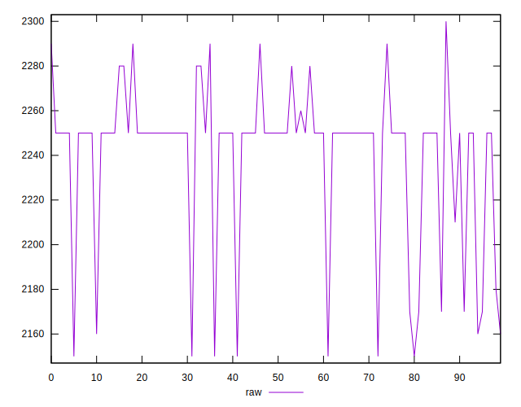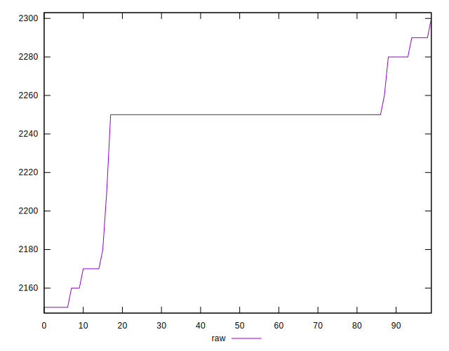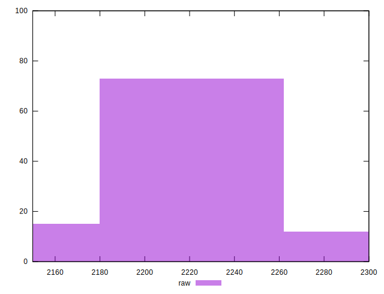
## Score


```yaml
p90min: 0.32
p90max: 0.34
p90range: 0.020000000000000018
p90mean: 0.3219148936170213
p90median: 0.32
p90stdev: 0.004898240184349507
p90skewness: 2.569352794456918
p90eccentricity: 1.0000000000000007
p90discretization: 31.333333333333332
outlandishness: 1.0030161505769124
confidence: 0.002225746008682743
p90confidence: 0.0019804060151093783

```

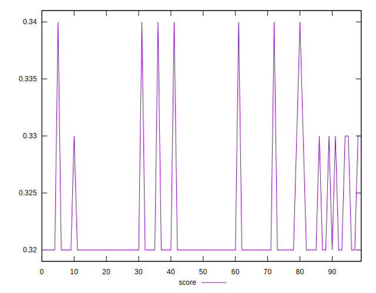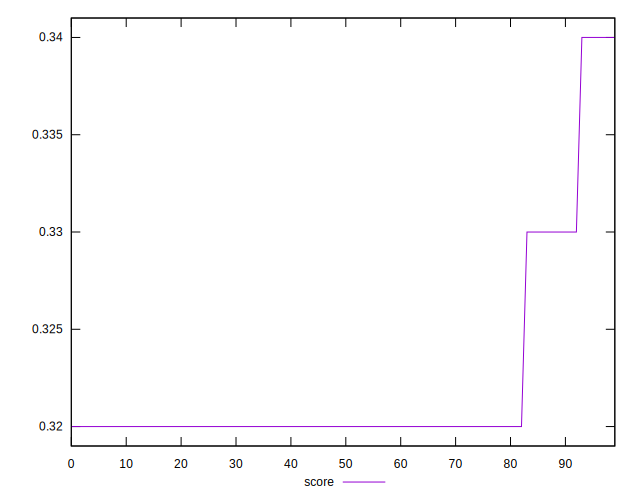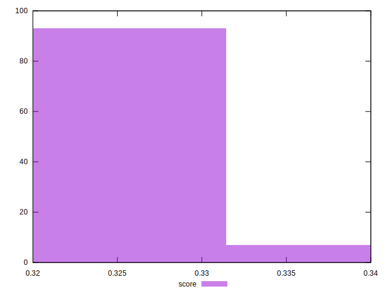
## Raw Estimate

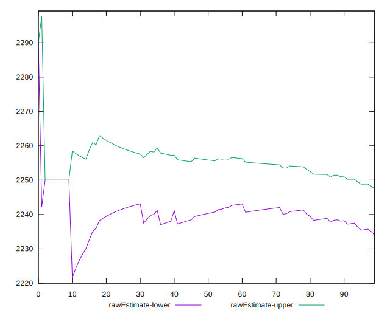
## Score Estimate

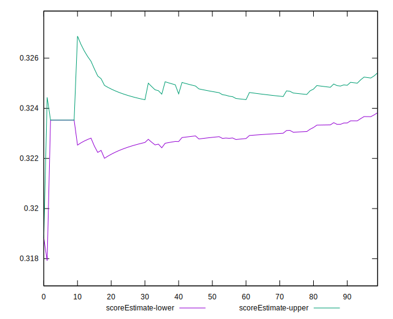
## P Score


```yaml
p90min: 0.31882352941176473
p90max: 0.33529411764705885
p90range: 0.016470588235294126
p90mean: 0.32461827284105166
p90median: 0.32352941176470584
p90stdev: 0.003932880745630367
p90skewness: 1.6538218433481586
p90eccentricity: 0.9999999999999999
p90discretization: 10.444444444444445
outlandishness: 1.0008298748429174
confidence: 0.0017130637543644313
p90confidence: 0.0015901018309065597

```

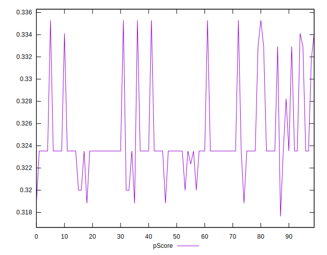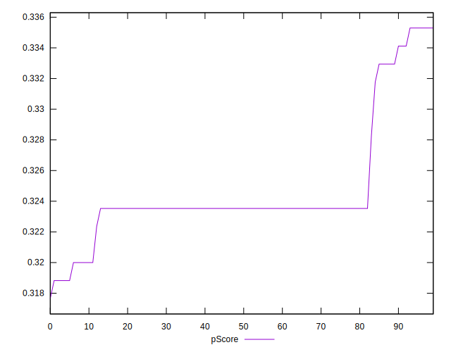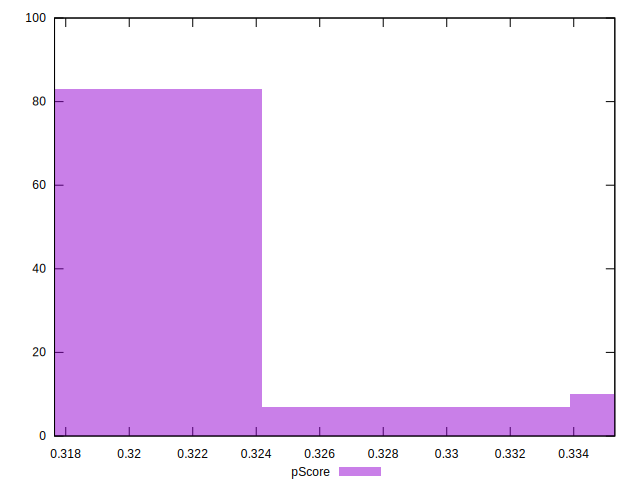
## Score Difference


```yaml
p90min: 0
p90max: 0
p90range: 0
p90mean: 0
p90median: 0
p90stdev: 0
p90skewness: .nan
p90eccentricity: .nan
p90discretization: 94
outlandishness: .nan
confidence: 0
p90confidence: 0

```


## P Score Difference


```yaml
p90min: -0.004705882352941171
p90max: 0.0035294117647058365
p90range: 0.008235294117647007
p90mean: 0.002521902377972432
p90median: 0.0035294117647058365
p90stdev: 0.0021392692898503807
p90skewness: -2.1543278046419143
p90eccentricity: 1.0000000000000036
p90discretization: 10.444444444444445
outlandishness: 0.8704936302791096
confidence: 0.000953514321714386
p90confidence: 0.0008649273228975176

```

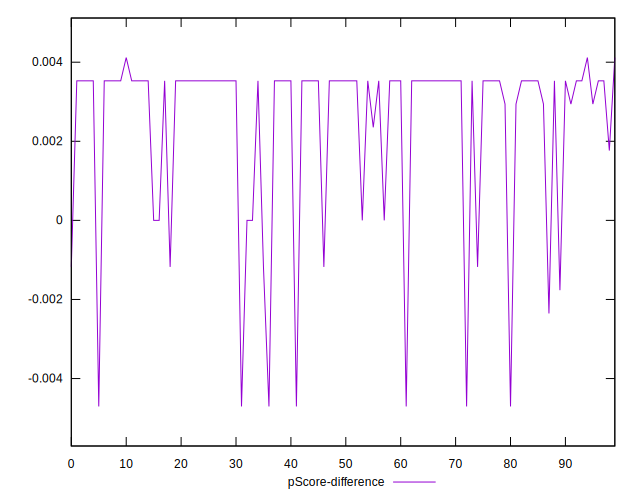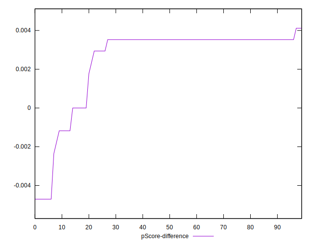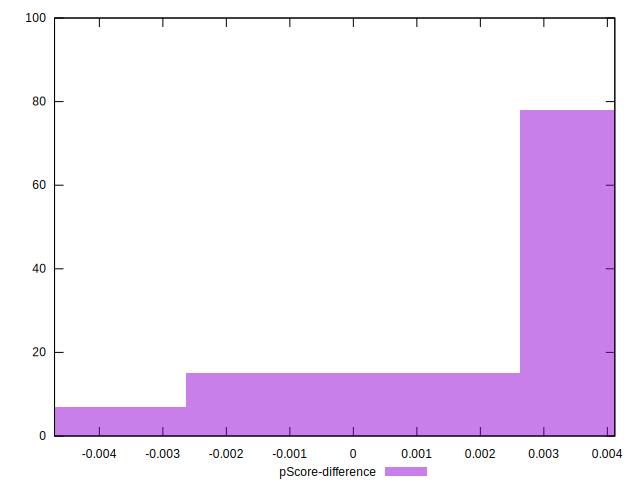