# //unused-javascript/samples/pages+cached+noadtech

[→ Parent](../..)


## Raw


```yaml
p90min: 2000
p90max: 2290
p90range: 290
p90mean: 2140.6382978723404
p90median: 2100
p90stdev: 71.5007589699087
p90skewness: 0.7560347210762189
p90eccentricity: 1
p90discretization: 5.222222222222222
outlandishness: 1.0002445234442627
confidence: 30.5356853541216
p90confidence: 28.90845034535557

```

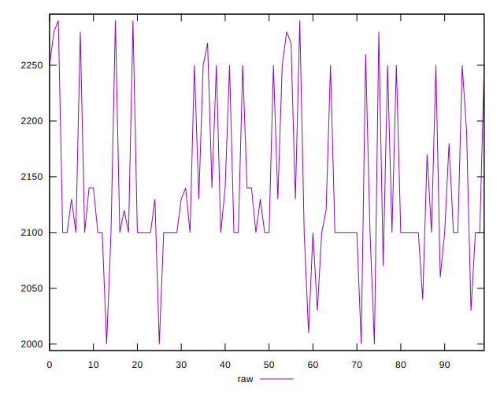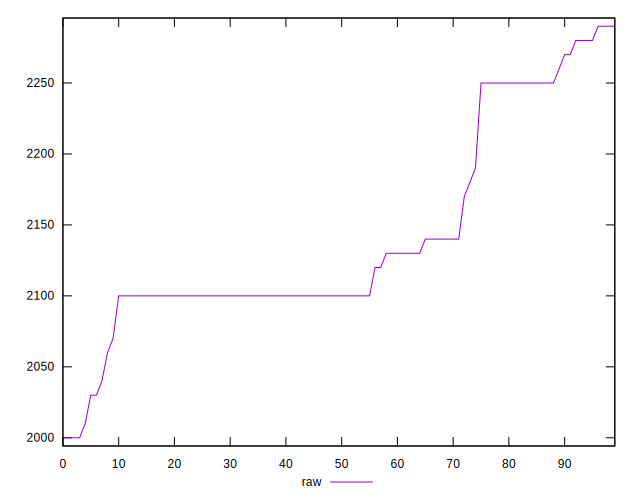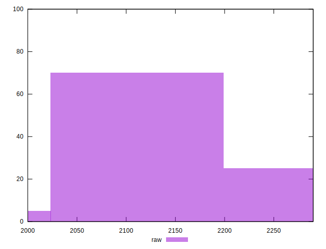
## Score


```yaml
p90min: 0.32
p90max: 0.35
p90range: 0.02999999999999997
p90mean: 0.33563829787234045
p90median: 0.34
p90stdev: 0.009174259856319311
p90skewness: -0.8496983331952292
p90eccentricity: 1
p90discretization: 23.5
outlandishness: 0.9997718038281003
confidence: 0.0037729179431792784
p90confidence: 0.003709242242077621

```

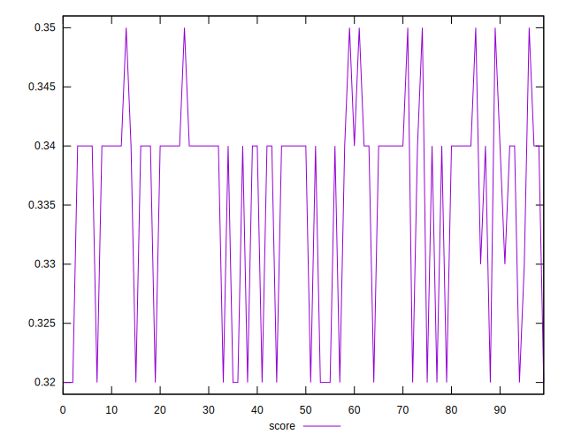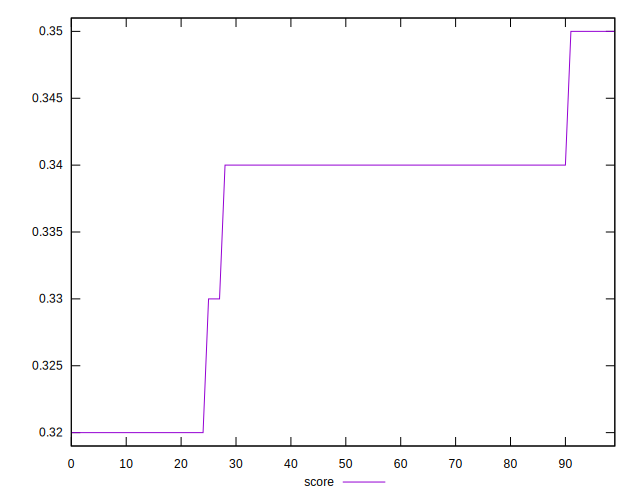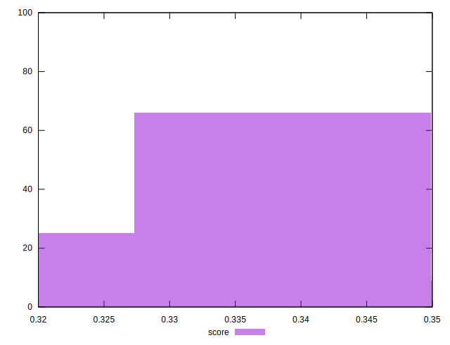
## Raw Estimate

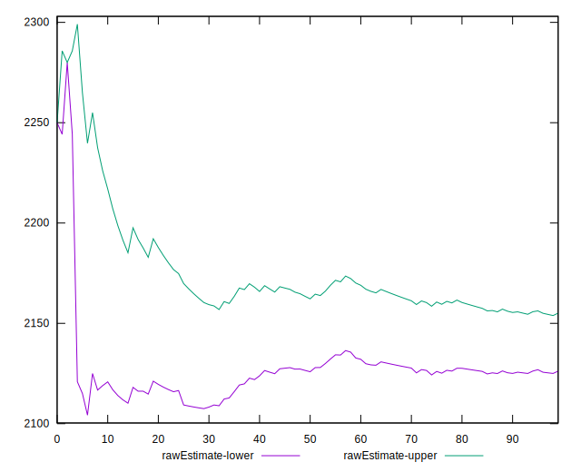
## Score Estimate

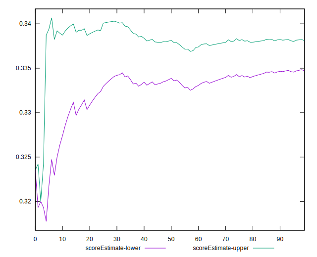
## P Score


```yaml
p90min: 0.31882352941176473
p90max: 0.3529411764705882
p90range: 0.034117647058823475
p90mean: 0.3363954943679597
p90median: 0.3411764705882353
p90stdev: 0.00841185399645985
p90skewness: -0.7560347210761081
p90eccentricity: 0.9999999999999996
p90discretization: 5.222222222222222
outlandishness: 0.9998169590427369
confidence: 0.0035924335710731314
p90confidence: 0.003400994158277127

```

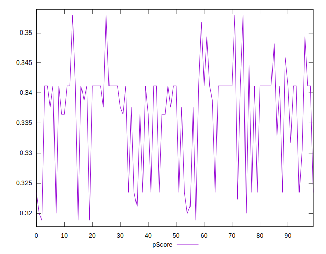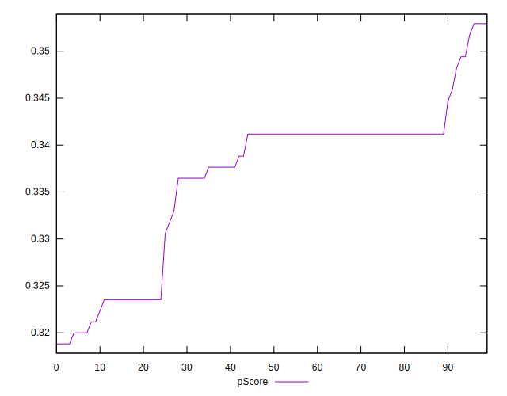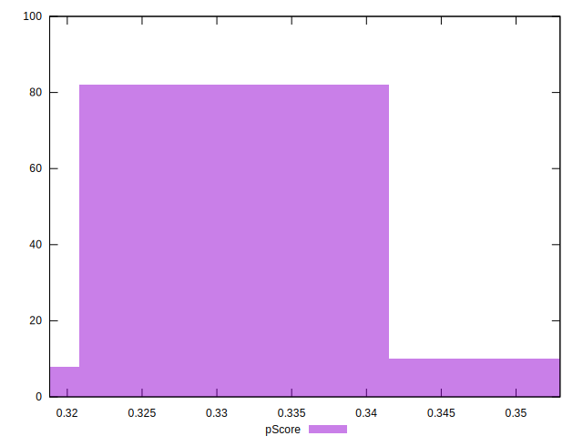
## Score Difference


```yaml
p90min: 0
p90max: 5.551115123125783e-17
p90range: 5.551115123125783e-17
p90mean: 3.543264972207946e-18
p90median: 0
p90stdev: 1.3569671737421595e-17
p90skewness: 3.568591947091798
p90eccentricity: 0.999999999999998
p90discretization: 47
outlandishness: 1.9881000000000004
confidence: 6.2273069308442164e-18
p90confidence: 5.486349897196453e-18

```

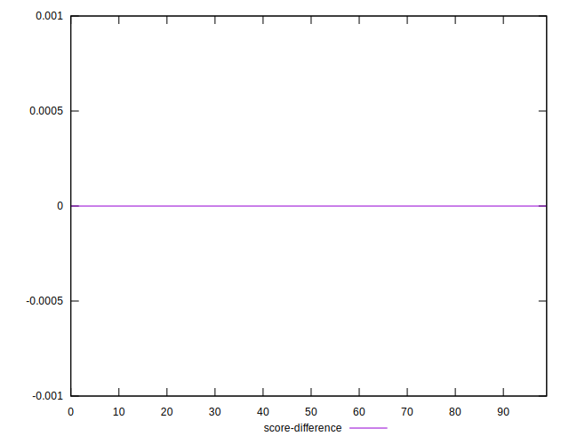
## P Score Difference


```yaml
p90min: -0.0035294117647059475
p90max: 0.0035294117647058365
p90range: 0.007058823529411784
p90mean: 0.0008072590738422833
p90median: 0.0011764705882352788
p90stdev: 0.0018541854545511061
p90skewness: -0.6702212103324116
p90eccentricity: 1.000000000000001
p90discretization: 7.230769230769231
outlandishness: 0.8973523225767638
confidence: 0.0007984335118245387
p90confidence: 0.0007496651632261638

```

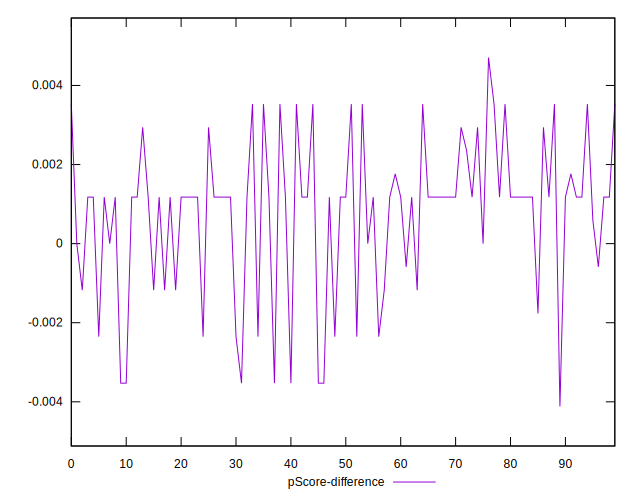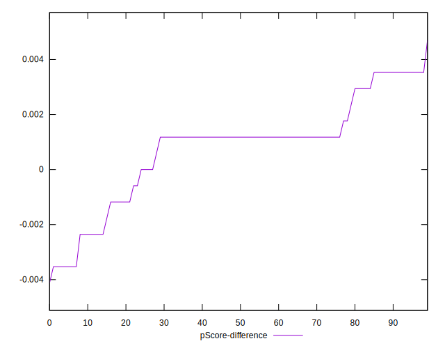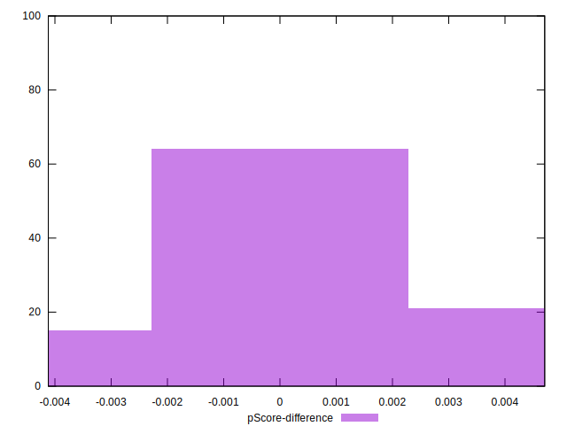