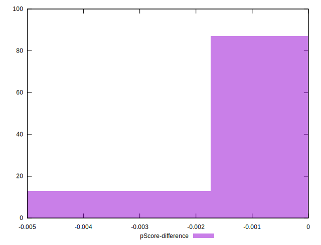

# //uses-http2/samples/pages+cached+noadtech+nomedia

[→ Parent](../..)


## Raw


```yaml
p90min: 0
p90max: 150
p90range: 150
p90mean: 15.957446808510639
p90median: 0
p90stdev: 46.249074721881186
p90skewness: 2.553242569566713
p90eccentricity: 1.0000000000000002
p90discretization: 47
outlandishness: 1.5395846399999997
confidence: 20.087326556602765
p90confidence: 18.698949484981235

```


## Score


```yaml
p90min: 0.88
p90max: 1
p90range: 0.12
p90mean: 0.9872340425531914
p90median: 1
p90stdev: 0.03699925977750498
p90skewness: -2.5532425695666956
p90eccentricity: 0.9999999999999974
p90discretization: 47
outlandishness: 0.9936609399570818
confidence: 0.016134634944034852
p90confidence: 0.014959159587984997

```


## Raw Estimate


## Score Estimate


## P Score


```yaml
p90min: 0.875
p90max: 1
p90range: 0.125
p90mean: 0.9867021276595744
p90median: 1
p90stdev: 0.038540895601567655
p90skewness: -2.553242569566708
p90eccentricity: 1.0000000000000004
p90discretization: 47
outlandishness: 0.9935199658241364
confidence: 0.016739438797168958
p90confidence: 0.01558245790415103

```


## Score Difference


```yaml
p90min: 0
p90max: 0
p90range: 0
p90mean: 0
p90median: 0
p90stdev: 0
p90skewness: .nan
p90eccentricity: .nan
p90discretization: 94
outlandishness: .nan
confidence: 0
p90confidence: 0

```


## P Score Difference


```yaml
p90min: -0.0050000000000000044
p90max: 0
p90range: 0.0050000000000000044
p90mean: -0.0004787234042553184
p90median: 0
p90stdev: 0.0014096581000213454
p90skewness: -2.6870676355179306
p90eccentricity: 0.999999999999997
p90discretization: 31.333333333333332
outlandishness: 1.5708444444444463
confidence: 0.0006164805966078785
p90confidence: 0.0005699384422694802

```

