# //uses-http2/samples/pages+cached+noadtech

[→ Parent](../..)


## Raw


```yaml
p90min: 0
p90max: 160
p90range: 160
p90mean: 102.65957446808511
p90median: 150
p90stdev: 70.3210802193992
p90skewness: -0.772631718320324
p90eccentricity: 1.000000000000001
p90discretization: 31.333333333333332
outlandishness: 1.0302355181615614
confidence: 30.950952950358527
p90confidence: 28.431494784689043

```

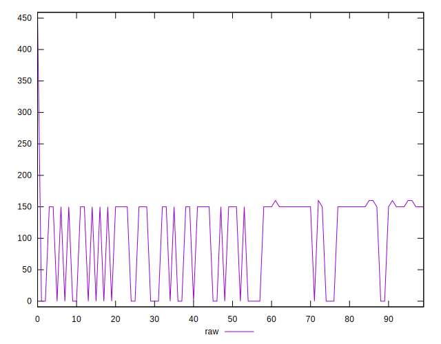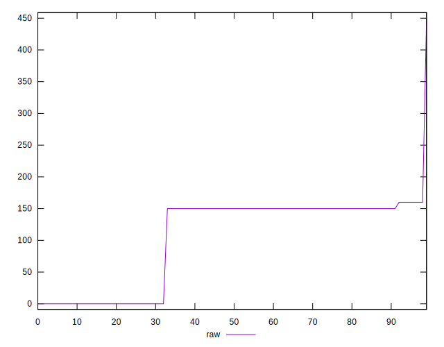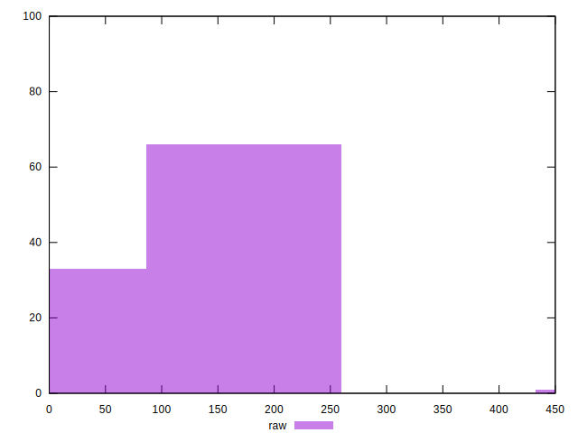
## Score


```yaml
p90min: 0.87
p90max: 1
p90range: 0.13
p90mean: 0.9177659574468083
p90median: 0.88
p90stdev: 0.05634533066646324
p90skewness: 0.770742027054714
p90eccentricity: 1.0000000000000016
p90discretization: 31.333333333333332
outlandishness: 0.9978960886503807
confidence: 0.024309116540320957
p90confidence: 0.022780963688086187

```

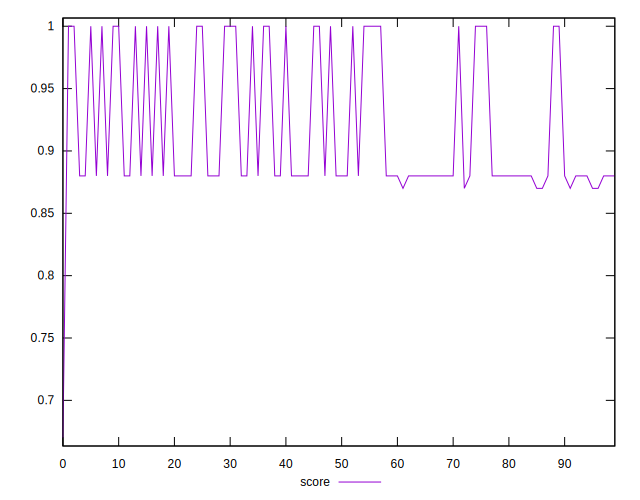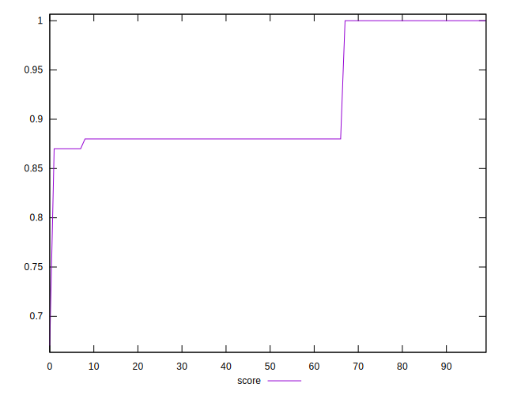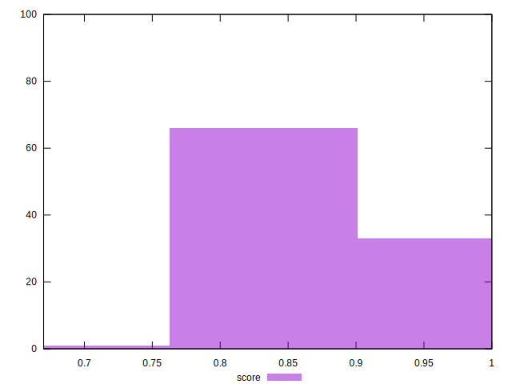
## Raw Estimate

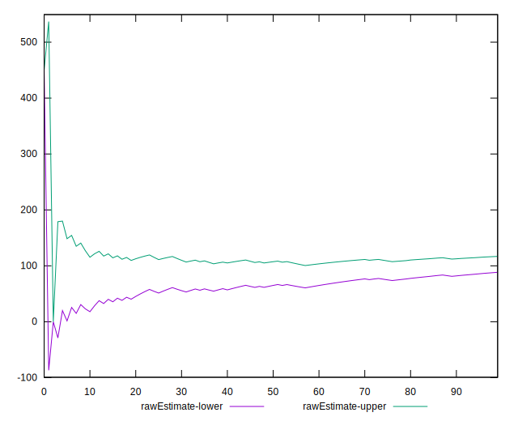
## Score Estimate

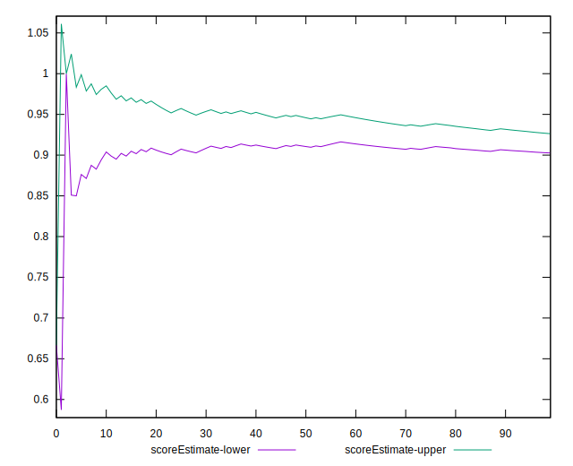
## P Score


```yaml
p90min: 0.8666666666666667
p90max: 1
p90range: 0.1333333333333333
p90mean: 0.9144503546099289
p90median: 0.875
p90stdev: 0.05860090018283268
p90skewness: 0.7726317183203181
p90eccentricity: 0.9999999999999989
p90discretization: 31.333333333333332
outlandishness: 0.9981046313861774
confidence: 0.025119567880991584
p90confidence: 0.023692912320574206

```

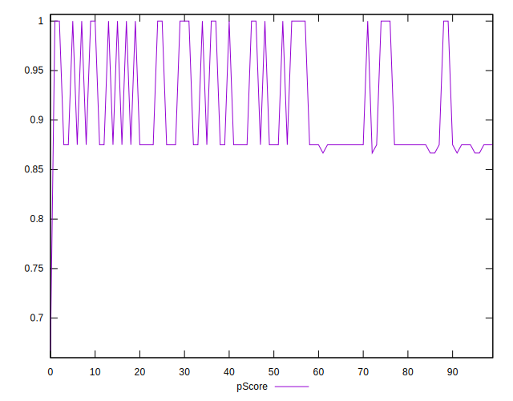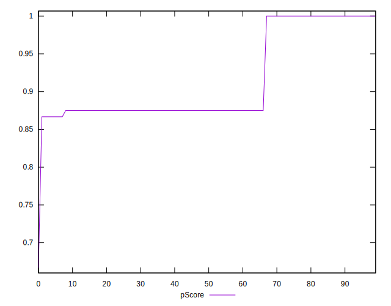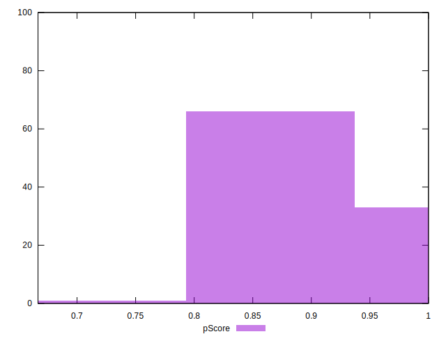
## Score Difference


```yaml
p90min: 0
p90max: 0
p90range: 0
p90mean: 0
p90median: 0
p90stdev: 0
p90skewness: .nan
p90eccentricity: .nan
p90discretization: 94
outlandishness: .nan
confidence: 0
p90confidence: 0

```


## P Score Difference


```yaml
p90min: -0.0050000000000000044
p90max: 0
p90range: 0.0050000000000000044
p90mean: -0.0032624113475177314
p90median: -0.0050000000000000044
p90stdev: 0.0022794551319132226
p90skewness: 0.6717729901050692
p90eccentricity: 0.9999999999999996
p90discretization: 23.5
outlandishness: 0.9721531309073723
confidence: 0.0009017491151031854
p90confidence: 0.0009216058185216138

```

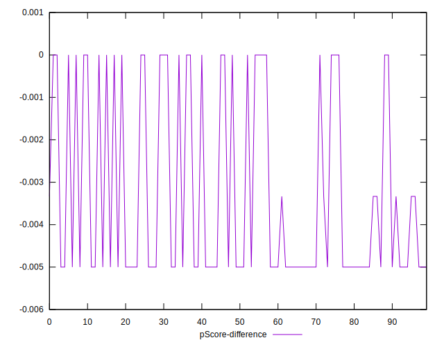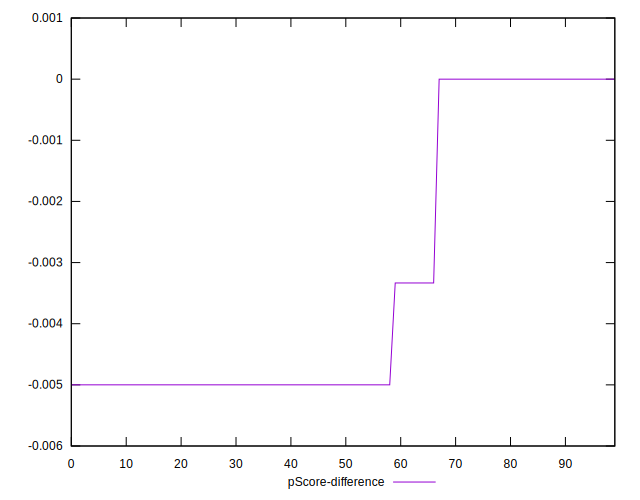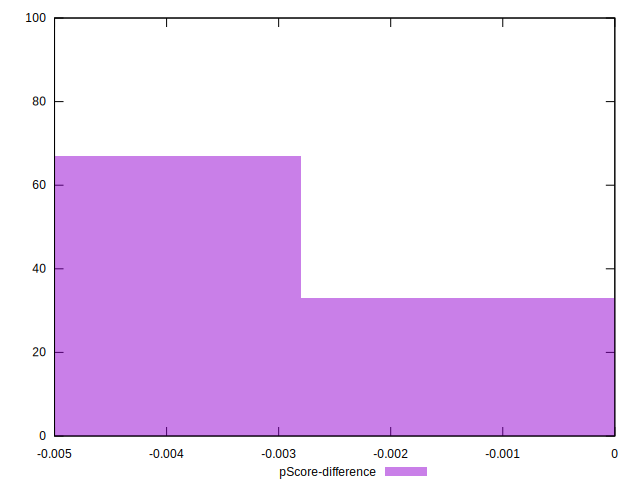