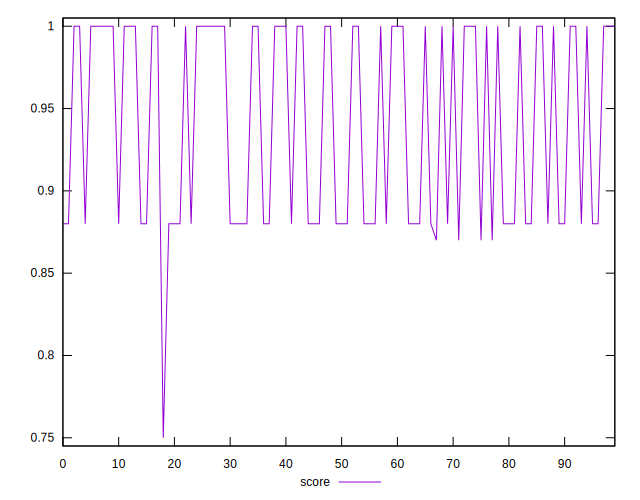

# //uses-http2/samples/pages+cached

[→ Parent](../..)


## Raw


```yaml
p90min: 0
p90max: 160
p90range: 160
p90mean: 72.02127659574468
p90median: 0
p90stdev: 75.1676111105869
p90skewness: 0.08630742532684908
p90eccentricity: 1.0000000000000018
p90discretization: 31.333333333333332
outlandishness: 1.0528518064534431
confidence: 30.710302854298398
p90confidence: 30.390994231038913

```


## Score


```yaml
p90min: 0.87
p90max: 1
p90range: 0.13
p90mean: 0.9423404255319148
p90median: 1
p90stdev: 0.06018456598495704
p90skewness: -0.08695342913256972
p90eccentricity: 0.9999999999999979
p90discretization: 31.333333333333332
outlandishness: 0.9965214318271461
confidence: 0.024718899178627175
p90confidence: 0.02433320376452401

```


## Raw Estimate


## Score Estimate


## P Score


```yaml
p90min: 0.8666666666666667
p90max: 1
p90range: 0.1333333333333333
p90mean: 0.9399822695035461
p90median: 1
p90stdev: 0.06263967592548911
p90skewness: -0.08630742532685041
p90eccentricity: 0.9999999999999996
p90discretization: 31.333333333333332
outlandishness: 0.9966716414129702
confidence: 0.025591919045248664
p90confidence: 0.025325828525865766

```


## Score Difference


```yaml
p90min: 0
p90max: 0
p90range: 0
p90mean: 0
p90median: 0
p90stdev: 0
p90skewness: .nan
p90eccentricity: .nan
p90discretization: 94
outlandishness: .nan
confidence: 0
p90confidence: 0

```


## P Score Difference


```yaml
p90min: -0.0050000000000000044
p90max: 0
p90range: 0.0050000000000000044
p90mean: -0.002269503546099291
p90median: 0
p90stdev: 0.002441406308944471
p90skewness: -0.17153999047191937
p90eccentricity: 0.9999999999999987
p90discretization: 31.333333333333332
outlandishness: 1.0122246337890626
confidence: 0.0009586474839780227
p90confidence: 0.0009870842501778436

```

