# //uses-http2/samples/pages

[→ Parent](../..)


## Raw


```yaml
p90min: 0
p90max: 300
p90range: 300
p90mean: 108.51063829787235
p90median: 150
p90stdev: 70.57450336434896
p90skewness: -0.6888658977775152
p90eccentricity: 0.999999999999998
p90discretization: 31.333333333333332
outlandishness: 1.048294920799692
confidence: 30.78526355234858
p90confidence: 28.533956220171525

```

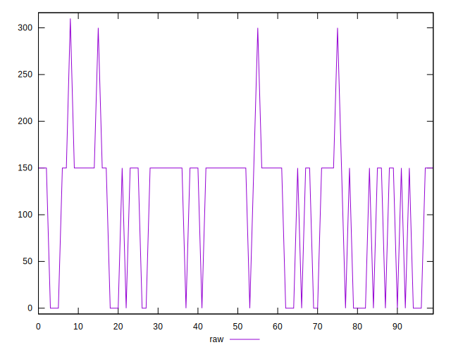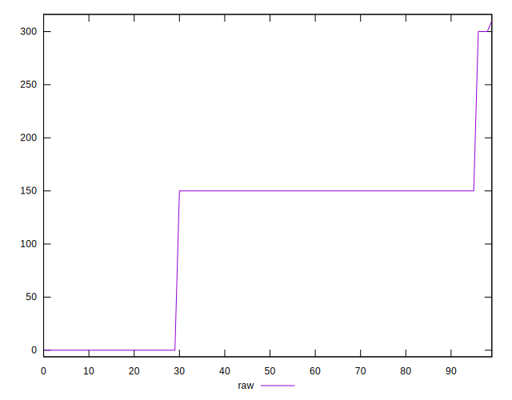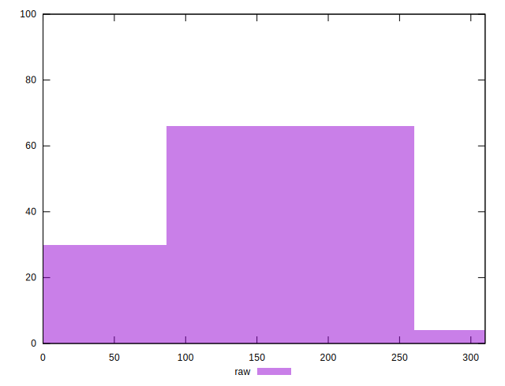
## Score


```yaml
p90min: 0.75
p90max: 1
p90range: 0.25
p90mean: 0.9130851063829789
p90median: 0.88
p90stdev: 0.05675678974744334
p90skewness: 0.6400276344240554
p90eccentricity: 1.0000000000000002
p90discretization: 31.333333333333332
outlandishness: 0.994782542722243
confidence: 0.025040056814975935
p90confidence: 0.022947320585313877

```

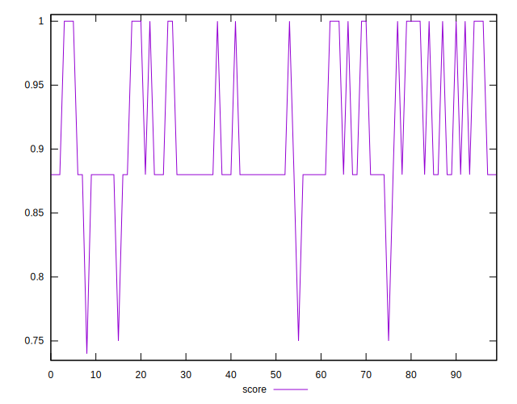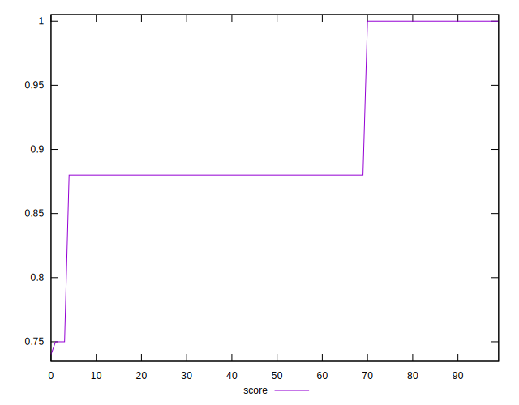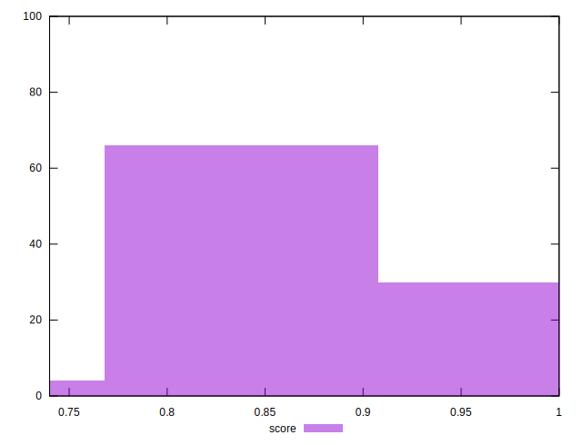
## Raw Estimate

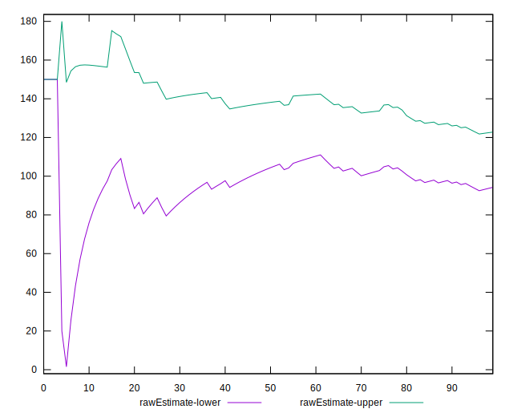
## Score Estimate

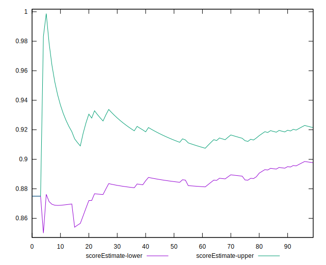
## P Score


```yaml
p90min: 0.75
p90max: 1
p90range: 0.25
p90mean: 0.9095744680851063
p90median: 0.875
p90stdev: 0.05881208613695736
p90skewness: 0.6888658977775204
p90eccentricity: 1.0000000000000004
p90discretization: 31.333333333333332
outlandishness: 0.9953219231815974
confidence: 0.025627023560316656
p90confidence: 0.023778296850142898

```

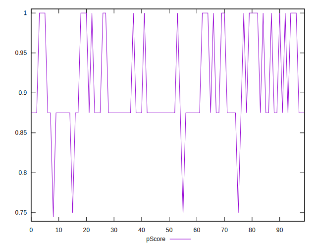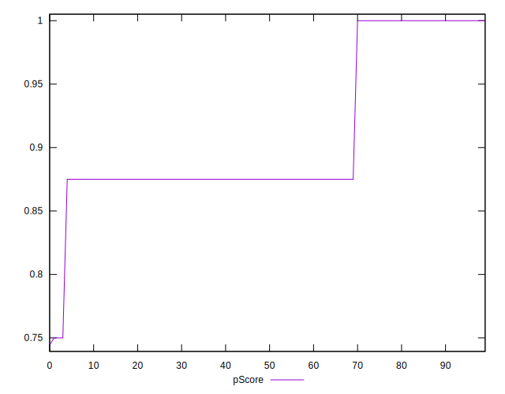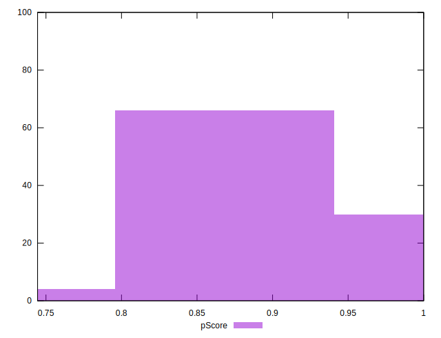
## Score Difference


```yaml
p90min: 0
p90max: 0
p90range: 0
p90mean: 0
p90median: 0
p90stdev: 0
p90skewness: .nan
p90eccentricity: .nan
p90discretization: 94
outlandishness: .nan
confidence: 0
p90confidence: 0

```


## P Score Difference


```yaml
p90min: -0.0050000000000000044
p90max: 0
p90range: 0.0050000000000000044
p90mean: -0.0033510638297872372
p90median: -0.0050000000000000044
p90stdev: 0.002350678701487699
p90skewness: 0.7241005155222736
p90eccentricity: 1.0000000000000004
p90discretization: 47
outlandishness: 0.9438105365968973
confidence: 0.0009680626119968821
p90confidence: 0.0009504021985059051

```

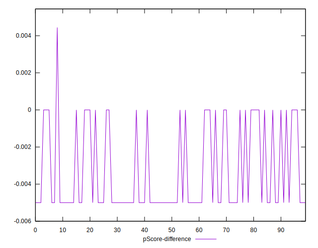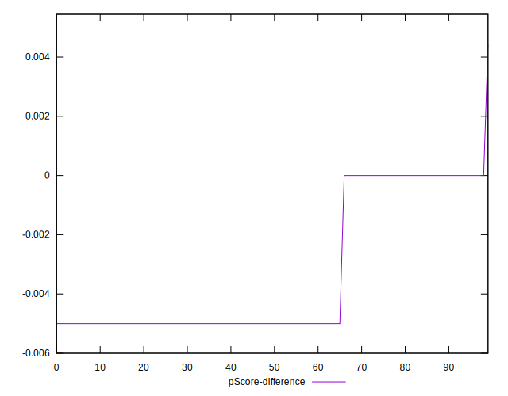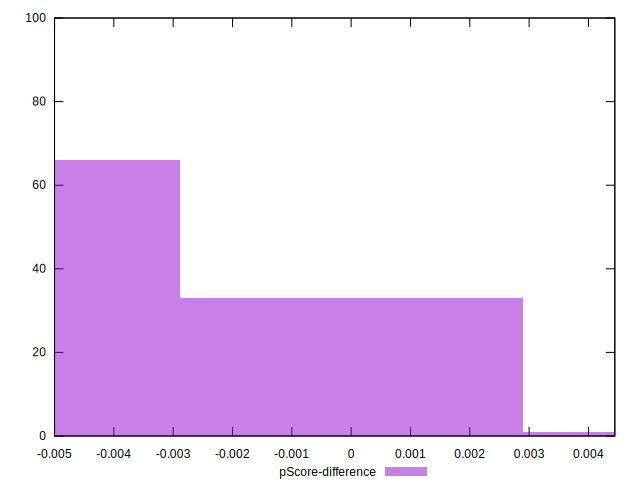