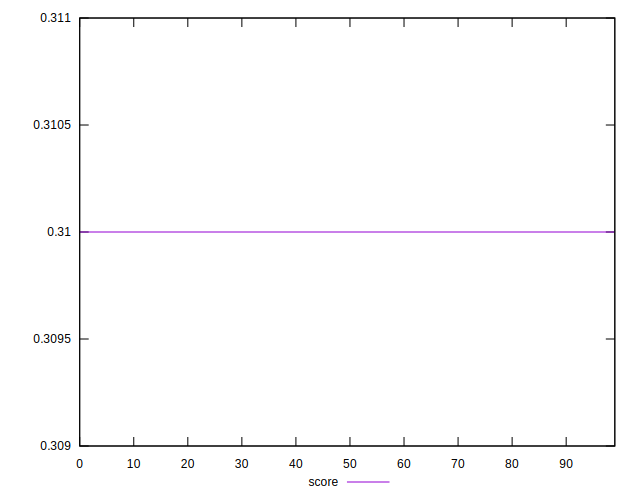

# //uses-long-cache-ttl/samples/pages+cached+noadtech+nomedia+nocss

[→ Parent](../..)


## Raw


```yaml
p90min: 238691.71666666665
p90max: 238693.48333333334
p90range: 1.76666666669189
p90mean: 238692.8631205675
p90median: 238692.6
p90stdev: 0.5285852048634955
p90skewness: -0.2265509106224592
p90eccentricity: 0.9999999999999997
p90discretization: 31.333333333333332
outlandishness: 0.9999933125840248
confidence: 3.103310075068517
p90confidence: 0.21371212513306098

```


## Score


```yaml
p90min: 0.31
p90max: 0.31
p90range: 0
p90mean: 0.3099999999999995
p90median: 0.31
p90stdev: 4.996003610813204e-16
p90skewness: 1
p90eccentricity: 1
p90discretization: 94
outlandishness: 0.9999999999999996
confidence: 2.175997143072433e-16
p90confidence: 2.0199327166470086e-16

```


## Raw Estimate


## Score Estimate


## P Score


```yaml
p90min: 0.3066193348092728
p90max: 0.30662152605636617
p90range: 0.0000021912470933860284
p90mean: 0.3066201040752698
p90median: 0.30662043042992815
p90stdev: 6.556185210396023e-7
p90skewness: 0.2265572417351184
p90eccentricity: 0.9999999999999987
p90discretization: 31.333333333333332
outlandishness: 1.0000064585809547
confidence: 0.000003850026669296161
p90confidence: 2.650729269733372e-7

```


## Score Difference


```yaml
p90min: 0
p90max: 0
p90range: 0
p90mean: 0
p90median: 0
p90stdev: 0
p90skewness: .nan
p90eccentricity: .nan
p90discretization: 94
outlandishness: .nan
confidence: 0
p90confidence: 0

```


## P Score Difference


```yaml
p90min: -0.0033806651907272167
p90max: -0.0033784739436338307
p90range: 0.0000021912470933860284
p90mean: -0.0033798959247300594
p90median: -0.0033795695700718498
p90stdev: 6.556185210396014e-7
p90skewness: 0.22655724082425666
p90eccentricity: 1.0000000000000007
p90discretization: 31.333333333333332
outlandishness: 0.9994141720527028
confidence: 0.000003850026669296161
p90confidence: 2.650729269733369e-7

```

