# //uses-long-cache-ttl/samples/pages+cached+noadtech+nomedia

[→ Parent](../..)


## Raw


```yaml
p90min: 571110.9666666667
p90max: 571112.7333333334
p90range: 1.7666666667209938
p90mean: 571112.2070921994
p90median: 571111.85
p90stdev: 0.48756698859572706
p90skewness: -0.18609175315277762
p90eccentricity: 0.9999999999999994
p90discretization: 31.333333333333332
outlandishness: 0.9999907925175461
confidence: 10.538010690710985
p90confidence: 0.19712806245575604

```

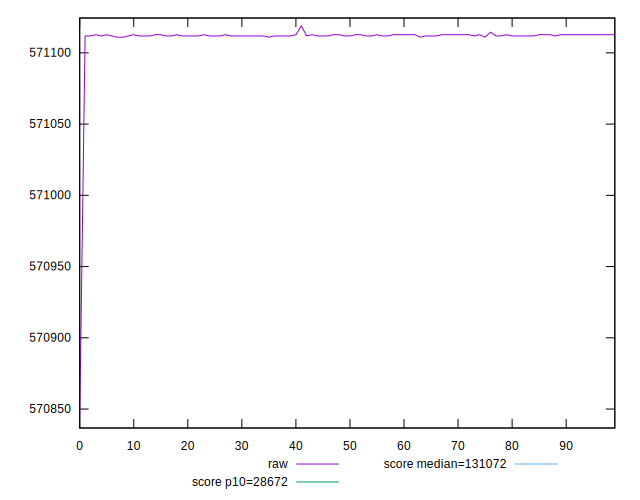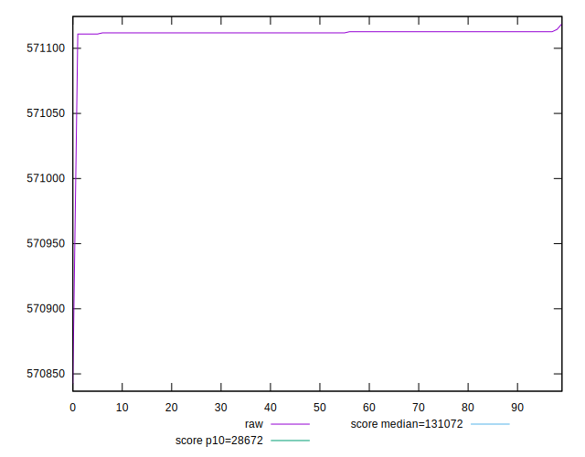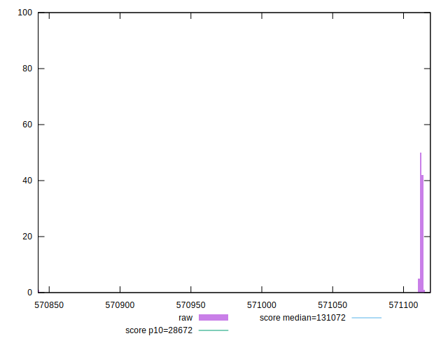
## Score


```yaml
p90min: 0.11
p90max: 0.11
p90range: 0
p90mean: 0.10999999999999997
p90median: 0.11
p90stdev: 2.7755575615628914e-17
p90skewness: 1
p90eccentricity: 1
p90discretization: 94
outlandishness: 0.9999999999999996
confidence: 2.1759971430724333e-17
p90confidence: 1.1221848425816715e-17

```


## Raw Estimate

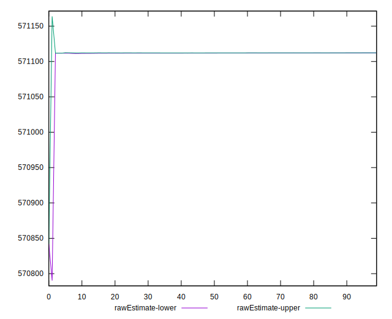
## Score Estimate

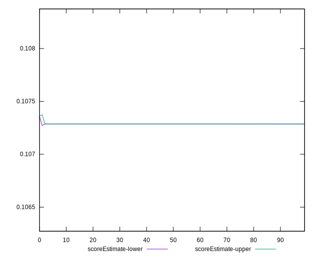
## P Score


```yaml
p90min: 0.10728655134467074
p90max: 0.10728703308634607
p90range: 4.817416753288839e-7
p90mean: 0.1072866948419884
p90median: 0.10728679221512716
p90stdev: 1.329515521751548e-7
p90skewness: 0.1860944898667529
p90eccentricity: 1.0000000000000022
p90discretization: 31.333333333333332
outlandishness: 1.0000133719231348
confidence: 0.000002874931576524648
p90confidence: 5.375360205632122e-8

```

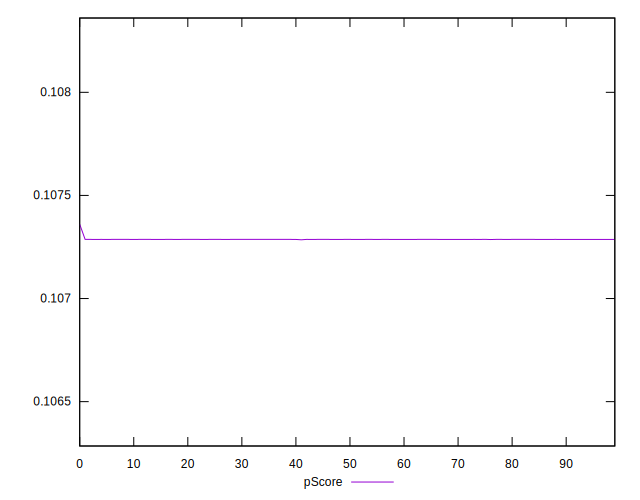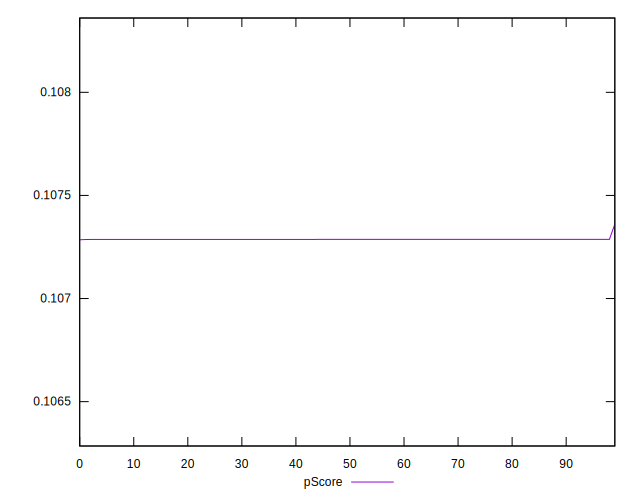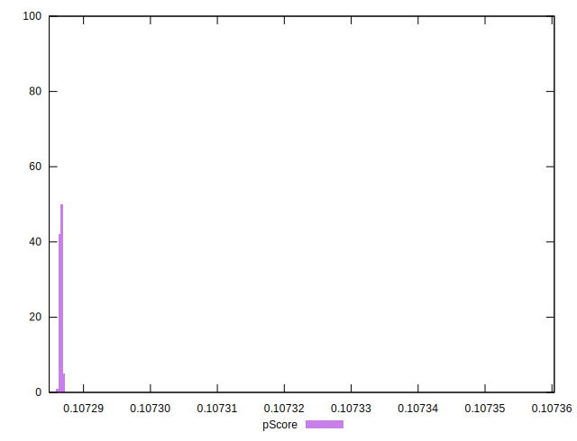
## Score Difference


```yaml
p90min: 0
p90max: 0
p90range: 0
p90mean: 0
p90median: 0
p90stdev: 0
p90skewness: .nan
p90eccentricity: .nan
p90discretization: 94
outlandishness: .nan
confidence: 0
p90confidence: 0

```


## P Score Difference


```yaml
p90min: -0.0027134486553292564
p90max: -0.0027129669136539275
p90range: 4.817416753288839e-7
p90mean: -0.002713305158011732
p90median: -0.0027132077848728425
p90stdev: 1.3295155217515498e-7
p90skewness: 0.186094492773147
p90eccentricity: 1.0000000000000004
p90discretization: 31.333333333333332
outlandishness: 0.9994713329601368
confidence: 0.000002874931576524648
p90confidence: 5.37536020563213e-8

```

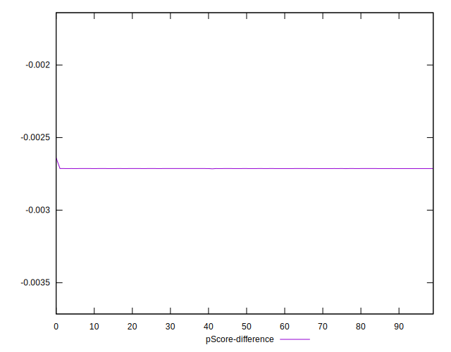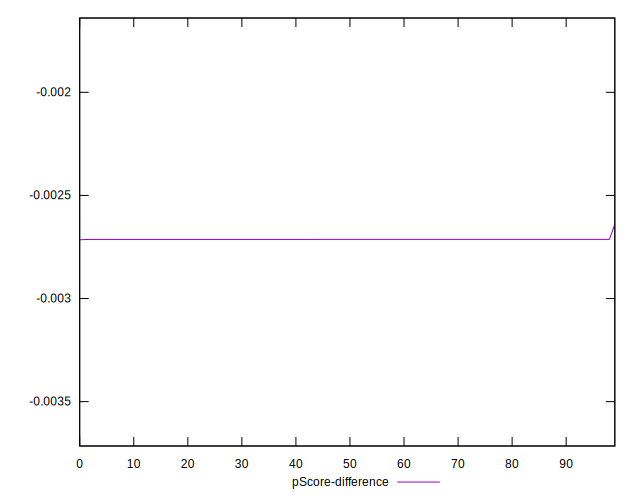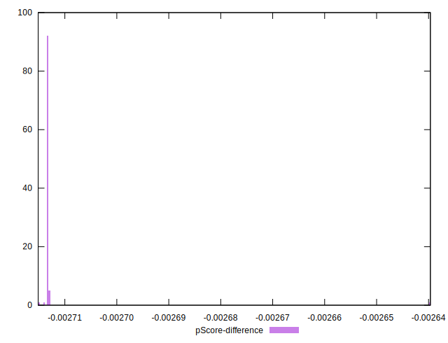