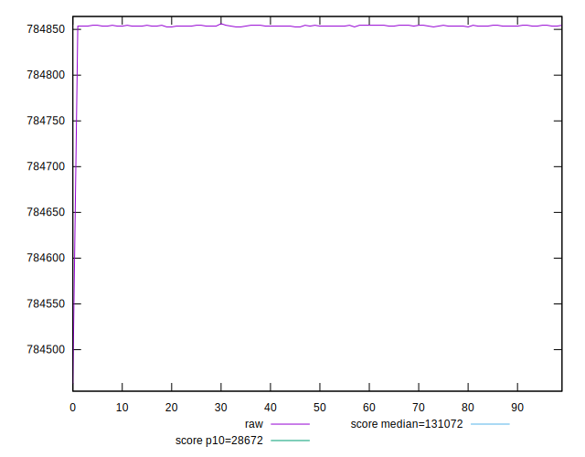
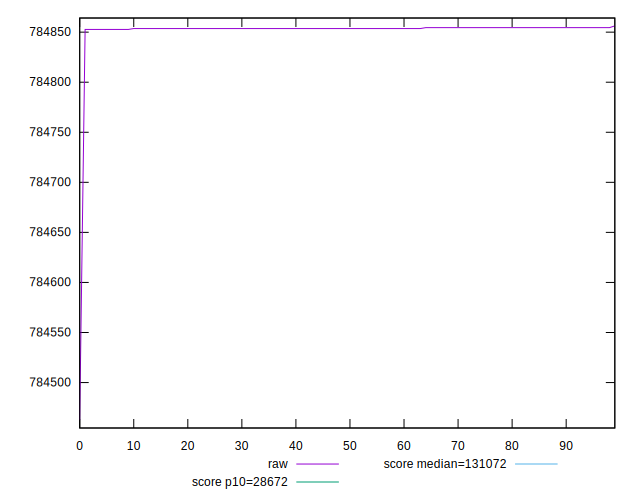
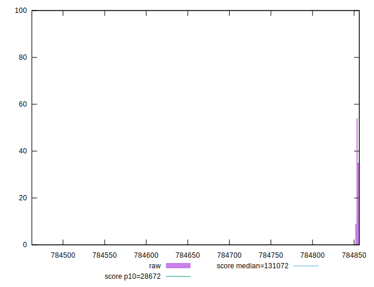
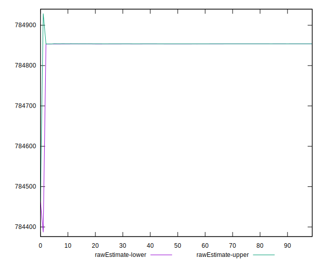
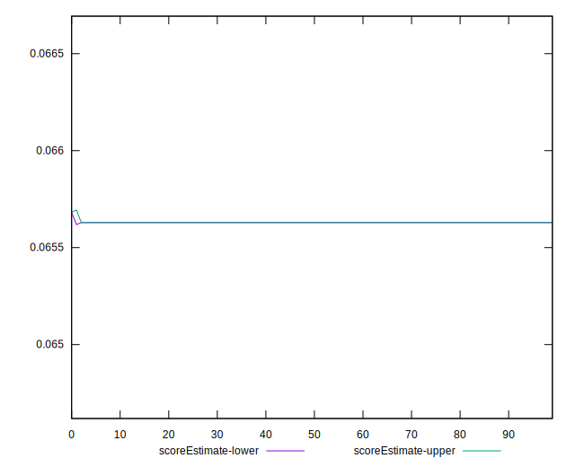
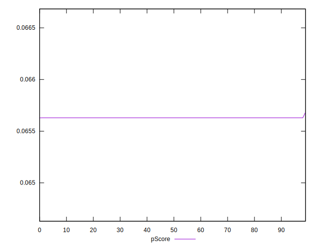
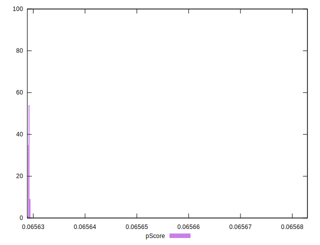
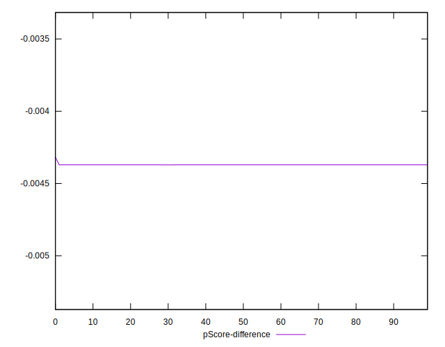
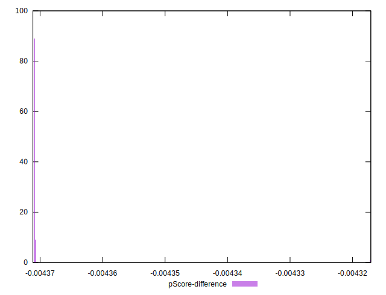

# //uses-long-cache-ttl/samples/pages+cached+noadtech

[→ Parent](../..)


## Raw


```yaml
p90min: 784852.7166666667
p90max: 784854.4833333334
p90range: 1.7666666667209938
p90mean: 784853.8443262416
p90median: 784853.6
p90stdev: 0.5218599283838208
p90skewness: -0.16577706162682873
p90eccentricity: 1
p90discretization: 31.333333333333332
outlandishness: 0.9999900635855118
confidence: 15.26648139377557
p90confidence: 0.21099303062312316

```


## Score


```yaml
p90min: 0.07
p90max: 0.07
p90range: 0
p90mean: 0.07000000000000008
p90median: 0.07
p90stdev: 6.938893903907228e-17
p90skewness: -1
p90eccentricity: 1
p90discretization: 94
outlandishness: 1.0000000000000004
confidence: 3.26399571460865e-17
p90confidence: 2.8054621064541785e-17

```


## Raw Estimate


## Score Estimate


## P Score


```yaml
p90min: 0.06562909015552887
p90max: 0.06562933262316839
p90range: 2.4246763952184835e-7
p90mean: 0.06562917785650091
p90median: 0.06562921138919359
p90stdev: 7.162305923723062e-8
p90skewness: 0.16578026134433646
p90eccentricity: 1.0000000000000007
p90discretization: 31.333333333333332
outlandishness: 1.0000163181256165
confidence: 0.0000020964469125111055
p90confidence: 2.8957897529637725e-8

```


## Score Difference


```yaml
p90min: 0
p90max: 0
p90range: 0
p90mean: 0
p90median: 0
p90stdev: 0
p90skewness: .nan
p90eccentricity: .nan
p90discretization: 94
outlandishness: .nan
confidence: 0
p90confidence: 0

```


## P Score Difference


```yaml
p90min: -0.004370909844471138
p90max: -0.004370667376831616
p90range: 2.4246763952184835e-7
p90mean: -0.004370822143499101
p90median: -0.00437078861080642
p90stdev: 7.162305923723067e-8
p90skewness: 0.16578026207094193
p90eccentricity: 0.9999999999999992
p90discretization: 31.333333333333332
outlandishness: 0.999754994560815
confidence: 0.0000020964469125111055
p90confidence: 2.8957897529637748e-8

```

