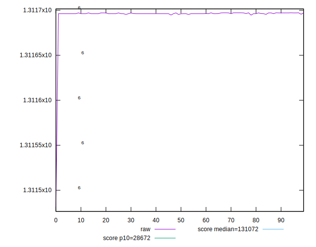
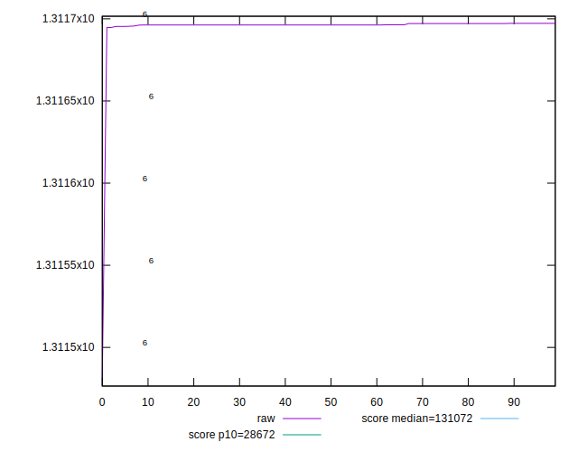
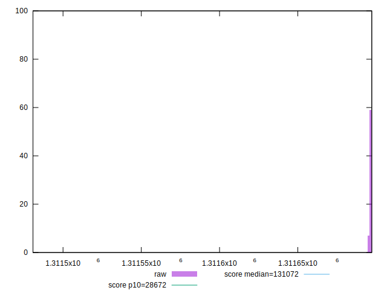
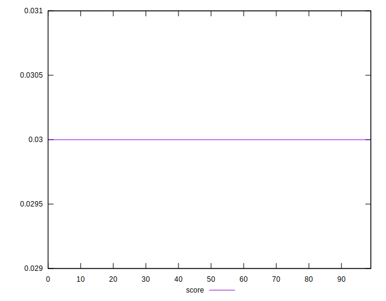
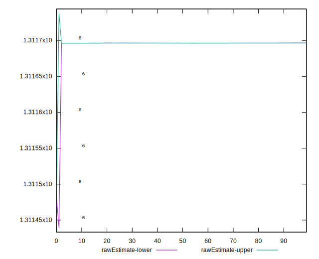
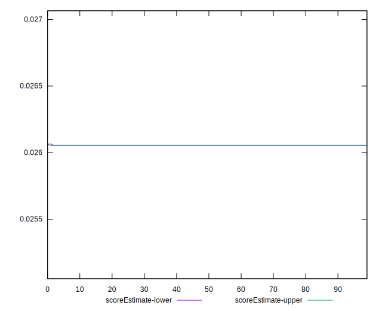
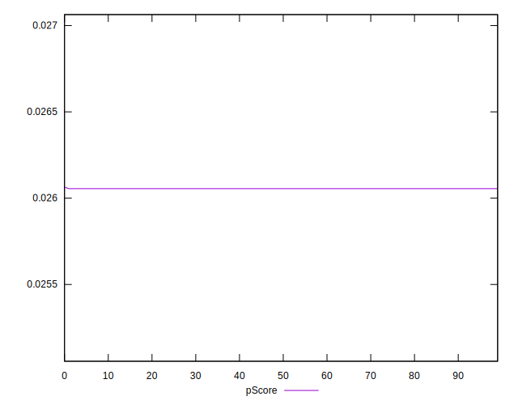
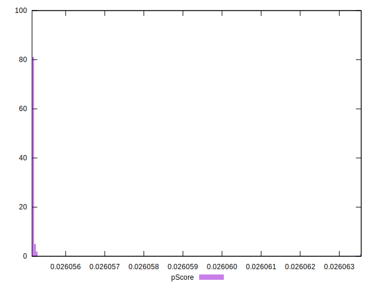
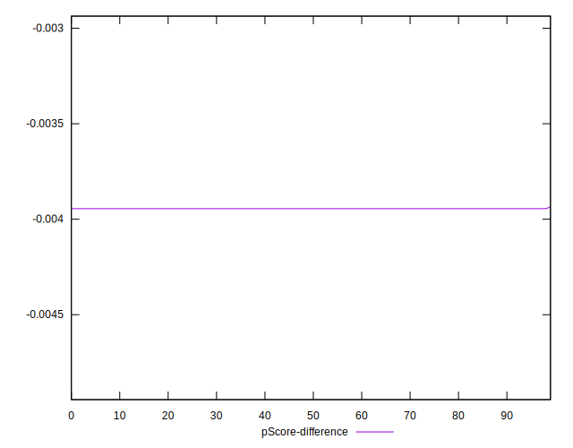
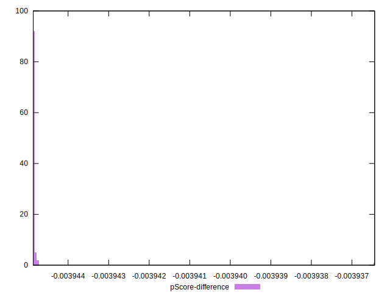

# //uses-long-cache-ttl/samples/pages+cached

[→ Parent](../..)


## Raw


```yaml
p90min: 1311695.3771004037
p90max: 1311697.2434877409
p90range: 1.8663873372133821
p90mean: 1311696.5119878792
p90median: 1311696.2604337372
p90stdev: 0.48754891234377457
p90skewness: 0.14918102916755815
p90eccentricity: 1.0000000000000016
p90discretization: 8.545454545454545
outlandishness: 0.999996689599573
confidence: 8.415254991891981
p90confidence: 0.19712075405176804

```


## Score


```yaml
p90min: 0.03
p90max: 0.03
p90range: 0
p90mean: 0.02999999999999996
p90median: 0.03
p90stdev: 3.8163916471489756e-17
p90skewness: 1
p90eccentricity: 1
p90discretization: 94
outlandishness: 0.9999999999999993
confidence: 1.903997500188379e-17
p90confidence: 1.5430041585497983e-17

```


## Raw Estimate


## Score Estimate


## P Score


```yaml
p90min: 0.026055140261607657
p90max: 0.02605521285454865
p90range: 7.259294099171143e-8
p90mean: 0.026055168713195423
p90median: 0.02605517849735678
p90stdev: 1.8963155057014776e-8
p90skewness: -0.1491790062543816
p90eccentricity: 0.9999999999999989
p90discretization: 9.4
outlandishness: 1.000006483463994
confidence: 3.2738129177115027e-7
p90confidence: 7.666987515303153e-9

```


## Score Difference


```yaml
p90min: 0
p90max: 0
p90range: 0
p90mean: 0
p90median: 0
p90stdev: 0
p90skewness: .nan
p90eccentricity: .nan
p90discretization: 94
outlandishness: .nan
confidence: 0
p90confidence: 0

```


## P Score Difference


```yaml
p90min: -0.003944859738392342
p90max: -0.0039447871454513506
p90range: 7.259294099171143e-8
p90mean: -0.003944831286804591
p90median: -0.00394482150264322
p90stdev: 1.8963155057014766e-8
p90skewness: -0.14917900337280482
p90eccentricity: 0.9999999999999999
p90discretization: 9.4
outlandishness: 0.9999571779745078
confidence: 3.2738129177115027e-7
p90confidence: 7.666987515303148e-9

```

