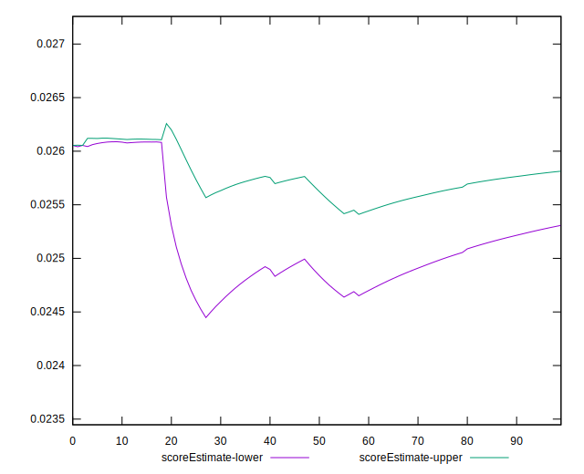

# //uses-long-cache-ttl/samples/pages

[→ Parent](../..)


## Raw


```yaml
p90min: 1305996.5081159603
p90max: 1395437.028940875
p90range: 89440.5208249148
p90mean: 1324591.9649047942
p90median: 1310014.1418104048
p90stdev: 32997.160338446854
p90skewness: 1.5592272747532696
p90eccentricity: 1
p90discretization: 1
outlandishness: 1.0040197454935775
confidence: 14936.903121832758
p90confidence: 13341.071967965783

```


## Score


```yaml
p90min: 0.02
p90max: 0.03
p90range: 0.009999999999999998
p90mean: 0.028085106382978696
p90median: 0.03
p90stdev: 0.003934732342320625
p90skewness: -1.5681404042640212
p90eccentricity: 0.9999999999999992
p90discretization: 47
outlandishness: 0.986861621900826
confidence: 0.001596618950599241
p90confidence: 0.0015908504494072735

```


## Raw Estimate


## Score Estimate


## P Score


```yaml
p90min: 0.023053896000804763
p90max: 0.026278146513083078
p90range: 0.003224250512278315
p90mean: 0.02559953016495039
p90median: 0.02612071515868422
p90stdev: 0.0011902466317246024
p90skewness: -1.557089169618988
p90eccentricity: 0.9999999999999996
p90discretization: 1
outlandishness: 0.9930938028370303
confidence: 0.0005265714817791784
p90confidence: 0.0004812282575408489

```


## Score Difference


```yaml
p90min: 0
p90max: 0
p90range: 0
p90mean: 0
p90median: 0
p90stdev: 0
p90skewness: .nan
p90eccentricity: .nan
p90discretization: 94
outlandishness: .nan
confidence: 0
p90confidence: 0

```


## P Score Difference


```yaml
p90min: -0.003945979326327315
p90max: 0.003205756394228893
p90range: 0.007151735720556208
p90mean: -0.0025185192585476
p90median: -0.003765694346361037
p90stdev: 0.002681606546234693
p90skewness: 1.6075685033886957
p90eccentricity: 1.0000000000000002
p90discretization: 1
outlandishness: 0.8998067963002195
confidence: 0.0010946430212773594
p90confidence: 0.0010841995358431234

```

