# //uses-rel-preconnect/samples/pages+cached+noadtech+nomedia+nocss

[→ Parent](../..)


## Raw


```yaml
p90min: 0
p90max: 108.62899971008301
p90range: 108.62899971008301
p90mean: 27.042659571830264
p90median: 0
p90stdev: 40.92902880724212
p90skewness: 0.9002614397479776
p90eccentricity: 1.000000000000002
p90discretization: 3.1333333333333333
outlandishness: 1.3085598068927757
confidence: 19.705263941363764
p90confidence: 16.54800332197505

```

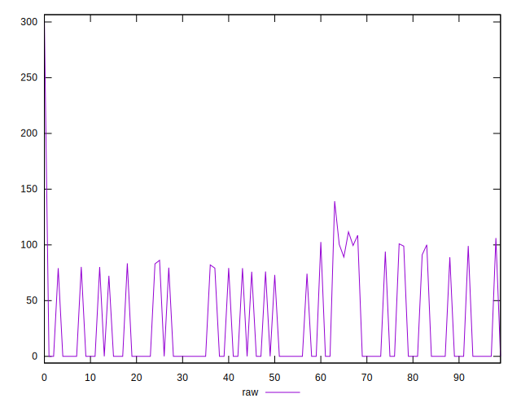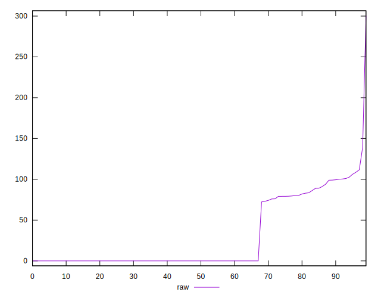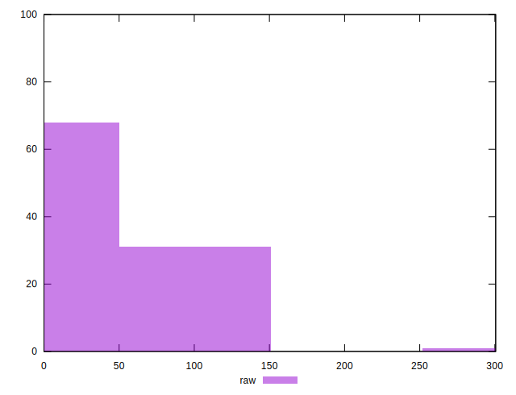
## Score


```yaml
p90min: 0.91
p90max: 1
p90range: 0.08999999999999997
p90mean: 0.9774468085106383
p90median: 1
p90stdev: 0.03411295910905558
p90skewness: -0.8957673596559789
p90eccentricity: 0.9999999999999974
p90discretization: 18.8
outlandishness: 0.993367585874631
confidence: 0.016428006104593874
p90confidence: 0.013792200233179392

```

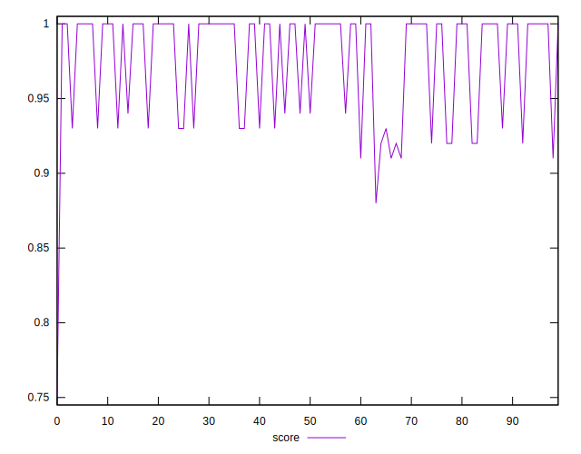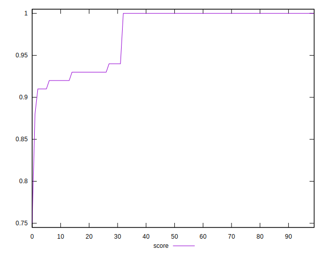
## Raw Estimate

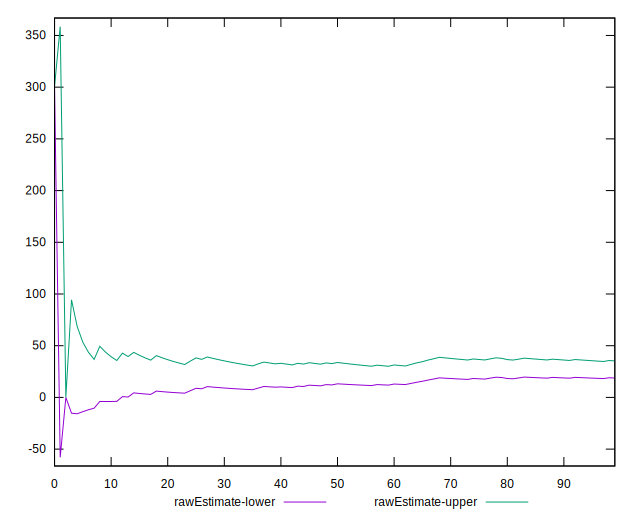
## Score Estimate

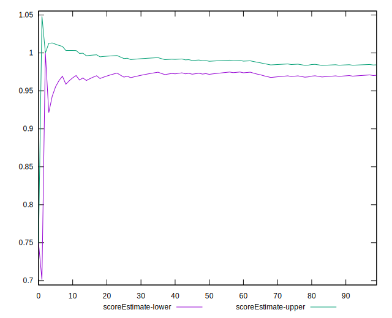
## P Score


```yaml
p90min: 0.9094758335749308
p90max: 1
p90range: 0.09052416642506922
p90mean: 0.9774644503568081
p90median: 1
p90stdev: 0.0341075240060351
p90skewness: -0.9002614397479642
p90eccentricity: 1.0000000000000013
p90discretization: 3.1333333333333333
outlandishness: 0.9933777939906289
confidence: 0.016417853727162417
p90confidence: 0.013790002768312541

```

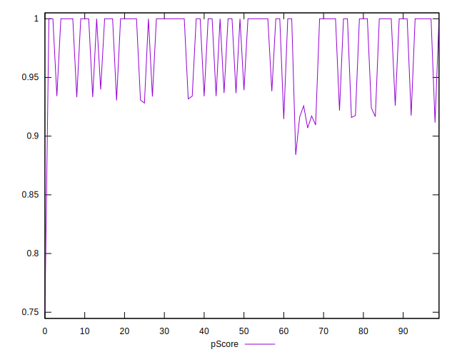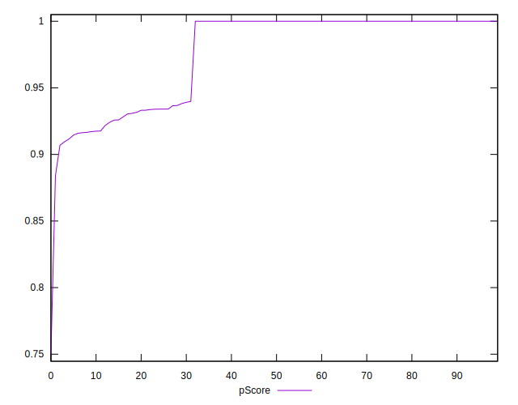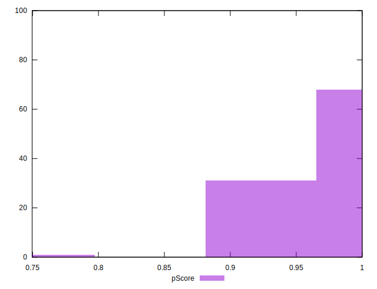
## Score Difference


```yaml
p90min: 0
p90max: 1.1102230246251565e-16
p90range: 1.1102230246251565e-16
p90mean: 2.362176648138631e-18
p90median: 0
p90stdev: 1.6021061506108986e-17
p90skewness: 6.634888026970372
p90eccentricity: 0.9999999999999989
p90discretization: 47
outlandishness: 5.522500000000001
confidence: 9.484951648085955e-18
p90confidence: 6.477470556979047e-18

```

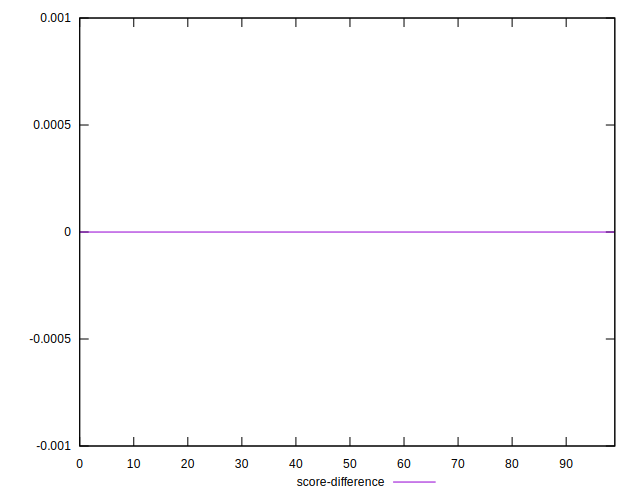
## P Score Difference


```yaml
p90min: -0.0036608338356018955
p90max: 0.004047500292460038
p90range: 0.007708334128061933
p90mean: 0.000021716907807835045
p90median: 0
p90stdev: 0.00142715974610232
p90skewness: 0.4135784973045528
p90eccentricity: 1.0000000000000022
p90discretization: 3.4814814814814814
outlandishness: 1.0819170981641755
confidence: 0.0006748498296124263
p90confidence: 0.0005770145275304321

```

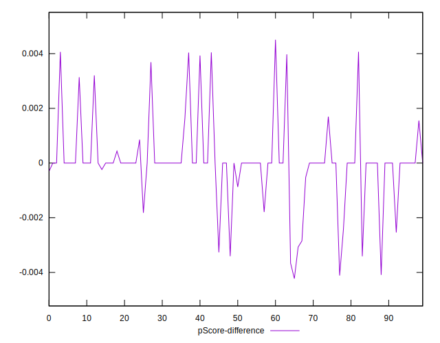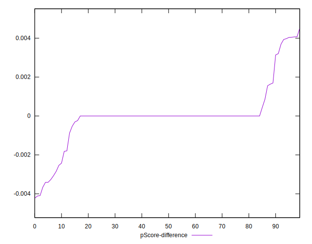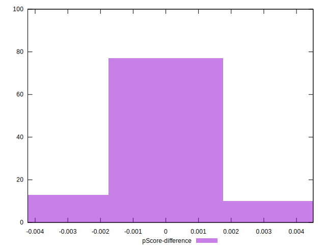