# //uses-rel-preconnect/samples/pages+cached+noadtech+nomedia

[→ Parent](../..)


## Raw


```yaml
p90min: 0
p90max: 212.03000020980835
p90range: 212.03000020980835
p90mean: 44.37723405310448
p90median: 0
p90stdev: 70.20497338902852
p90skewness: 1.0915806698341666
p90eccentricity: 1.000000000000001
p90discretization: 3.2413793103448274
outlandishness: 1.2258332824920366
confidence: 30.22796934248404
p90confidence: 28.3845516670371

```

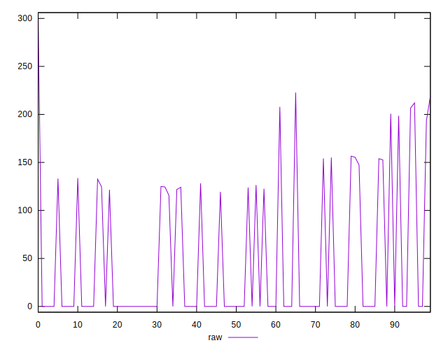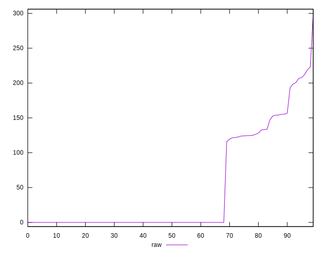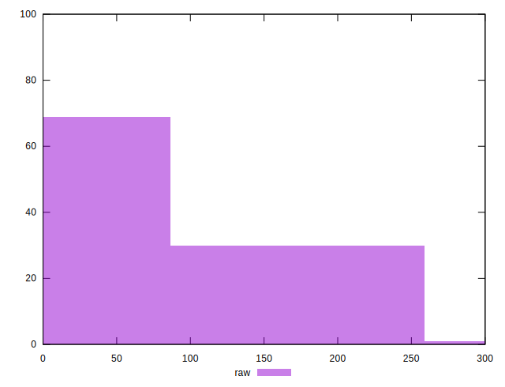
## Score


```yaml
p90min: 0.82
p90max: 1
p90range: 0.18000000000000005
p90mean: 0.9630851063829788
p90median: 1
p90stdev: 0.05851034816175648
p90skewness: -1.103523072654144
p90eccentricity: 0.9999999999999996
p90discretization: 11.75
outlandishness: 0.9917414121333099
confidence: 0.025210318172975782
p90confidence: 0.023656301260178963

```

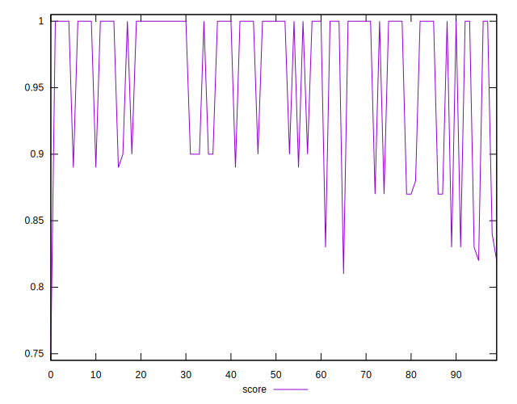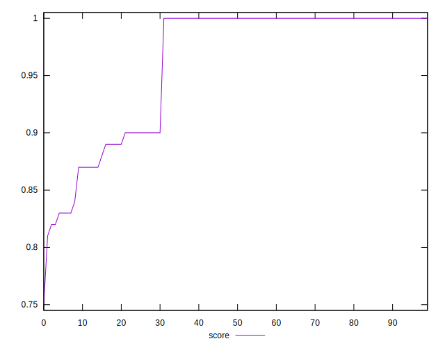
## Raw Estimate

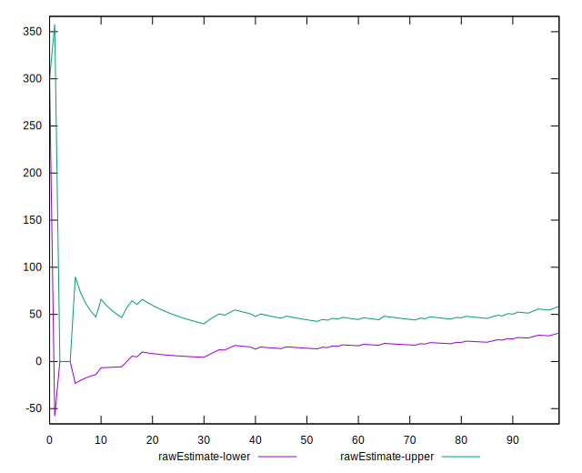
## Score Estimate

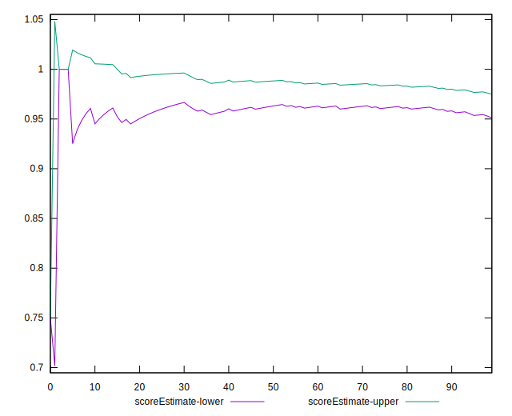
## P Score


```yaml
p90min: 0.823308333158493
p90max: 1
p90range: 0.17669166684150694
p90mean: 0.9630189716224129
p90median: 1
p90stdev: 0.0585041444908571
p90skewness: -1.0915806698341652
p90eccentricity: 1.0000000000000009
p90discretization: 3.2413793103448274
outlandishness: 0.9917860399371495
confidence: 0.02518980439299996
p90confidence: 0.02365379305586425

```

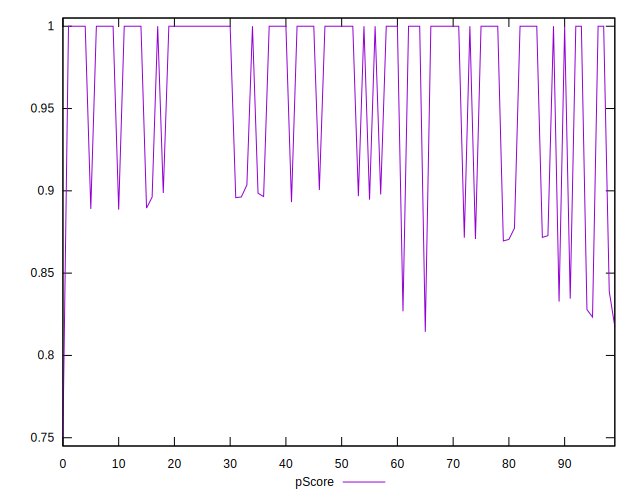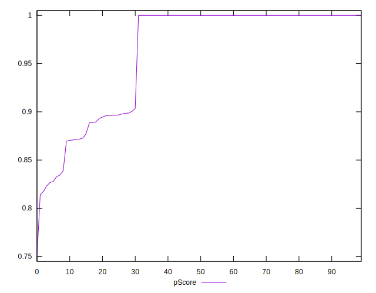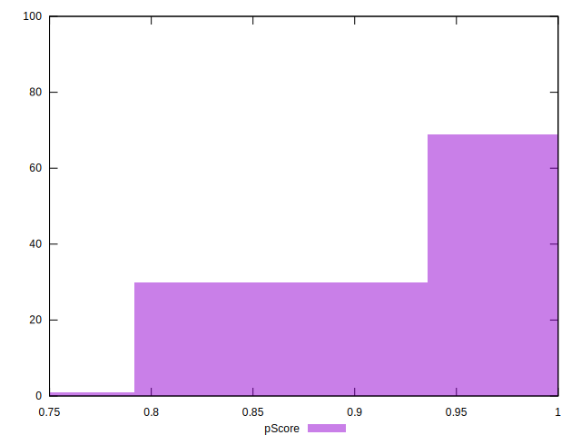
## Score Difference


```yaml
p90min: 0
p90max: 1.1102230246251565e-16
p90range: 1.1102230246251565e-16
p90mean: 3.543264972207946e-18
p90median: 0
p90stdev: 1.9514781802162935e-17
p90skewness: 5.32600228748551
p90eccentricity: 1.0000000000000062
p90discretization: 47
outlandishness: 3.5344000000000007
confidence: 1.0335413782903674e-17
p90confidence: 7.890015558655768e-18

```

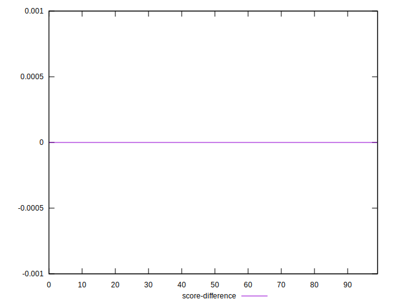
## P Score Difference


```yaml
p90min: -0.003452500104904166
p90max: 0.003554999828338623
p90range: 0.007007499933242789
p90mean: -0.00006620568106360389
p90median: 0
p90stdev: 0.0011248013051662058
p90skewness: 0.09043802129345486
p90eccentricity: 1.0000000000000013
p90discretization: 3.6153846153846154
outlandishness: 0.4473942676809242
confidence: 0.0005882715698020834
p90confidence: 0.00045476807725178074

```

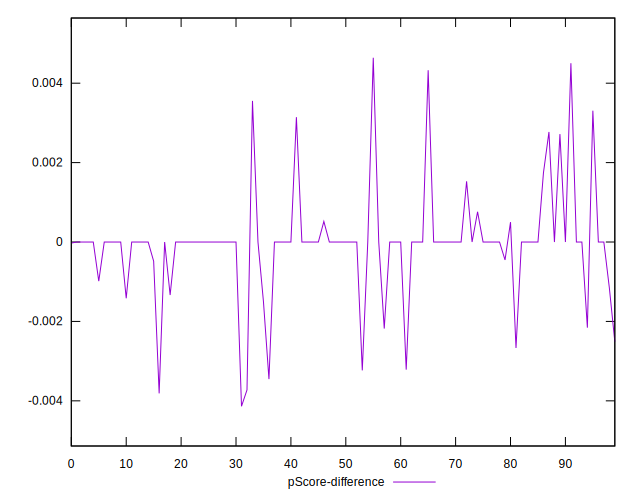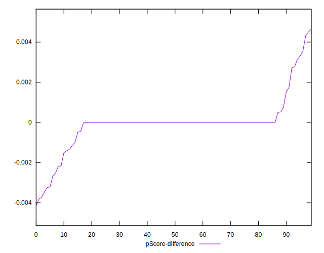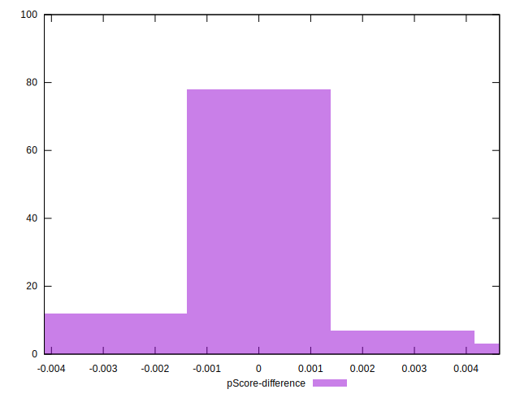