# //uses-rel-preconnect/samples/pages+cached+noadtech

[→ Parent](../..)


## Raw


```yaml
p90min: 0
p90max: 199.84899997711182
p90range: 199.84899997711182
p90mean: 54.00621276713432
p90median: 0
p90stdev: 68.1278821743938
p90skewness: 0.548140806823737
p90eccentricity: 0.9999999999999989
p90discretization: 2.473684210526316
outlandishness: 1.1089758273989985
confidence: 28.030590283691268
p90confidence: 27.54476354302135

```

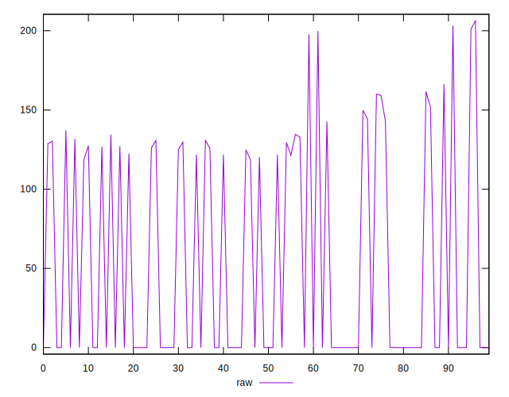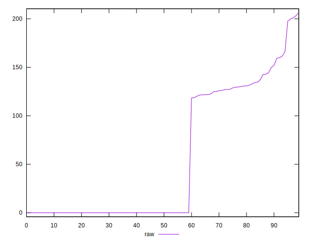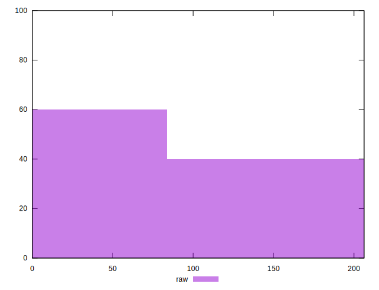
## Score


```yaml
p90min: 0.83
p90max: 1
p90range: 0.17000000000000004
p90mean: 0.9551063829787234
p90median: 1
p90stdev: 0.05662013552166422
p90skewness: -0.5466356246426193
p90eccentricity: 1.0000000000000007
p90discretization: 11.75
outlandishness: 0.9949673636568407
confidence: 0.023315203009674046
p90confidence: 0.02289206995640683

```

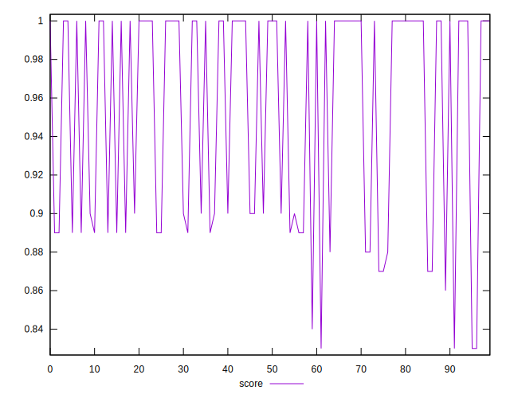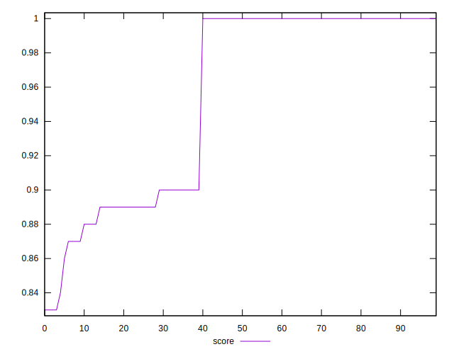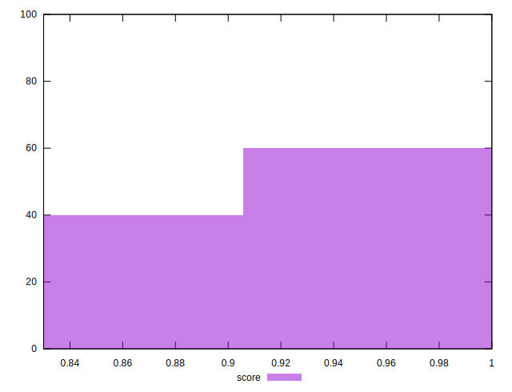
## Raw Estimate

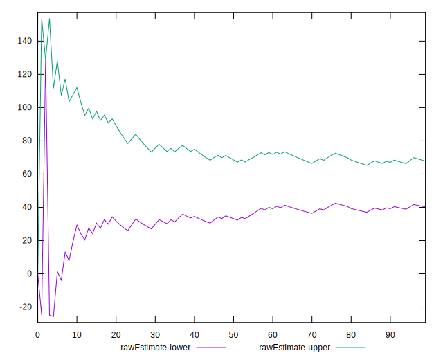
## Score Estimate

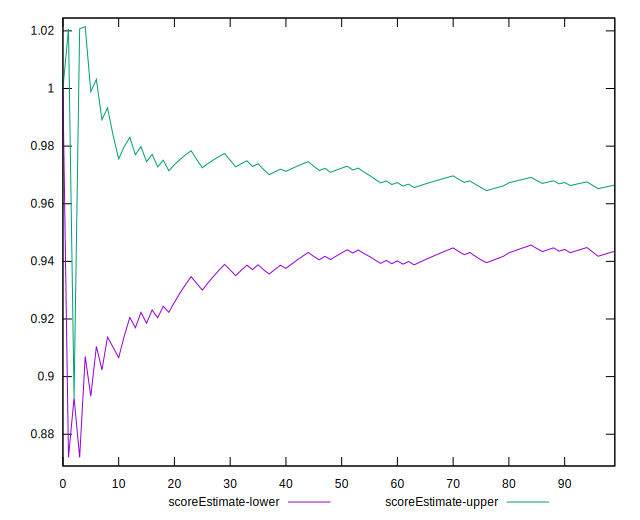
## P Score


```yaml
p90min: 0.8334591666857402
p90max: 1
p90range: 0.16654083331425984
p90mean: 0.9549948226940547
p90median: 1
p90stdev: 0.05677323514532816
p90skewness: -0.5481408068237329
p90eccentricity: 0.9999999999999997
p90discretization: 2.473684210526316
outlandishness: 0.9950034250154536
confidence: 0.02335882523640937
p90confidence: 0.022953969619184455

```

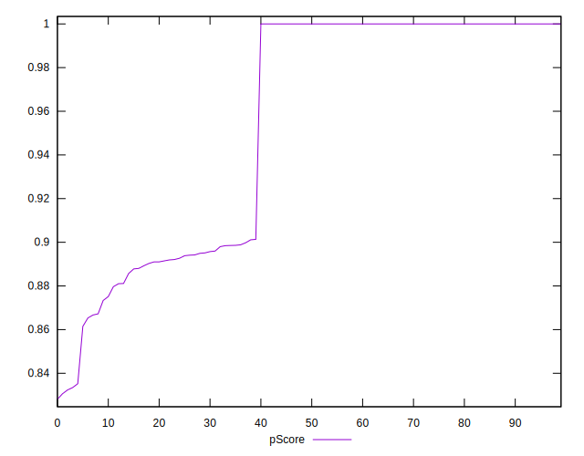
## Score Difference


```yaml
p90min: 0
p90max: 1.1102230246251565e-16
p90range: 1.1102230246251565e-16
p90mean: 1.1810883240693154e-18
p90median: 0
p90stdev: 1.139000331521095e-17
p90skewness: 9.539955591519908
p90eccentricity: 0.9999999999999996
p90discretization: 47
outlandishness: 14.137600000000003
confidence: 8.528132291650261e-18
p90confidence: 4.605088813249998e-18

```

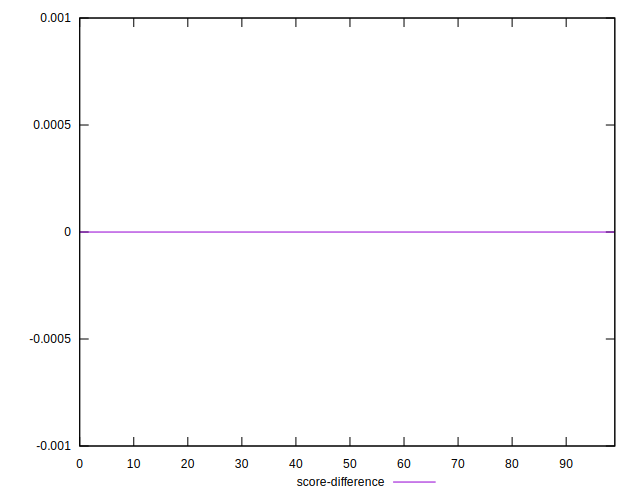
## P Score Difference


```yaml
p90min: -0.004640833139419542
p90max: 0.0038350001970927083
p90range: 0.00847583333651225
p90mean: -0.0000862588780991594
p90median: 0
p90stdev: 0.0014162940788823926
p90skewness: -0.6659502319000302
p90eccentricity: 0.9999999999999997
p90discretization: 2.6857142857142855
outlandishness: 1.1879607531643797
confidence: 0.0006981230493119748
p90confidence: 0.0005726214328860995

```

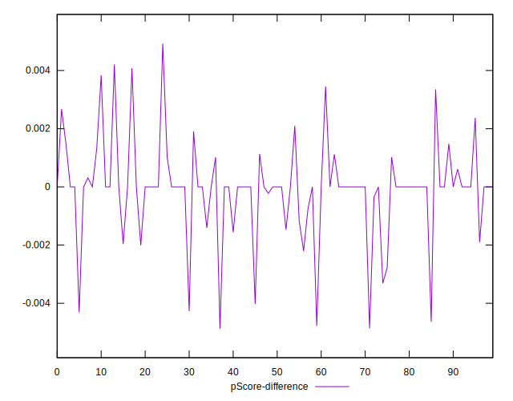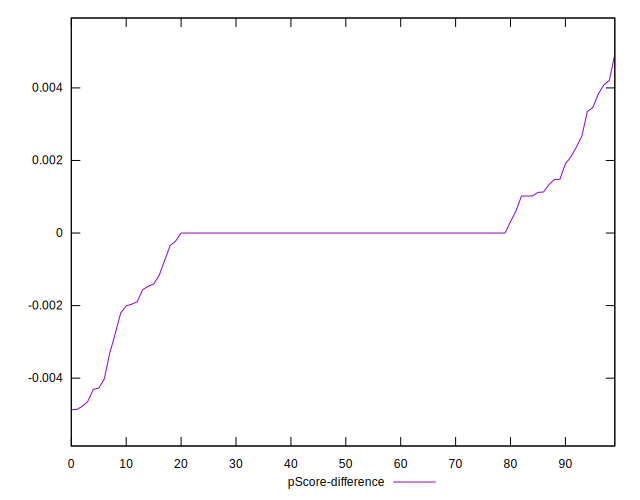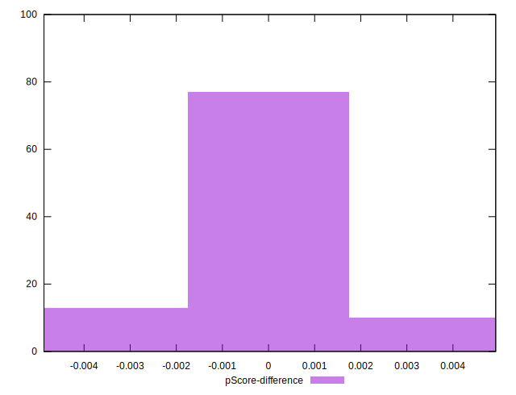