# //uses-rel-preconnect/samples/pages+cached

[→ Parent](../..)


## Raw


```yaml
p90min: 0
p90max: 300.894
p90range: 300.894
p90mean: 215.36897870445247
p90median: 291.455500125885
p90stdev: 122.150310469111
p90skewness: -1.10117114434232
p90eccentricity: 0.9999999999999996
p90discretization: 1.46875
outlandishness: 0.964759610168572
confidence: 49.012424718618085
p90confidence: 49.3865552721219

```

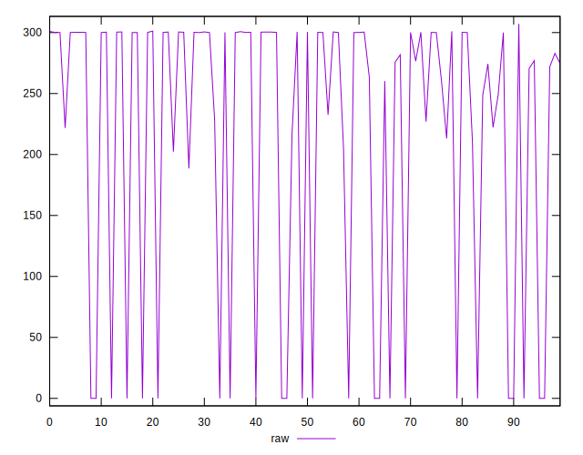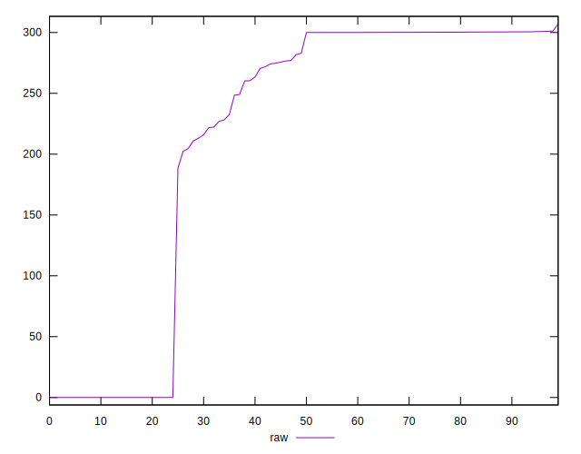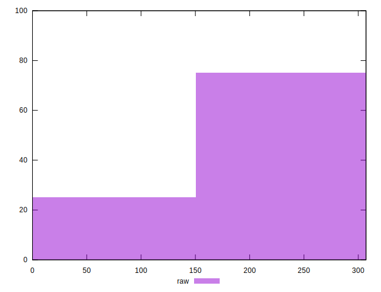
## Score


```yaml
p90min: 0.75
p90max: 1
p90range: 0.25
p90mean: 0.8203191489361703
p90median: 0.755
p90stdev: 0.1018076213305164
p90skewness: 1.1069054802857738
p90eccentricity: 1.0000000000000004
p90discretization: 9.4
outlandishness: 1.008014958371427
confidence: 0.04082946994711709
p90confidence: 0.04116180874738139

```

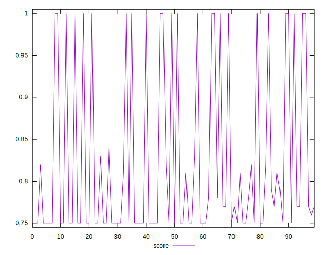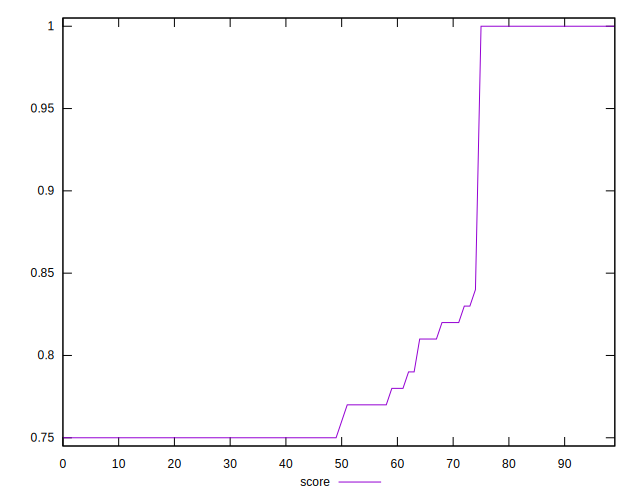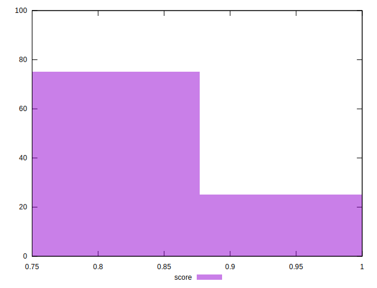
## Raw Estimate

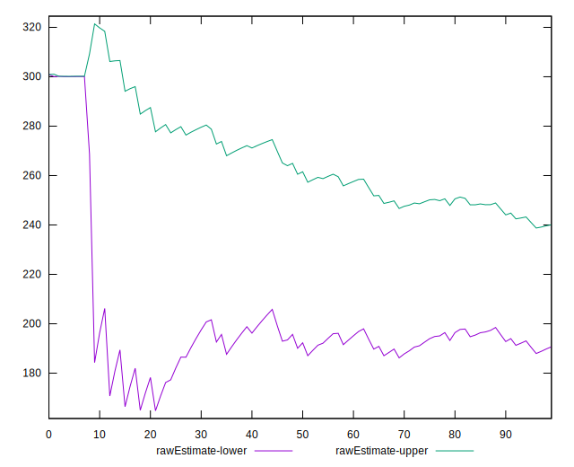
## Score Estimate

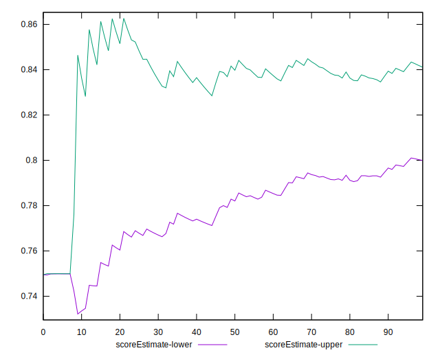
## P Score


```yaml
p90min: 0.7495033333333333
p90max: 1
p90range: 0.2504966666666667
p90mean: 0.8205573699921521
p90median: 0.7571204165617624
p90stdev: 0.10176998587625728
p90skewness: 1.1014044224237596
p90eccentricity: 1
p90discretization: 1.46875
outlandishness: 1.0078508684702614
confidence: 0.0408278573981976
p90confidence: 0.04114659236819396

```

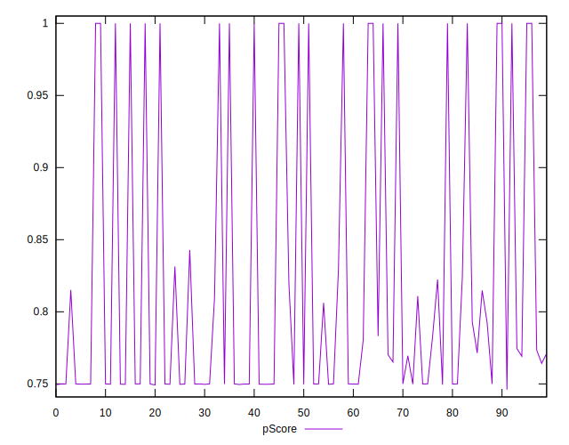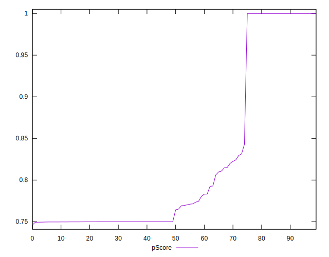
## Score Difference


```yaml
p90min: 0
p90max: 1.1102230246251565e-16
p90range: 1.1102230246251565e-16
p90mean: 3.543264972207946e-18
p90median: 0
p90stdev: 1.9514781802162963e-17
p90skewness: 5.326002287485491
p90eccentricity: 1.0000000000000044
p90discretization: 47
outlandishness: 3.5344000000000007
confidence: 1.0335413782903697e-17
p90confidence: 7.89001555865578e-18

```

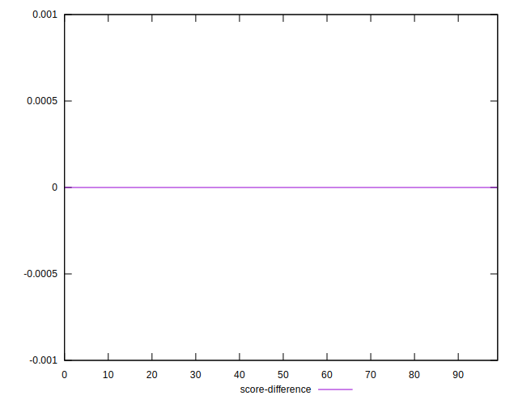
## P Score Difference


```yaml
p90min: -0.0037949999173483295
p90max: 0.0042408331235249674
p90range: 0.008035833040873297
p90mean: 0.00018367909302948406
p90median: 0
p90stdev: 0.0010244578271279112
p90skewness: 1.490755035980221
p90eccentricity: 1
p90discretization: 1.5666666666666667
outlandishness: 0.8780646144528621
confidence: 0.0005849714802871118
p90confidence: 0.0004141982358383334

```

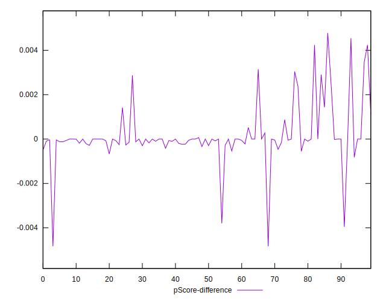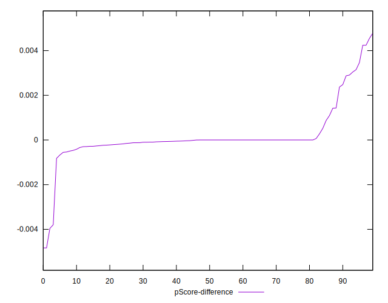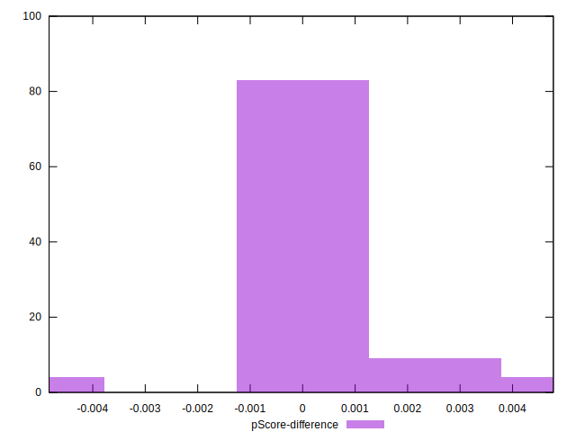