# //uses-rel-preconnect/samples/pages

[→ Parent](../..)


## Raw


```yaml
p90min: 0
p90max: 301.726
p90range: 301.726
p90mean: 225.1438510711752
p90median: 300
p90stdev: 128.29573992238488
p90skewness: -1.1800185929077962
p90eccentricity: 1.0000000000000002
p90discretization: 1.9583333333333333
outlandishness: 0.9622681247860291
confidence: 51.37542829154959
p90confidence: 51.87121200528497

```

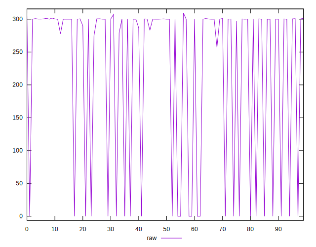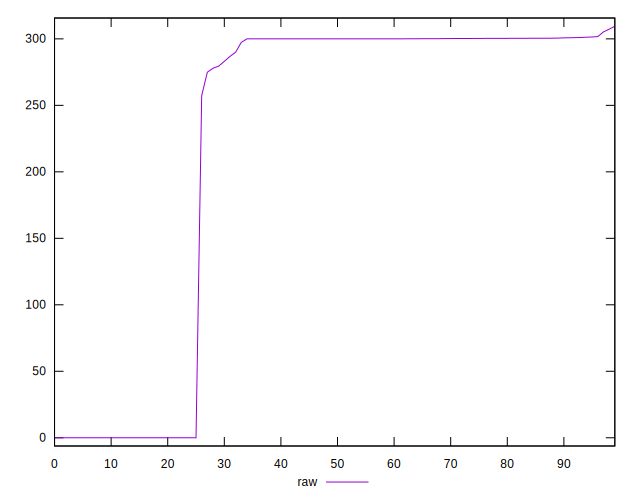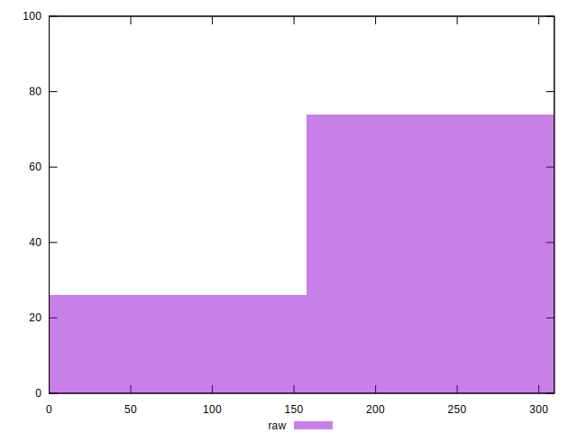
## Score


```yaml
p90min: 0.75
p90max: 1
p90range: 0.25
p90mean: 0.8125531914893617
p90median: 0.75
p90stdev: 0.10682991224085547
p90skewness: 1.179167038645626
p90eccentricity: 0.9999999999999988
p90discretization: 18.8
outlandishness: 1.008996314687639
confidence: 0.04276057517123877
p90confidence: 0.04319236967419014

```

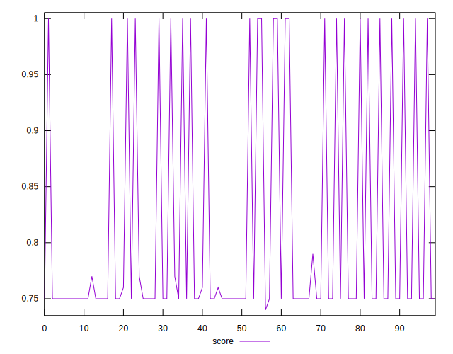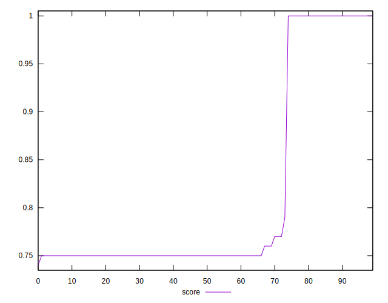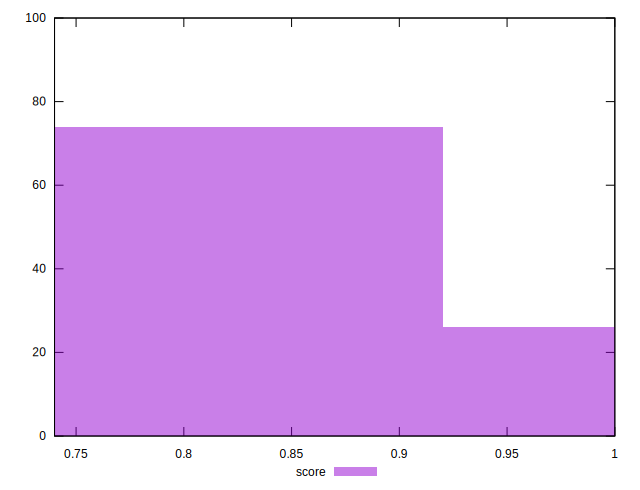
## Raw Estimate

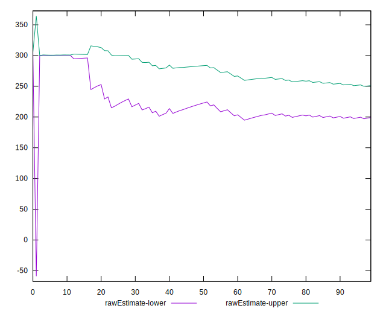
## Score Estimate

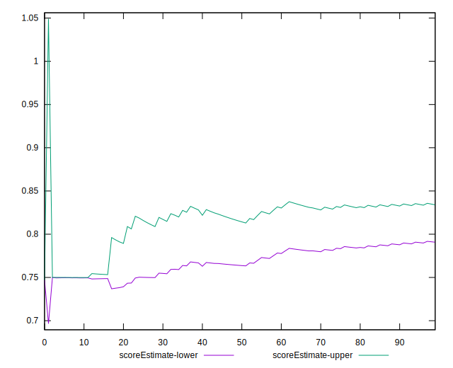
## P Score


```yaml
p90min: 0.7490411111111112
p90max: 1
p90range: 0.25095888888888884
p90mean: 0.81242946216882
p90median: 0.75
p90stdev: 0.10688406490672653
p90skewness: 1.1800761614679907
p90eccentricity: 1.0000000000000009
p90discretization: 1.9583333333333333
outlandishness: 1.0089607648094212
confidence: 0.04278609680294052
p90confidence: 0.04321426412223455

```

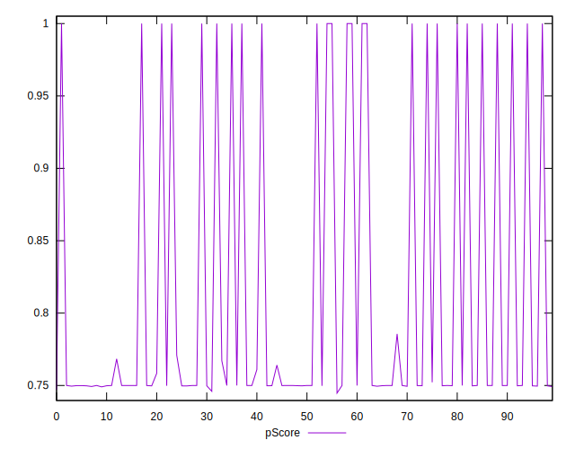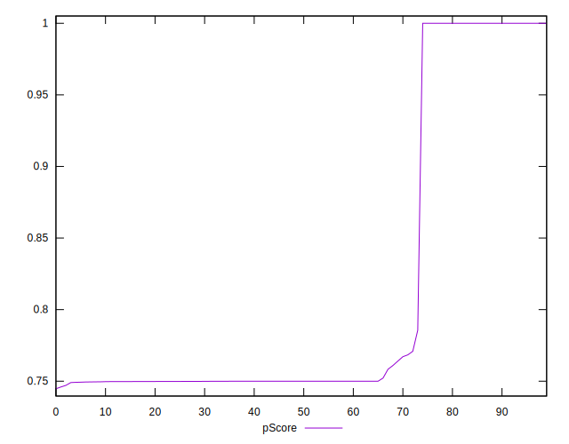
## Score Difference


```yaml
p90min: 0
p90max: 0
p90range: 0
p90mean: 0
p90median: 0
p90stdev: 0
p90skewness: .nan
p90eccentricity: .nan
p90discretization: 94
outlandishness: .nan
confidence: 0
p90confidence: 0

```


## P Score Difference


```yaml
p90min: -0.002893333435058598
p90max: 0.0009916663169859952
p90range: 0.0038849997520445934
p90mean: -0.00014377364816958962
p90median: 0
p90stdev: 0.00043139429807889787
p90skewness: -3.3967480730221427
p90eccentricity: 0.9999999999999984
p90discretization: 2.1363636363636362
outlandishness: 0.9301453135246566
confidence: 0.00040256515677393934
p90confidence: 0.0001744168988546229

```

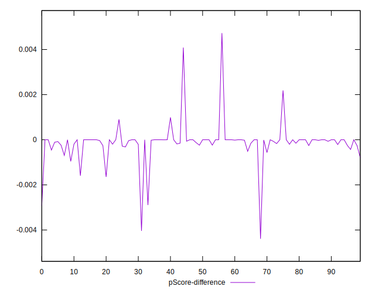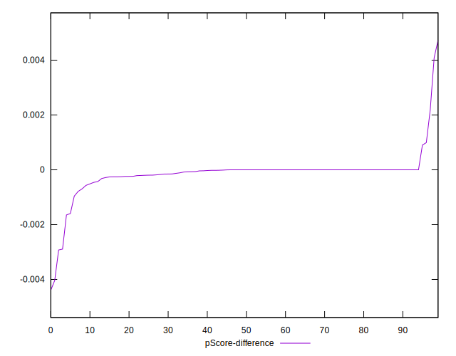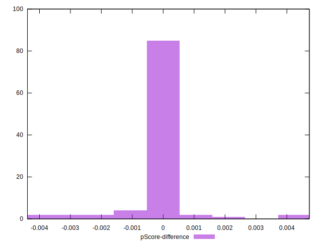