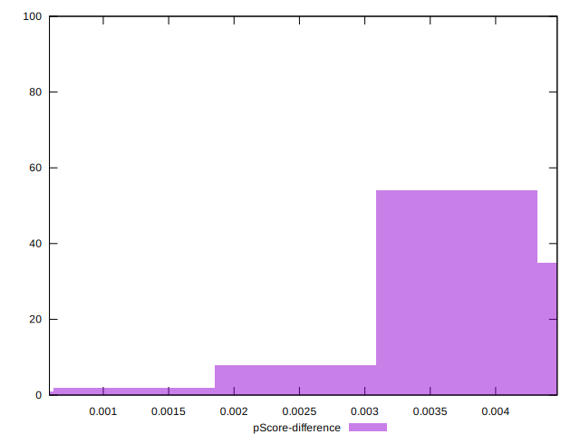

# //uses-rel-preload/samples/pages+cached+noadtech+nomedia+nocss

[→ Parent](../..)


## Raw


```yaml
p90min: 986
p90max: 1064
p90range: 78
p90mean: 1055.436170212766
p90median: 1054
p90stdev: 8.132622134314264
p90skewness: -6.481299019201318
p90eccentricity: 1.0000000000000016
p90discretization: 8.545454545454545
outlandishness: 0.9924984225683164
confidence: 9.98735107251299
p90confidence: 3.2880980081107487

```


## Score


```yaml
p90min: 0.46
p90max: 0.47
p90range: 0.009999999999999953
p90mean: 0.4601063829787241
p90median: 0.46
p90stdev: 0.00102592029372265
p90skewness: 9.539955591517986
p90eccentricity: 0.9999999999999994
p90discretization: 47
outlandishness: 1.0025820113682375
confidence: 0.0013864580750514392
p90confidence: 0.0004147895252672127

```


## Raw Estimate


## Score Estimate


## P Score


```yaml
p90min: 0.46305882352941174
p90max: 0.4722352941176471
p90range: 0.009176470588235341
p90mean: 0.46406633291614524
p90median: 0.4642352941176471
p90stdev: 0.0009567790746252119
p90skewness: 6.481299019200221
p90eccentricity: 0.999999999999997
p90discretization: 8.545454545454545
outlandishness: 1.0020119660025641
confidence: 0.0011749824791191747
p90confidence: 0.00038683505977773683

```


## Score Difference


```yaml
p90min: 0
p90max: 0
p90range: 0
p90mean: 0
p90median: 0
p90stdev: 0
p90skewness: .nan
p90eccentricity: .nan
p90discretization: 94
outlandishness: .inf
confidence: 2.165089820536967e-18
p90confidence: 0

```


## P Score Difference


```yaml
p90min: 0.002235294117647113
p90max: 0.0043529411764705594
p90range: 0.0021176470588234464
p90mean: 0.003913642052565686
p90median: 0.004235294117647059
p90stdev: 0.0005012464862969116
p90skewness: -0.8897050134170821
p90eccentricity: 0.9999999999999978
p90discretization: 8.545454545454545
outlandishness: 0.9591843951332617
confidence: 0.00028985279897968385
p90confidence: 0.00020265881605531608

```

